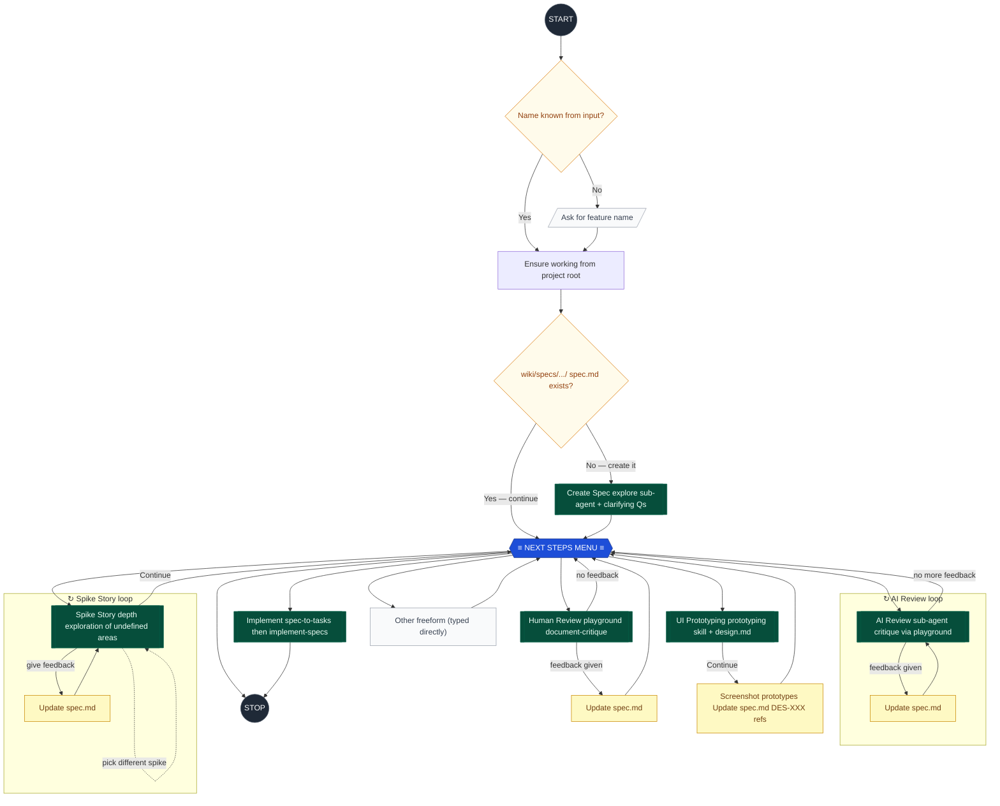

# Spec Orchestrator

Create and iterate on detailed specifications for features that are clear, actionable,
and suitable for implementation by an AI agent or human engineer with zero prior codebase context.

**CRITICAL: This skill NEVER stops until the user chooses "Stop". After every action, always return to the Next Steps Check and present the menu again.**

---

## Agent Flow



---

## Entry Point (REQUIRED)

1. If the user input clearly names a feature (e.g. "/spec folder permissions"), derive the feature slug.
2. If no name can be inferred, use `ask_user` to ask for the feature name.
3. **Ensure you are working from the project root.** All subsequent file reads and writes in this session MUST run from the repository root.
4. Check whether `wiki/specs/<feature-slug>/spec.md` already exists.
   - **Exists** - go straight to **Next Steps Check**.
   - **Does not exist** - go to **Create Spec**.

---

## Create Spec

> **Sub-agent: REQUIRED.** Use an `explore` sub-agent to research the codebase before writing.
> **Reference:** Read `.github/skills/spec/references/creating-a-spec.md` for the full creation guidelines.
> **Example:** See `.github/skills/spec/references/example-spec.md` for a complete, well-formed spec.

Steps:
1. Run an `explore` sub-agent to understand the affected area of the codebase.
2. Ask 3-5 clarifying questions using the lettered format from `references/creating-a-spec.md`.
3. Write `wiki/specs/<feature>/spec.md` following the structure in `references/creating-a-spec.md`.
4. Update `Last updated: YYYY-MM-DD` at the top of the file.
5. Go to **Next Steps Check**.

**Output location:** `wiki/specs/[feature-name]/spec.md`
**Never start implementing.** Planning only.

---

## Next Steps Check (REQUIRED -- always present after every action)

After every Spec render, edit, or completed stage, use `ask_user` to present this menu.
**NEVER print the menu as plain text -- always use `ask_user` with `choices`.**

Present exactly these choices (in this order), with `allow_freeform: true` (the default):

```
choices: ["AI Review", "Human Review", "UI Prototyping", "Spike Story", "Implement", "Stop"]
```

What each choice does:
- **AI Review** -- AI sub-agent reads the spec + codebase, generates a critique, presents it via the playground skill. Feedback is incorporated, then loops again.
- **Human Review** -- Creates an interactive document-critique page (playground skill) for you to read and annotate.
- **UI Prototyping** -- Uses the prototyping skill to explore UI flows. Loops until you say "Continue".
- **Spike Story** -- Explores an undefined or risky area of the spec in depth. Sub-loop with feedback loop.
- **Implement** -- Converts spec to tasks.json (spec-to-tasks) then runs the implement-specs skill. Ends the loop.
- **Stop** -- End the session. Commit spec files and present a summary of what was done.

**Freeform text entered** → treat as an ad-hoc "Other" action (e.g. "add a diagram", "tighten the FR section", "research X"). Execute the action, update `spec.md` as needed, then return to **Next Steps Check**. Do NOT add "Other" as an explicit choice — the freeform field is the mechanism.

Conditionally add with your own recommendation on WHAT to prototype or spike:
- If the UI has unexplored areas -- recommend **UI Prototyping**, naming which areas.
- If there are vague or risky stories -- recommend **Spike Story**, naming which story/stories.

---

## AI Review Stage

> **Sub-agent: REQUIRED.**
> **Reference:** Read `.github/skills/spec/references/ai-review.md` for the full review prompt template.

Steps:
1. Launch a `general-purpose` sub-agent using the prompt from `references/ai-review.md`.
   - Pass the spec file path and codebase root.
   - The sub-agent reads spec + codebase, cross-references claims, and generates a playground HTML critique.
2. Present the playground link to the user.
3. Ask: "Here is the AI review. Please provide feedback or say 'no changes' to continue."
4. **If feedback given:** Update `spec.md` -- loop back to step 1 (another AI review pass).
5. **If no feedback:** Return to **Next Steps Check**.

---

## Human Review Stage

> **Sub-loop: TRUE.** Loops until user says "no feedback" or equivalent.

Steps:
1. Use the **playground** skill with the `document-critique` template.
   - Pass the full `spec.md` content.
   - The playground creates an interactive review page served locally.
2. Present the link to the user and ask them to review.
3. **If feedback given:** Update `spec.md` -- return to **Next Steps Check**.
4. **If no feedback:** Return to **Next Steps Check**.

---

## UI Prototyping Stage

> **Sub-agent: REQUIRED** -- delegates to the **prototyping** skill.
> **Sub-loop: TRUE** -- the prototyping skill manages its own feedback loop.

Steps:
1. Read the current `spec.md` and `wiki/specs/<feature>/design.md` (if it exists).
2. Identify which UI areas need prototyping. Present your recommendation to the user.
3. Invoke the **prototyping** skill via a `general-purpose` sub-agent with `model: 'claude-opus-4.6'`.
   - Pass the spec content, design.md content, and your analysis of which UI areas to prototype.
   - The prototyping skill manages its own inner feedback loop.
   - The loop ends when the user chooses **"Continue"** in the prototyping skill.
4. **On receiving "Continue" back from the prototyping skill:**
   - Read `wiki/specs/<feature>/design.md` (updated by the prototyping skill).
   - Use `playwright-cli` to navigate to each deep link from design.md (using `?review=0&scenario=...` URLs) and capture screenshots as follows:
     a. **Default state** — navigate to the URL and screenshot immediately. Name: `DES-{ID}-{scenario}-default.png`.
     b. **Interactive states** — inspect the prototype for state-changing elements: toggles/switches, tabs/segmented controls, expandable panels, open dropdowns/selects, form validation states (empty, filled, error). Use `playwright-cli` to interact with each element and take an additional screenshot. Always use four segments: `DES-{ID}-{scenario}-{state-description}.png` (e.g. `DES-001-default-toggle-on.png`, `DES-002-checkout-form-validation-error.png`).
     c. Only capture states that reveal meaningfully different UI — skip states where the interaction produces no visible change (e.g. an accordion that was already open, a field that shows no validation until typing).
   - Save all screenshots to `wiki/specs/<feature>/design/`.
   - Update `design.md` to index every screenshot alongside its deep link, with a one-line caption per screenshot.
   - Update `spec.md` to reference the design decisions (DES-XXX IDs) in the relevant user stories and Design Considerations section.
5. Return to **Next Steps Check**.

---

## Spike Story Stage

> **Sub-agent: REQUIRED.**
> **Sub-loop: TRUE.**

Steps:
1. Identify spike candidates from the spec. Present them to the user as a numbered list.
2. Ask the user which spike to work on (or confirm your recommendation).
3. Launch a `general-purpose` sub-agent to:
   - Research the specific area deeply (codebase exploration, web search, library docs via Context7).
   - Ask the user targeted clarifying questions about mechanics, constraints, and options.
   - Update `spec.md` with findings (add/refine the relevant story's Technical Considerations and Acceptance Criteria).
4. After the sub-agent finishes, use `ask_user` with:
   - `choices: ["Continue (to next steps check)", "Pick a different spike"]`
   - `allow_freeform: true` (the default)
   - Question text should describe the freeform field as: _"Or give feedback below — I'll incorporate it and re-run the spike."_

   Interpret the response:
   - **Freeform text entered** → treat as feedback; incorporate it and loop back to step 3 for another spike pass.
   - **"Pick a different spike"** → Return to step 1 to choose another spike area.
   - **"Continue (to next steps check)"** → Return to **Next Steps Check**.

---

## Implement Stage

> **Sub-agent: REQUIRED.**
> **No loop** -- after delegation, the session ends.

Steps:
1. **Commit all spec files before proceeding** (REQUIRED — do this before anything else):
   a. Run `git status` scoped to the spec folder to check for uncommitted changes:
      ```powershell
      git status wiki/specs/<feature>/
      ```
   b. If there are uncommitted changes, stage and commit everything under that folder:
      ```powershell
      git add wiki/specs/<feature>/
      git commit -m "[Spec] Save <feature> spec files before implementation"
      ```
      This captures `spec.md`, `design.md`, `research.md`, screenshots, any existing `tasks.json`, and any other artefacts.
   c. If nothing to commit, note the working tree is clean and proceed.
   d. **Do not proceed to step 2 until the spec folder is confirmed committed.**
2. **Exit plan mode** -- remind the user to press **Shift+Tab** to leave plan mode before continuing (implementation requires normal or autopilot mode, not plan mode).
3. Ask the user which mode to use via `ask_user` with these choices:
   - **Autopilot** -- AI works through all tasks autonomously without stopping for confirmation.
   - **Normal** -- AI implements task by task, pausing for review between each.
4. Launch a `general-purpose` sub-agent that:
   a. Runs the **spec-to-tasks** skill to create/update `wiki/specs/<feature>/tasks.json`.
   b. Then runs the **implement-specs** skill to execute the tasks, passing the chosen mode as context (autopilot or normal) so it behaves accordingly.
5. The session ends when implementation is handed off.

---

## Stop

1. Commit all spec files: `spec.md`, `research.md` (if present), `design.md` (if present), `design/` screenshots.
2. Present a summary of:
   - What was done this session (stages completed, decisions made)
   - State of the spec (stories count, open questions remaining)
   - Recommended next step (e.g. "Run Implement to start building")
3. End the session.

---

## Persistence Rules (CRITICAL)

- **NEVER stop silently.** After every stage completes, always return to **Next Steps Check** and present the menu again using `ask_user`.
- **Never end a turn with only a question.** If you need clarification, produce a best-effort spec draft first, capture unknowns in Open Questions, then ask.
- The **only** valid exit is when the user explicitly chooses **Stop** from the menu.

---

## Output

- **Format:** Markdown (`.md`)
- **Location:** `wiki/specs/[feature-name]/`
- **Filename:** `spec.md` (kebab-case)
- **Freshness:** Always include `Last updated: YYYY-MM-DD` at the top; update on every edit.

---

## Formatting

- Never use "smart quotes"
- Use British English throughout
