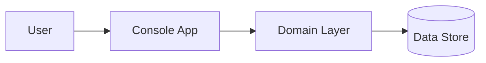

# Creating a Spec — Reference Guidelines

This document contains detailed guidance for the **Create Spec** stage of the spec orchestrator.
It is referenced by `spec/SKILL.md` — do not use it in isolation.

---

## Step 0: Research (optional, recommended)

Before writing or revising `spec.md`, optionally create/update `wiki/specs/[feature-name]/research.md`.

- Research output MUST include date metadata so future sessions can judge staleness:
  - `Discovered:` (ISO date, e.g. `2026-02-15`) — when the current behaviour was observed.
  - `Last updated:` (ISO date) — update this whenever `research.md` is edited.
  - Do not invent timestamps; use the session current date.

- Use an `explore` sub-agent to locate current implementations, constraints, and key files.
- If the new Spec affects **existing UI or behaviour**, default to a quick local exploration to understand the current state.
  - This is most useful for: bugfixes/improvements to an existing flow, changes to an existing screen or form, or anything where we need to describe **current behaviour** accurately.
  - Record: pages/routes visited, role/context used, and concrete observations.
  - Where helpful, date-stamp key findings (e.g. `2026-02-15 — Observed: ...`) so individual notes retain context.
  - If possible, capture screenshots under `wiki/specs/[feature-name]/research/` and index them from `research.md` (e.g. `RS-001-current-state.png`, `RS-002-error-state.png` + a short caption and repro steps).
  - If local exploration is not feasible (services not running / user prefers not to run locally), record that explicitly (with date) and create a spike story or open question rather than guessing.
- If needed, use web search / Context7 to confirm external SDK/standards behaviour.
- Capture: current behaviour, important files/symbols, constraints, open questions, and recommended story slicing.

---

## Step 1: Clarifying Questions

### Entry point (REQUIRED)

Offer two entry points (either is fine; iteration is expected):
- **Start from requirements (Problem/Goals/Constraints)** — clarify the "why/what" first, then write stories.
- **Start from user stories (Solution slices)** — sketch stories early, then extract requirements/constraints as you go.

Ask only critical questions where the initial prompt is ambiguous. Focus on:

- **Problem/Goal:** What problem does this solve? Who experiences it?
- **Scope/Layers:** Frontend only? Backend only? Both? Which apps affected?
- **Core Functionality:** What are the key actions/flows?
- **Boundaries:** What should it NOT do?
- **Success Criteria:** How do we know it's done?
- **Docs/Diagrams:** Do we need to update docs and include Mermaid diagrams for complex flows?

### Format Questions Like This:

```
1. What is the primary goal of this feature?
   A. Improve user workflow efficiency
   B. Add new capability users are requesting
   C. Fix/improve existing broken behaviour
   D. Support compliance/security requirement
   E. Other: [please specify]

2. Which layers are affected?
   A. Backend only (API/data)
   B. Frontend only (UI)
   C. Both frontend and backend
   D. Infrastructure/configuration only

3. Which part of the application does this involve?
   A. Core domain / business logic
   B. CLI / user-facing commands
   C. Data persistence / storage
   D. Multiple areas: [specify which]

4. What is the scope?
   A. Minimal viable version
   B. Full-featured implementation
   C. Prototype/proof of concept

5. Documentation & diagrams:
   A. No documentation changes needed (state "None" in Spec)
   B. Update existing docs/runbooks only (specify where)
   C. Add/update an overview doc (recommended for complex flows)
   D. Include Mermaid diagram(s) in Spec + docs (recommended for complex flows)
```

This lets users respond with "1B, 2C, 3A, 4A" for quick iteration.

### Quality Gates Question (REQUIRED)

- For frontend applications quality gates will be typechecking, linting and unit tests.
- Backend applications will require a clean build and test execution.
  + Default backend policy: specify **filtered** tests rather than running the entire test suite, unless the story explicitly needs a full suite.

You must determine the most appropriate quality gate for the user story depending on the scope of changes.

If it is not obvious what quality gate must execute you can ask the user for clarification.

---

## Step 2: Spec Structure

Generate the Spec with these sections:

### 1. Introduction/Overview
Brief description of the feature and the problem it solves.

Include a single freshness line near the top of `spec.md`:
- `Last updated: YYYY-MM-DD`

If a GitHub Issue has been created to track this feature, add the following line immediately after `Last updated:`:
- `GitHub Issue: #<n>`

Update `Last updated:` whenever the Spec is revised.

### 2. Goals
Specific, measurable objectives (bullet list).

### 3. Non-Goals (Out of Scope)
What this feature will NOT include. Critical for managing scope.

### 4. User Stories
Each story needs:
- **Title:** Short descriptive name
- **Description:** "As a [user], I want [feature] so that [benefit]"
- **Workstream:** One of: `backend` | `frontend` | `infra` | `docs` | `tests-only`
- **Agent routing hint:** Describe required capabilities (e.g., ".NET 9 + domain commands"), **not** a specific agent name
- **Acceptance Criteria:** Verifiable checklist of what "done" means
- **Quality Gates:** What commands must pass?
- **Technical Considerations:** Reduce codebase rediscovery by noting likely integration points.
  - Backend: key classes/services involved, existing patterns to follow, auth/permission requirements.
  - Frontend: route/page, key components to create/modify, existing components to reuse.

**Story Sizing:** Each story should be completable in one focused session (2-4 hours). If a story has more than 6-8 acceptance criteria, consider splitting it.

**Exploration:** If the implementation approach is unclear, create a separate **spike** story for research/prototyping rather than adding uncertainty to an implementation story.

**Spike story guidance (from shaping):**
- Spike acceptance criteria should describe the **understanding we will have** and the **concrete artefacts produced** (notes, diagrams, identified files/commands), not effort estimates.
- Prefer questions about mechanics ("Where is X?", "What changes are needed to achieve Y?", "What constraints exist?") over yes/no questions.

You MUST consider existing patterns and implementations in the codebase. These become our anchors for important patterns to follow, for authorisation changes, and for basic command/query structure. For example, if adding a new API command, identify an existing similar command in the same app and reference it as a pattern to follow for structure, auth, and testing.

**Format:**
```markdown
### US-001: [Title]
**Description:** As a [user], I want [feature] so that [benefit].

**Acceptance Criteria:**
- [ ] Specific verifiable criterion
- [ ] Another criterion
- [ ] All tests pass (existing + new)

**Technical Considerations:**

- Reference the closest existing pattern in the codebase for structure and testing
- Note likely integration points (files, classes, services) to reduce rediscovery
- Call out any database changes, auth/permission requirements, or external dependencies

```

### 5. Diagrams
If the feature involves non-trivial **data flows**, **cross-service interactions**, **security/authorisation**, or multi-step **user journeys**, include at least one Mermaid diagram.

Use diagrams to help:
- Engineers understand the system boundaries and integration points
- Others understand "what talks to what", failure modes, and where to look when something breaks

Prefer Mermaid diagrams embedded directly in the Spec (and in docs where applicable):



Common Mermaid types:
- `flowchart` for data flows/system boundaries
- `sequenceDiagram` for request/response and async sequences
- `stateDiagram-v2` for lifecycle/state transitions

**Layer-Specific Criteria:**

For **backend stories**, include where applicable:
- [ ] Authorization/permission tests added
- [ ] Integration tests cover happy path and failure cases

For **frontend stories**, include:
- [ ] Verify visually (describe what to check)
- [ ] Typecheck/lint passes

If documentation is impacted, create a **dedicated documentation user story** (e.g., `US-00X: Update docs`) rather than burying it inside another story.

For **documentation stories** (when applicable), include:
- [ ] Docs updated in the agreed location(s) (or explicitly "None")
- [ ] Mermaid diagrams included where they improve clarity (flows/sequences/states)
- [ ] Support notes added (common failure modes, where to look)

**Important:**
- Acceptance criteria must be verifiable, not vague. "Works correctly" is bad. "Button shows confirmation dialog before deleting" is good.
- Use the exact terminology the codebase uses.

### 6. Functional Requirements
Numbered list of specific functionalities:
- "FR-1: The system must allow users to..."
- "FR-2: When a user clicks X, the system must..."

Be explicit and unambiguous.

**Chunking rule (from shaping):** Avoid more than ~9 top-level functional requirements. If you exceed this, group them into a few top-level FRs with sub-requirements (e.g. FR-3a, FR-3b) so the list stays scannable.

Where requirements imply multi-step orchestration or async work, add a Mermaid `sequenceDiagram` (either here or in the Diagrams section) to remove ambiguity.

### 7. Design Considerations (Optional)
- UI/UX requirements or sketches
- Link to Figma/mockups if available
- Relevant existing components to reuse
- Existing patterns to follow (look for similar features in codebase)

If UI prototyping is used (via the **prototyping** skill), the Spec task pack MUST also include a durable "Design Pack":

- `wiki/specs/<feature>/design.md`
- `wiki/specs/<feature>/design/` (screenshots)

The Spec should reference Design IDs (e.g. `DES-001`) alongside screenshots and design decisions.

### 7a. Documentation & Support Overview (Recommended)
If the feature changes user-visible behaviour, adds new flows, or introduces non-trivial integrations, include a short overview suitable for:
- engineers (implementation/data flow context)
- support/customer success (where issues may occur, what to check)
- non-technical stakeholders (what happens end-to-end)

Include:
- **Docs to update** (paths/areas): e.g. `wiki/`, in-app help, runbooks, troubleshooting
- **Suggested new/updated docs** (if helpful): a brief "Feature Overview" doc with Mermaid diagrams
- **Support notes**: common failure modes, logs/telemetry to check, escalation boundaries

### 8. Technical Considerations (Optional)
- Known constraints or dependencies
- Integration points (which services or components interact?)
- Database changes (schema changes, migrations?)
- Performance requirements
- Security/authorization considerations
- **Data flows & sequences:** If complex, include Mermaid diagrams (flowchart/sequence/state) to make interactions explicit

### 9. Success Metrics (If Applicable)
How will success be measured? Only include if genuinely measurable:
- "Reduce time to complete X by 50%"
- "Users can complete flow without contacting support"
- "Page loads under 2 seconds"

For internal/technical features, this section may be brief or omitted.

### 10. Open Questions
Remaining questions or areas needing clarification.

---

## Writing for AI Agents and Junior Developers

The Spec reader may be a junior developer or AI agent. Therefore:

- **Be explicit and unambiguous** - State exactly what should happen
- **Provide enough context** to understand purpose and core logic
- **Number requirements** for easy reference in implementation and review
- **Reference existing patterns** - "Follow the pattern in `ExistingCommand.cs`" is helpful
- **Include file paths** when known - "Modify `src/Domain/Features/X/`"
- **Use Mermaid to compress complexity** - if a flow is hard to describe precisely in prose, add a diagram rather than adding more text

---

## Checklist

Before saving the Spec:

- [ ] Asked clarifying questions with lettered options
- [ ] Incorporated user's answers into all relevant sections
- [ ] User stories are small enough for one focused session (2-4 hours)
- [ ] Backend stories include test requirements (unit tests, integration tests)
- [ ] Frontend stories include visual verification and typecheck/lint
- [ ] If the Spec affects existing behaviour, current state was verified (or explicitly recorded as not feasible)
- [ ] Functional requirements are numbered and unambiguous
- [ ] Non-goals section defines clear boundaries
- [ ] Technical considerations reference existing patterns where applicable
- [ ] Added Mermaid diagram(s) if there are non-trivial flows (data, sequence, lifecycle)
- [ ] Documentation impact assessed:
      - [ ] Existing docs identified to update (or explicitly "None")
      - [ ] New/updated overview docs suggested when helpful for support/non-technical readers
- [ ] Asked user about output format (local file vs GitHub issue vs review)

---

## Large Feature Guidance

If a feature seems to require more than 8-10 user stories:

1. **Consider splitting into phases** - Phase 1: MVP, Phase 2: Enhanced, etc.
2. **Create separate Specs** for each phase
3. **Link them** - "This Spec is Phase 1. See `<feature>-phase-2/spec.md` for Phase 2"
4. **Prioritise** - Which stories are essential vs. nice-to-have?

Each Spec should be completable in 1-2 sprints of focused work.

---

## Iteration & Change Visibility

When updating an existing Spec or revising a draft in-chat:
- Keep the document consistent with itself (Goals ↔ User Stories ↔ Functional Requirements ↔ Open Questions).
- When re-rendering an edited table/list, mark each changed or added line with **🟡** at the start of the changed cell/line so the user can spot changes without mentally diffing.
- If the Spec has already been converted to `tasks.json`, call out when changes require re-running **spec-to-tasks** to keep tasks in sync.
- If implementation is already underway and you discover spec drift, update `spec.md` first, then re-run **spec-to-tasks** to update `tasks.json` while preserving `passes`/`notes` where possible.
