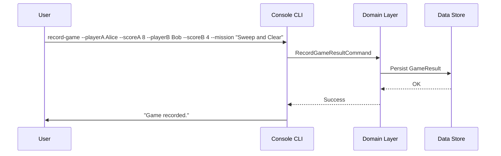

# Example Spec: Record Game Result

> This is a reference example showing all sections of a well-formed spec.
> Use this as a template when creating new specs.

---

# Spec: Record Game Result

Last updated: 2026-03-12

## Introduction

Allow players to record the result of a Kill Team game after it is played. Currently results are tracked manually outside the app. This feature lets players log the outcome (winner, score, mission played) from the console, so game history is persisted and can be queried later.

## Goals

- Allow recording a game result (two players, scores, mission, date played)
- Persist results so they survive application restarts
- Allow viewing a history of past results

## Non-Goals

- No live game tracking during play
- No bracket or tournament management
- No editing or deleting past results
- No online multiplayer or sync

## User Stories

### US-001: Record a Game Result (Backend)

**Description:** As a developer, I need a domain command to record a game result so the application can persist outcomes.

**Workstream:** `backend`

**Agent routing hint:** Requires .NET 9 domain model + repository pattern + NUnit integration tests.

**Acceptance Criteria:**
- [ ] `RecordGameResultCommand` created following existing command patterns
- [ ] Command accepts: player A name, player B name, player A score, player B score, mission name, date played
- [ ] Validate that scores are non-negative integers
- [ ] Validate that at least one score is greater than zero (must have a result)
- [ ] Result persisted to data store
- [ ] Unit tests cover: success case, invalid scores, draw case
- [ ] Integration test covers end-to-end persistence and retrieval

**Quality Gates:**
```
dotnet build
dotnet test --filter "FullyQualifiedName~RecordGameResult"
```

**Technical Considerations:**
- Follow the closest existing domain command as a reference pattern
- `GameResult` domain entity: `PlayerA`, `PlayerB`, `ScoreA`, `ScoreB`, `Mission`, `PlayedAt`
- Repository interface: `IGameResultRepository` — add `AddAsync` method

---

### US-002: View Game History (Console UI)

**Description:** As a player, I want to view a list of past game results so I can track my record over time.

**Workstream:** `frontend`

**Agent routing hint:** Requires Spectre.Console CLI table rendering.

**Acceptance Criteria:**
- [ ] New `history` command shows a table of past results (newest first)
- [ ] Table columns: Date, Player A, Score A, Player B, Score B, Mission
- [ ] Shows "No games recorded yet." when history is empty
- [ ] Typecheck/build passes

**Quality Gates:**
```
dotnet build
dotnet test --filter "FullyQualifiedName~GameHistory"
```

**Technical Considerations:**
- Use `Spectre.Console` `Table` API (see existing command for rendering patterns)
- Inject `IGameResultRepository` into the command
- Results sorted descending by `PlayedAt`

---

## Functional Requirements

- FR-1: A game result requires exactly two named players
- FR-2: Scores must be non-negative integers
- FR-3: Results are persisted between application runs
- FR-4: History is displayed in reverse chronological order
- FR-5: The UI handles an empty history gracefully

## Diagrams



## Design Considerations

Command syntax:
```
kill-team record-game
kill-team history
```

Use Spectre.Console prompts if flags are omitted (interactive fallback).

## Documentation & Support Overview

- **Docs to update:** `README.md` — add usage examples for `record-game` and `history` commands
- **Support notes:** If results are missing after restart, check data store path configuration in `appsettings.json`

## Technical Considerations

- Data store: JSON file or SQLite (decide in spike if not already established)
- No external service dependencies
- All date/time stored as UTC

## Success Metrics

- Players can record a game and see it appear in history without leaving the terminal
- Zero data loss between application restarts

## Open Questions

- Should draws (equal scores) be allowed, or must there always be a winner?
- Should mission name be free-text or chosen from a predefined list?

