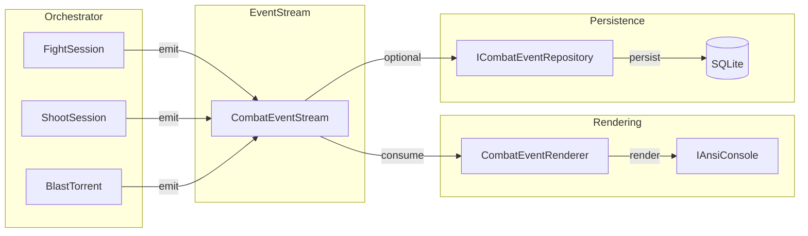
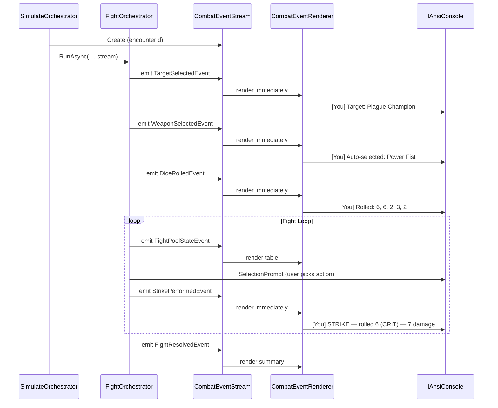

# Spec: Combat Event Stream

Last updated: 2026-03-16

## Introduction

Refactor the combat orchestrators (Fight, Shoot, Blast/Torrent) to emit structured events during execution rather than writing directly to the console. A renderer consumes the event stream to produce console output, enabling:

- Clear labelling of actions by participant (`[You]` / `[AI]`)
- Decoupled presentation from game logic
- Persistent event log for encounter replay and history
- Foundation for a future AI narrative layer (separate spec)
- Easier testing — assert on events, not console output

Currently, orchestrators interleave game logic with `console.MarkupLine()` calls. This makes it impossible to distinguish who performed an action, replay an encounter, or swap the rendering strategy.

## Goals

- Emit a structured event for every meaningful combat step (target selection, weapon choice, dice rolls, rerolls, strikes, blocks, damage, incapacitation)
- Render all combat output from events rather than inline `console.MarkupLine()` calls
- Label output with participant context (`[You]` / `[AI]`) in simulate mode
- Persist events to SQLite for encounter replay (optional, alongside in-memory rendering)
- Cover all three combat types: Fight, Shoot, Blast/Torrent
- Maintain existing game logic and resolution services unchanged

## Non-Goals

- AI-generated narrative text (separate spec)
- Changes to dice resolution logic (`FightResolutionService`, `CombatResolutionService`)
- Changes to the reroll mechanics logic
- UI beyond CLI (no web/GUI replay viewer)
- Changes to the strategy phase or firefight phase orchestration
- Replay command implementation (persistence enables it; the command is future work)

## User Stories

### US-001: Define Combat Event Types (Domain)

**Description:** As a developer, I need a set of event record types that capture every combat step so orchestrators can emit structured data instead of writing to the console.

**Workstream:** `backend-dotnet`

**Agent routing hint:** Requires .NET 10 record types in Domain project. No external dependencies.

**Acceptance Criteria:**
- [ ] Create `CombatEvent` base record with `Timestamp`, `EncounterId`, `SequenceNumber`
- [ ] Define event types covering the full combat lifecycle (see FR-1 for complete list)
- [ ] Events are immutable records — no mutable state
- [ ] `CombatEventStream` class collects events in order, exposes `IReadOnlyList<CombatEvent>`
- [ ] Each event carries enough context for rendering without looking up external state (operative names, weapon names, values — not just IDs)
- [ ] All existing tests pass unchanged

**Quality Gates:**
```
dotnet build KillTeam.DataSlate.Domain/KillTeam.DataSlate.Domain.csproj
dotnet test KillTeam.DataSlate.Tests --filter "FullyQualifiedName~Domain"
```

**Technical Considerations:**
- Place in `KillTeam.DataSlate.Domain/Events/`
- Use C# records for immutability: `public sealed record TargetSelectedEvent(...) : CombatEvent`
- Include a `Participant` enum or string (`"You"`, `"AI"`, or player name) on relevant events
- `CombatEventStream` is the collection wrapper — passed into orchestrators, appended to during execution

---

### US-002: Refactor FightSessionOrchestrator to Emit Events

**Description:** As a developer, I need the fight orchestrator to emit events instead of writing to the console so combat output can be rendered from the event stream.

**Workstream:** `backend-dotnet`

**Agent routing hint:** Requires .NET 10, Spectre.Console knowledge, familiarity with FightSessionOrchestrator fight loop.

**Acceptance Criteria:**
- [ ] FightSessionOrchestrator accepts a `CombatEventStream` parameter
- [ ] Every `console.MarkupLine()` call in FightSessionOrchestrator is replaced with an event emission
- [ ] Events emitted: `TargetSelectedEvent`, `WeaponSelectedEvent` (attacker + defender), `FightAssistSetEvent`, `DiceRolledEvent` (attack + defence), `DiceClassifiedEvent`, `ShockAppliedEvent`, `StrikePerformedEvent`, `BlockPerformedEvent`, `WoundsUpdatedEvent`, `IncapacitationEvent`
- [ ] Interactive prompts (weapon selection, dice entry, action selection) remain as direct console calls — only output/display is event-driven
- [ ] `CombatEventRenderer` renders fight events to console with same visual quality as current output
- [ ] `DisplayFightPools` table rendering moves to the renderer
- [ ] All existing fight-related tests pass unchanged
- [ ] New unit tests verify correct events are emitted for a fight sequence

**Quality Gates:**
```
dotnet build KillTeam.DataSlate.Console/KillTeam.DataSlate.Console.csproj
dotnet test KillTeam.DataSlate.Tests --verbosity quiet
```

**Technical Considerations:**
- The fight loop (`while atkPool.Remaining.Count > 0 || defPool.Remaining.Count > 0`) stays in the orchestrator — it emits `StrikePerformedEvent` / `BlockPerformedEvent` per iteration
- `FormatFightAction` and `DisplayFightPools` logic moves to `CombatEventRenderer`
- After the loop, emit `FightResolvedEvent` with summary totals
- Keep `GameAction` persistence — it's the summary record; events are the detailed log

---

### US-003: Refactor ShootSessionOrchestrator to Emit Events

**Description:** As a developer, I need the shoot orchestrator to emit events so ranged combat output flows through the event stream.

**Workstream:** `backend-dotnet`

**Agent routing hint:** Requires .NET 10, Spectre.Console, familiarity with ShootSessionOrchestrator and CombatResolutionService.

**Acceptance Criteria:**
- [ ] ShootSessionOrchestrator accepts a `CombatEventStream` parameter
- [ ] Events emitted: `TargetSelectedEvent`, `WeaponSelectedEvent`, `CoverStatusEvent`, `FightAssistSetEvent`, `DiceRolledEvent` (attack + defence), `ShootResolvedEvent` (hits/blocks/damage breakdown), `WoundsUpdatedEvent`, `IncapacitationEvent`, `StunAppliedEvent`, `HotDamageEvent`
- [ ] Interactive prompts remain as direct console calls
- [ ] `CombatEventRenderer` renders shoot events with same visual quality
- [ ] Existing tests pass; new tests verify event emission

**Quality Gates:**
```
dotnet build KillTeam.DataSlate.Console/KillTeam.DataSlate.Console.csproj
dotnet test KillTeam.DataSlate.Tests --verbosity quiet
```

**Technical Considerations:**
- The shoot result table (Unblocked Crits, Normals, Total Damage) becomes a `ShootResolvedEvent`
- Cover/obscured status is captured in `CoverStatusEvent`
- Stun and Hot effects each get their own event type
- Reroll events (from `RerollOrchestrator`) are a stretch goal — can be added later

---

### US-004: Refactor BlastTorrentSessionOrchestrator to Emit Events

**Description:** As a developer, I need the blast/torrent orchestrator to emit events so multi-target ranged combat flows through the event stream.

**Workstream:** `backend-dotnet`

**Agent routing hint:** Requires .NET 10, Spectre.Console, familiarity with BlastTorrentSessionOrchestrator.

**Acceptance Criteria:**
- [ ] BlastTorrentSessionOrchestrator accepts a `CombatEventStream` parameter
- [ ] Events emitted: `MultiTargetDeclaredEvent`, `TargetSelectedEvent` (per target), `CoverStatusEvent` (per target), `DiceRolledEvent` (shared attack + per-target defence), `ShootResolvedEvent` (per target), `WoundsUpdatedEvent` (per target), `IncapacitationEvent` (per target)
- [ ] Friendly fire warning is an event
- [ ] Existing tests pass; new tests verify event emission

**Quality Gates:**
```
dotnet build KillTeam.DataSlate.Console/KillTeam.DataSlate.Console.csproj
dotnet test KillTeam.DataSlate.Tests --verbosity quiet
```

**Technical Considerations:**
- Blast/Torrent shares attack dice across targets — `DiceRolledEvent` emitted once for attack, once per target for defence
- Each target's resolution is a separate `ShootResolvedEvent` with the target's name
- The "This will affect N friendly operative(s)" warning becomes `FriendlyFireWarningEvent`

---

### US-005: Combat Event Renderer with Participant Labels

**Description:** As a player, I want combat output prefixed with `[You]` / `[AI]` labels so I can clearly follow who is doing what during simulate mode.

**Workstream:** `backend-dotnet`

**Agent routing hint:** Requires .NET 10, Spectre.Console markup rendering.

**Acceptance Criteria:**
- [ ] `CombatEventRenderer` class consumes `CombatEvent` list and renders to `IAnsiConsole`
- [ ] In simulate mode, output lines are prefixed with `[You]` or `[AI]` based on the event's participant
- [ ] In full game mode (firefight phase), participant labels use player names instead
- [ ] Dice rolls display as: `[You] Rolled: 6, 6, 2, 3, 2`
- [ ] Weapon selection displays as: `[You] Auto-selected melee weapon: Power Fist (Attack: 5 | ...)`
- [ ] Target selection displays as: `[You] Target: Plague Marine Champion (Wounds: 15/15)`
- [ ] Fight pool tables and shoot result tables render from events with same visual quality
- [ ] Events can be rendered incrementally (one at a time during the fight loop) or as a batch (after resolution)

**Quality Gates:**
```
dotnet build KillTeam.DataSlate.Console/KillTeam.DataSlate.Console.csproj
dotnet test KillTeam.DataSlate.Tests --verbosity quiet
```

**Technical Considerations:**
- Renderer receives participant mapping (which team ID = "You", which = "AI") from SimulateSessionOrchestrator
- For firefight phase, mapping comes from game participants
- Use pattern matching on event types: `switch (evt) { case TargetSelectedEvent t => ..., case DiceRolledEvent d => ... }`
- Green values for stats: `Attack: [green]5[/]` pattern continues

---

### US-006: Persist Combat Events to SQLite

**Description:** As a developer, I need combat events persisted to SQLite so encounters can be replayed or reviewed later.

**Workstream:** `backend-dotnet`

**Agent routing hint:** Requires .NET 10, Microsoft.Data.Sqlite, schema migration.

**Acceptance Criteria:**
- [ ] New `combat_events` table: `id, encounter_id, sequence_number, event_type, event_data_json, created_at`
- [ ] `ICombatEventRepository` with `SaveAsync(encounterId, IReadOnlyList<CombatEvent>)` and `GetByEncounterAsync(encounterId)`
- [ ] Events serialised as JSON in `event_data_json` column (using `System.Text.Json`)
- [ ] Schema migration added to `DatabaseInitialiser`
- [ ] In-memory implementation for simulate mode (no persistence by default)
- [ ] Persistence is opt-in: `--save-events` flag or similar mechanism
- [ ] Roundtrip test: emit events → persist → load → verify identical

**Quality Gates:**
```
dotnet build KillTeam.DataSlate.Console/KillTeam.DataSlate.Console.csproj
dotnet test KillTeam.DataSlate.Tests --verbosity quiet
```

**Technical Considerations:**
- JSON serialisation with `System.Text.Json` using discriminated union pattern for event types
- `encounter_id` links to either `GameAction.Id` (real game) or a transient GUID (simulate)
- Keep existing `GameAction` table — it's the summary; `combat_events` is the detailed log
- Consider a `JsonDerivedType` attribute on `CombatEvent` for polymorphic deserialisation

---

### US-007: Wire Event Stream into SimulateSessionOrchestrator

**Description:** As a player using simulate mode, I want all combat output to flow through the event stream with `[You]` / `[AI]` labels.

**Workstream:** `backend-dotnet`

**Agent routing hint:** Requires .NET 10, familiarity with SimulateSessionOrchestrator.

**Acceptance Criteria:**
- [ ] SimulateSessionOrchestrator creates `CombatEventStream` per encounter
- [ ] Passes stream to Fight/Shoot/Blast orchestrators
- [ ] Passes participant mapping (`playerTeam.Id → "You"`, `aiTeam.Id → "AI"`) to renderer
- [ ] `CombatEventRenderer` renders events incrementally during the fight loop
- [ ] All simulate mode output now comes from events (no remaining direct `console.MarkupLine()` in combat orchestrators)
- [ ] `DisplayEncounterSummary` renders from `FightResolvedEvent` / `ShootResolvedEvent`

**Quality Gates:**
```
dotnet build KillTeam.DataSlate.Console/KillTeam.DataSlate.Console.csproj
dotnet test KillTeam.DataSlate.Tests --verbosity quiet
```

**Technical Considerations:**
- The fight loop needs incremental rendering: after each Strike/Block, render the new event immediately
- `DisplayFightPools` is called inside the loop — renderer must handle this as a "state snapshot" event
- SimulateSessionOrchestrator owns the participant mapping; orchestrators just emit team IDs

---

## Functional Requirements

- FR-1: The following combat event types must be defined:
  - FR-1a: `TargetSelectedEvent` — operative targeted, with name and current wounds
  - FR-1b: `WeaponSelectedEvent` — weapon chosen (auto or manual), with full stats
  - FR-1c: `CoverStatusEvent` — cover/obscured state for target (shoot only)
  - FR-1d: `FightAssistSetEvent` — friendly allies count applied
  - FR-1e: `DiceRolledEvent` — raw dice values, labelled attacker/defender
  - FR-1f: `DiceClassifiedEvent` — dice classified as CRIT/HIT/MISS with thresholds
  - FR-1g: `ShockAppliedEvent` — defender die discarded due to Shock rule
  - FR-1h: `StrikePerformedEvent` — die used, damage dealt, target name
  - FR-1i: `BlockPerformedEvent` — active die and cancelled die
  - FR-1j: `ShootResolvedEvent` — hits/blocks/damage breakdown
  - FR-1k: `WoundsUpdatedEvent` — operative name, new wounds / max wounds
  - FR-1l: `IncapacitationEvent` — operative name, cause (fight/shoot/self-damage)
  - FR-1m: `StunAppliedEvent` — target name, APL reduction
  - FR-1n: `HotDamageEvent` — attacker name, self-damage amount
  - FR-1o: `MultiTargetDeclaredEvent` — weapon type (Blast/Torrent)
  - FR-1p: `FriendlyFireWarningEvent` — count of friendly operatives affected
  - FR-1q: `FightPoolStateEvent` — snapshot of remaining dice pools (for table rendering)
  - FR-1r: `FightResolvedEvent` — summary totals (attacker damage, defender damage, incap flags)

- FR-2: Every event must carry participant context (team ID or name) so the renderer can label output
- FR-3: Interactive prompts (selection menus, text input) remain as direct console calls — only output is event-driven
- FR-4: Events must be emitted in real-time during the fight loop (not batched at the end) to support incremental rendering
- FR-5: The `CombatEventRenderer` must produce visually equivalent output to the current direct console writes
- FR-6: Event persistence is optional and does not block rendering
- FR-7: Existing `GameAction` persistence continues alongside events — events supplement, not replace

## Diagrams





## Technical Considerations

- **Incremental rendering pattern:** The `CombatEventStream` should support an `OnEventEmitted` callback (or similar) so the renderer can process events as they are emitted, not just at the end. This is critical for the fight loop where the player needs to see updated pools between actions.
- **Event serialisation:** Use `System.Text.Json` with `[JsonDerivedType]` attributes on the base `CombatEvent` type for polymorphic serialisation/deserialisation.
- **No changes to resolution services:** `FightResolutionService` and `CombatResolutionService` remain pure — they take inputs and return results. The orchestrator wraps their calls with event emission.
- **Reroll events are a stretch goal:** The `RerollOrchestrator` currently uses `AnsiConsole` directly (static calls). Refactoring it to emit events is desirable but can be a follow-up story.
- **Testing strategy:** Test event emission by running orchestrators with a mock console (for prompts) and asserting on the collected `CombatEventStream.Events` list. No need to test console rendering in unit tests.

## Open Questions

- Should reroll events (Balanced, Ceaseless, Relentless, CP re-roll) be included in Phase 1 or deferred?
- Should the `--save-events` flag be per-encounter or a global setting in `appsettings.json`?
- When firefight phase orchestrator adopts events, should it create one stream per activation or one per turning point?
