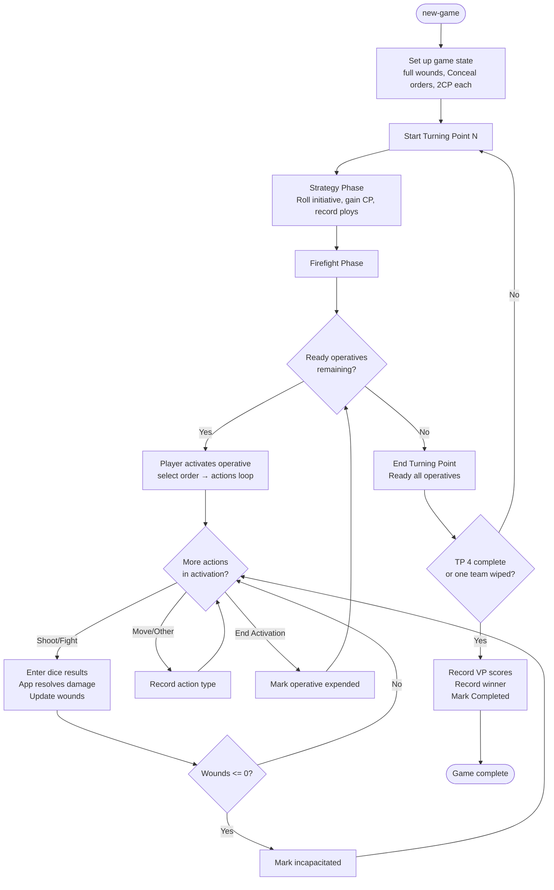
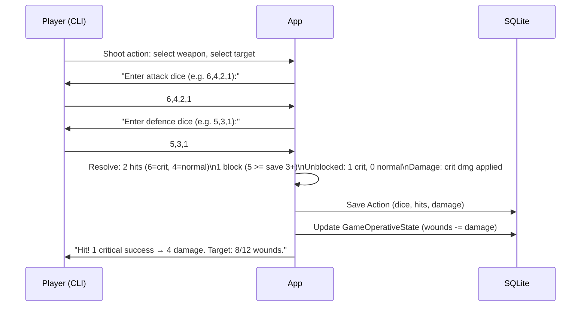

# Spec: Kill Team Game Tracking

Last updated: 2026-03-14 (Updated US-008 after human review of simulate spike)

## Introduction

A fully interactive CLI application for tracking a Kill Team game session from start to finish.
Players import their rosters from JSON files, then run through each Turning Point interactively --
recording every operative activation, action taken, weapon used, target, dice results, and damage
dealt. All data is persisted to SQLite. After a game, players can annotate any recorded action
with narrative fluff. Game history and win-rate statistics are available at any time.

---

## Goals

- Import kill team rosters (operatives + weapons + stats) from JSON
- Manage players (create, list) via dedicated CLI commands
- Guide players through a full 4-turning-point game via interactive CLI prompts
- Assign existing players to teams at game start (not locked into roster files)
- Record every operative activation: action type, target, weapon, attack dice, defence dice, damage
- Track operative state: current wounds, order (Engage/Conceal), injured/incapacitated status, CP
- Persist all game data to SQLite
- Add narrative fluff annotations to any recorded action after the game
- View full game history and per-team / per-player win/loss statistics
- Optional built-in dice roller — players may roll physical dice and enter results, or let the app roll

---

## Non-Goals

- No graphical or web UI
- No network/multiplayer sync
- No official roster validation against faction rules (roster is trusted as-is)
- No campaign progression mechanics (just individual game results in this iteration)
- No points-cost validation
- No PDF roster import (rosters sourced from the Kill Team app; export to JSON manually or via a future conversion tool)

---

## Domain Model

```
Player
  - Id, Name (unique display name, e.g. "Michael")

KillTeam
  - Id, Name, Faction
  - Operatives[]

Operative
  - Id, Name, OperativeType
  - Stats: Move, APL, Wounds, Save
  - Weapons[]
  - Equipment (string[], stored as JSON blob — free-text names e.g. "Frag grenades x2")

Weapon
  - Id, Name, Type (Ranged/Melee), Atk, Hit, NormalDmg, CriticalDmg
  - SpecialRules (TEXT, raw string as imported — e.g. "Piercing 1, Heavy (Dash only)")
  - ParsedRules: List<WeaponSpecialRule>  ← parsed at use time via SpecialRuleParser (not stored separately)

WeaponSpecialRule (value type / record, not a DB entity)
  - Kind (SpecialRuleKind enum)
  - Param (int?, e.g. 1 for Piercing 1, 5 for Lethal 5+, 2 for Blast 2")
  - RawText (string — original token from SpecialRules string)

SpecialRuleKind enum: Accurate, Balanced, Blast, Brutal, Ceaseless, Devastating, DDevastating,
  Heavy, HeavyDashOnly, Hot, Lethal, Limited, Piercing, PiercingCrits, Punishing, Range,
  Relentless, Rending, Saturate, Seek, SeekLight, Severe, Shock, Silent, Stun, Torrent, Unknown

Game
  - Id, PlayedAt, MissionName
  - TeamAId, TeamBId
  - PlayerAId, PlayerBId   ← assigned at new-game time, independent of roster
  - Status (InProgress/Completed)
  - WinnerTeamId (nullable until game ends)
  - VictoryPointsTeamA, VictoryPointsTeamB
  - CpTeamA, CpTeamB (int — current CP, updated after each spend/gain)
  - TurningPoints[]

TurningPoint
  - Id, GameId, Number (1-4)
  - TeamWithInitiativeId (FK → kill_teams)
  - CpTeamA (int)   ← CP at start of Firefight Phase (after Strategy Phase CP gain)
  - CpTeamB (int)
  - IsStrategyPhaseComplete (bool, default false)
  - Activations[]

Activation
  - Id, TurningPointId, SequenceNumber
  - OperativeId, TeamId
  - OrderSelected (Engage/Conceal)
  - IsCounteract (bool)
  - IsGuardInterrupt (bool)
  - Actions[]
  - NarrativeNote (nullable)

Action
  - Id, ActivationId, Type (Reposition/Dash/FallBack/Charge/Shoot/Fight/Guard/Other)
  - APCost
  - TargetOperativeId (nullable)
  - WeaponId (nullable)
  - AttackerDice (JSON: array of int results)
  - DefenderDice (JSON: array of int results — for Fight, this is the defender's roll)
  - TargetInCover (bool, nullable)
  - NormalHits, CriticalHits, Blocks
  - NormalDamageDealt, CriticalDamageDealt
  - CausedIncapacitation (bool)
  - NarrativeNote (nullable)

GameOperativeState
  - Id, GameId, OperativeId
  - CurrentWounds
  - Order (Engage/Conceal)
  - IsReady
  - IsOnGuard (bool)
  - IsIncapacitated
  - HasUsedCounteractThisTurningPoint
  - AplModifier (int, default 0 — Stun applies -1; reset to 0 at TP start)
```

---

## Weapon Special Rules

All 25+ KT24 V3.0 weapon special rules. Source of truth: `references/killteam-24-rules-reference.webp`.
Full enforcement design: `spike-weapon-rules.md`. Re-roll UX: `spike-reroll-mechanics.md`. Multi-target: `spike-blast-torrent.md`.

| Rule | Definition (exact, V3.0) | Enforcement tier |
|---|---|---|
| **Accurate x** | Retain x normal hits without rolling. Stacks, max 2. | Pre-attack |
| **Balanced** | Re-roll one attack dice. | Dice modification |
| **Blast x"** | Make attacks against all ops within x" of target, visible to target. | Multi-target (see spike-blast-torrent.md) |
| **Brutal** | Can only block with Criticals. | Combat effect (fight) |
| **Ceaseless** | Re-roll all results of one number (e.g. 2s). | Dice modification |
| **Devastating x** | Crits inflict x damage (overrides weapon CritDmg stat). | Combat effect |
| **D" Devastating x** | Crits inflict x damage to all ops within D". | Multi-target + combat effect |
| **Heavy** | Cannot shoot in same activation as moved. | Action restriction |
| **Heavy (x only)** | Can only move x" in same activation as shooting. | Action restriction |
| **Hot** | After shooting roll 1D6; if lower than Hit stat, attacker suffers 2 × result damage. | Post-action self-damage |
| **Lethal x** | Inflict crits with x+ instead of 6+. | Dice classification |
| **Limited x** | Has x uses per battle. | Usage counter |
| **Piercing x** | Remove x defence dice before rolling. | Pre-defence |
| **Piercing Crits x** | Remove x defence dice before rolling, if any critical successes rolled. | Pre-defence (conditional) |
| **Punishing** | Retain a fail as a success if any crits retained. | Dice modification |
| **Range x"** | Target must be within x" of shooter. | Targeting (display only) |
| **Relentless** | Re-roll any or all attack dice. | Dice modification |
| **Rending** | Convert a hit to a critical if any criticals retained. | Dice modification |
| **Saturate** | The defender cannot retain any cover saves. | Pre-defence (negates cover) |
| **Seek** | Targets cannot use terrain for cover. | Pre-defence (negates all terrain) |
| **Seek Light** | Targets cannot use light terrain for cover. | Pre-defence (negates light terrain) |
| **Severe** | Convert a hit to a critical if no criticals retained. | Dice modification |
| **Shock** | First Critical strike discards opponent's worst success. | Combat effect (fight) |
| **Silent** | Can Shoot whilst on Conceal order. | Action restriction lifted |
| **Stun** | Remove 1APL from target if any Critical Successes retained. | State: AplModifier -1 |
| **Torrent x"** | Make attacks against all ops within x" of target, visible to shooter. | Multi-target (see spike-blast-torrent.md) |

**Notes:**
- **Poison** and **Toxic** (present in Plague Marines starter set) have no definition in the KT24 V3.0 reference card. Treated as `SpecialRuleKind.Unknown` — displayed in weapon info but not mechanically enforced.
- **Blast/Torrent**: multi-target resolution fires as a modified Shoot sub-flow. Additional targets stored in `action_blast_targets` table. Full flow: `spike-blast-torrent.md`.
- **Re-roll ordering**: Weapon re-rolls (Balanced/Ceaseless/Relentless) fire first; then attacker CP Re-roll; then defender CP Re-roll. Never re-roll a re-rolled die. Full UX: `spike-reroll-mechanics.md`.
- **Fight Assist**: displayed on the reference card as a general rule (not a weapon special rule). "+1 to HIT per non-engaged friendly ally in enemy control range (max +2 modifier)." Implemented as a pre-dice prompt in the Fight and Shoot sub-flows.

---

## Roster JSON Format

Rosters are imported from JSON files. Example files for the starter set teams are provided at
`references/teams/angels-of-death.json` and `references/teams/plague-marines.json`.

These files are hand-authored from official PDFs downloaded from the Kill Team app. The JSON format
is our internal import format — player names are **not** stored in roster files; they are assigned
at game-start time by selecting an existing player.

Field notes:
- `"hit": "3+"` — parsed as integer threshold: strip `+`, parse int (e.g. "3+" → 3)
- `"dmg": "3/4"` — normal damage / critical damage (e.g. "3/4" → NormalDmg=3, CriticalDmg=4)
- `"save": "3+"` — parsed as integer save threshold (e.g. "3+" → 3)

Abbreviated example (Angels of Death):

```json
{
  "name": "Angels of Death",
  "faction": "Adeptus Astartes",
  "operatives": [
    {
      "name": "Intercessor Sergeant",
      "operativeType": "Intercessor Sergeant",
      "stats": { "move": 6, "apl": 3, "wounds": 15, "save": "3+" },
      "weapons": [
        { "name": "Bolt rifle", "type": "Ranged", "atk": 4, "hit": "3+", "dmg": "3/4", "specialRules": "Heavy (Dash only)" },
        { "name": "Fists", "type": "Melee", "atk": 4, "hit": "4+", "dmg": "3/4", "specialRules": "" }
      ],
      "equipment": []
    }
  ]
}
```

---

## User Stories

### US-001: Import a Roster from JSON

**Description:** As a player, I want to import my kill team from a JSON file so I can use it in games without re-entering data each time.

**Workstream:** `backend`

**Agent routing hint:** Requires .NET 10 + System.Text.Json + SQLite (Microsoft.Data.Sqlite) + repository pattern.

**Acceptance Criteria:**
- [ ] `import-kill-teams <filepath>` command reads and validates a single JSON file
- [ ] `import-kill-teams` (no argument) scans the configured roster folder (default: `./rosters/`; configurable via `DataSlate:RosterFolder` in `appsettings.json`) and imports all `.json` files found; prints a summary per file
- [ ] Validates required fields: team name, operative names, all stats (move, apl, wounds, save), all weapon fields (name, type, atk, hit, dmg)
- [ ] `playerName` field in JSON is **ignored** — player names are assigned at game-start time
- [ ] Imports are idempotent: re-importing the same file by team name updates the existing record rather than duplicating
- [ ] Shows a summary after import: "Imported 'Angels of Death' — 6 operatives, 14 weapons"
- [ ] Clear error messages for malformed JSON or missing required fields; invalid files are skipped in folder-scan mode (with a warning), not fatal
- [ ] Unit tests cover: valid import, update on re-import, missing-field validation, invalid JSON, folder-scan with mixed valid/invalid files

**Quality Gates:**
```
dotnet build
dotnet test --filter "FullyQualifiedName~ImportRoster"
```

**Technical Considerations:**
- `IKillTeamRepository` with `UpsertAsync(KillTeam)` — check by name only (no playerName); `kill_teams.name` should use `COLLATE NOCASE` so "Angels of Death" and "angels of death" are treated as the same team on upsert
- `IOperativeRepository` with `UpsertByTeamAsync(IEnumerable<Operative>, Guid teamId)`
- SQLite schema: `kill_teams`, `operatives`, `weapons` tables (no `player_name` column on `kill_teams`)
- Use `System.Text.Json` with `[JsonPropertyName]` for camelCase JSON
- Weapon `hit` field stored as string (e.g. "3+") and parsed to int threshold (e.g. 3) on import
- Folder scan: `Directory.GetFiles(rosterFolder, "*.json")` — wrap each file parse in try/catch to skip invalid files gracefully

---

### US-002: Start a New Game Session

**Description:** As a player, I want to start a new game by selecting two imported rosters and a mission name so the app can set up the game state.

**Workstream:** `backend`

**Agent routing hint:** Requires .NET 10 + SQLite + domain model.

**Acceptance Criteria:**
- [ ] `new-game` command prompts for: Team A (select from imported rosters), **player for Team A** (select from registered players), Team B (select from imported rosters), **player for Team B** (select from registered players), mission name (free text, optional)
- [ ] Player is selected from the list created via `player add`; `new-game` errors if fewer than two players are registered ("No players registered — run `player add <name>` first")
- [ ] Game record created with `PlayedAt = UTC now`, status = In Progress
- [ ] Each operative starts with full wounds, Conceal order, ready status
- [ ] Each team starts with 2 CP
- [ ] App outputs a game summary — e.g. "Game #4: Michael (Angels of Death) vs Solomon (Plague Marines) — started" — and the game ID for reference
- [ ] Cannot start a game if fewer than two rosters have been imported
- [ ] Unit tests cover: happy path, single-roster-imported error, no-players-registered error

**Quality Gates:**
```
dotnet build
dotnet test --filter "FullyQualifiedName~NewGame"
```

**Technical Considerations:**
- `Game` entity: status enum (InProgress, Completed); `PlayerAId`, `PlayerBId` foreign keys to `players` table
- `new-game` uses `SelectionPrompt` to choose from registered players; errors with "No players registered — run `player add <name>` first" if player list is empty
- `GameOperativeState` table tracks per-game mutable operative state: `CurrentWounds`, `Order`, `IsReady`, `IsIncapacitated`, `HasUsedCounteractThisTurningPoint`
- CP tracked at two levels: `CpTeamA`/`CpTeamB` on `games` table (live mutable totals, updated after every spend/gain); `CpTeamA`/`CpTeamB` on `turning_points` (snapshot of CP at the start of that Firefight Phase after Strategy Phase gain — read-only during Firefight). Board header display reads from the live `games` columns, not the snapshot

---

### US-003: Play Through a Game Session (Interactive CLI)

**Description:** As a player, I want the app to guide me through each Turning Point — prompting for initiative, recording activations in sequence, and tracking operative state — so the full game is captured without manual note-taking.

**Workstream:** `frontend`

**Agent routing hint:** Requires .NET 10 + Spectre.Console interactive prompts + domain services.

**Acceptance Criteria:**
- [ ] `play <game-id>` command (or continuing an in-progress game from `new-game`)
- [ ] **Strategy Phase:** prompts for who won initiative roll; records CP gain (auto-calculated per rules: TP1 both teams gain 1CP; TP2-4: initiative team gains 1CP, other gains 2CP); allows recording ploy use (name + CP cost, free text) — **non-initiative player records ploys first**, then initiative player
- [ ] **Firefight Phase:** alternates prompting "Activate an operative" for the initiative player first, showing a list of ready operatives; player selects one
- [ ] **Operative activation:** prompts for order (Engage/Conceal), then for each action:
  - Action type (Reposition/Dash/FallBack/Charge/Shoot/Fight/Guard/Other/End Activation)
  - For **Shoot**: select target, select weapon, prompt "Is target in cover? (Y/N)", then **"Roll dice or enter results? (R/E)"** — if R, app rolls the correct number of D6s automatically; if E, enter attack dice results (comma-separated ints); same choice for defence dice; app calculates hits/blocks/damage and updates target's wounds; `TargetInCover` persisted on Action
  - For **Fight**: select target, both players select their melee weapon; **Fight is only available in the action menu if the activating operative has ≥ 1 melee weapon**; if the defender has no melee weapons they still roll defence dice but have no weapon to "select" — the app skips the defender weapon selection and uses the operative's save stat only; same roll/enter choice for attacker dice then defender dice; app calculates hits/crits/misses for both sides (misses discarded); then enters the alternating resolution loop — attacker acts first, players take turns spending one die per turn as Strike (deal damage) or Block (cancel an opponent die); `CausedIncapacitation` set if target reaches ≤ 0 wounds; damage applied immediately on each Strike; the loop continues die-by-die until **both** pools are exhausted or either operative is incapacitated — when one pool runs out the other player continues Strike-only (no blocks available), still die-by-die; see spike-fight-ui.md for the full state machine and CLI transcript
  - For movement actions: records action type and AP cost only
- [ ] In-cover saves: if target is in cover, defender **always retains one die as a normal success** before rolling the rest (app enforces this automatically, not as a player prompt); applies to **both Shoot and Fight** actions
- [ ] **Obscured target**: if attacker selects "Obscured" at the cover/target prompt, all crit hits become normal hits and 1 normal hit is discarded; `PiercingCrits` evaluated on the pre-Obscured crit count (see spike-shoot-ui.md)
- [ ] **Fight Assist**: before dice entry for any FIGHT or SHOOT action, app prompts "Fight Assist — how many non-engaged, non-incapacitated friendly allies are within 6\" of the target?" (player enters count); attacker's HIT threshold is reduced by 1 per ally, max -2 total
- [ ] **CP Re-roll**: after attack dice entry and weapon re-rolls, app offers attacker "Spend 1CP to re-roll one attack die? (Y/N)" if CP ≥ 1; same offered to defender after defence dice entry; spending deducts 1CP from the team's pool; a die cannot be re-rolled a second time. **For Blast/Torrent**: the attacker CP re-roll is offered **once** on the shared attack pool (before the per-target loop); the defender CP re-roll is offered **once per target** inside the target loop
- [ ] Weapon special rules enforced per their tier (see Weapon Special Rules section); Blast/Torrent trigger multi-target flow (see spike-blast-torrent.md); re-roll rules (Balanced/Ceaseless/Relentless) prompt before CP re-roll (see spike-reroll-mechanics.md)
- [ ] Injured stat penalty: when `CurrentWounds < StartingWounds / 2`, the app automatically applies Move -2" to displayed stat and Hit threshold +1 to all weapons in the weapon selection list; this is enforced in combat resolution (`CombatResolutionService` receives effective Hit value)
- [ ] After each activation, shows updated operative states (wounds, order, injured/incapacitated status) for both teams
- [ ] Marks operative as expended after activation ends
- [ ] **Counteract:** when all your operatives are expended but opponent has ready operatives, one expended friendly operative with **Engage order** that has **not already counteracted this TP** can perform a single 1AP action for free (move distance capped at 2"); `HasUsedCounteractThisTurningPoint` set to true after use; `IsCounteract = true` on the resulting `Activation`. An operative with `IsOnGuard = true` and Engage order **is** eligible for Counteract — being on Guard does not block it
- [ ] End of Turning Point: all operatives expended; reset `IsReady = true` and `HasUsedCounteractThisTurningPoint = false` for all non-incapacitated operatives
- [ ] After TP4 (or earlier if all operatives on one side are incapacitated): prompt for final VP scores; mark game as Completed; record winner
- [ ] App can resume an in-progress game (state persisted to SQLite between sessions)
- [ ] Unit tests cover: initiative rotation, CP calculation (TP1 vs TP2+), wound reduction, injured threshold, incapacitation, Shoot resolution (normal hit, critical hit, 1 crit save blocks crit, **2 normal saves block 1 crit**, 1 normal save cannot block crit, cover save), Fight resolution (strike/block alternation, both sides damage)

**Quality Gates:**
```
dotnet build
dotnet test --filter "FullyQualifiedName~GameSession OR FullyQualifiedName~CombatResolution"
```

**Technical Considerations:**
- `CombatResolutionService.ResolveShoot(ShootContext ctx)` returns `ShootResult`; `ShootContext` bundles: `attackDice`, `defenceDice`, `inCover`, `isObscured`, `hitThreshold`, `saveThreshold`, `normalDmg`, `critDmg`, `weaponRules: List<WeaponSpecialRule>`; blocking algorithm (app allocates defender saves optimally): (1) crit save → 1 crit attack; (2) 2 normal saves → 1 crit attack (if crits remain); (3) normal save → 1 normal attack. Full design: `spike-weapon-rules.md` + `spike-shoot-ui.md`.
- `FightResolutionService.CalculateDice(...)` and `ApplyStrike`/`ApplySingleBlock` as in `spike-fight-ui.md`; fight actions accept `bool brutalWeapon` — if true, opponent normal dice cannot Block (only crits can Block)
- `GuardResolutionService` — `GetEligibleGuards`, `IsGuardStillValid`, `ClearAllGuards` — see `spike-guard-action.md`
- `RerollOrchestrator` — handles Balanced/Ceaseless/Relentless weapon re-rolls and CP Re-roll prompts; enforces "never re-roll a re-roll" via `HasBeenRerolled` flag on in-memory `RollableDie` record — see `spike-reroll-mechanics.md`
- In-cover save: **unconditionally** retain 1 defence die as a normal success before rolling the rest (app handles, not player choice)
- Dice results entered as comma-separated ints, e.g. `6,4,2,1` for 4 dice; alternatively player chooses "Roll" and the app generates them via `System.Random` (results shown on screen so they can be verified against physical dice if desired)
- Injured state: wounds < half starting wounds → display "(Injured)" next to operative name, Move -2", Hit threshold +1 displayed in weapon list. **Effective Move = `operatives.move - 2`** — derived at display/resolution time from the `Operative` stat; no separate column needed. This derivation applies wherever Move matters at runtime: Guard interrupt distance check and Counteract 2" movement cap both use effective Move, not the base stat
- Operative removal: wounds <= 0 → mark incapacitated, remove from active list
- Spectre.Console `SelectionPrompt` for operative/weapon/action selection; `TextPrompt` for dice entry
- Counteract: when your team is all expended but opponent has ready operatives, offer counteract option

---

### US-004: Annotate Actions with Narrative Fluff

**Description:** As a player, I want to add narrative flavour text to any recorded action or activation after the game so I can build a story around the battle.

**Workstream:** `frontend`

**Agent routing hint:** Requires .NET 10 + Spectre.Console + SQLite.

**Acceptance Criteria:**
- [ ] `annotate <game-id>` command works on both in-progress and completed games
- [ ] Shows a numbered list of all activations (with operative name, TP number, sequence number)
- [ ] Player selects an activation to annotate; can also drill down to a specific action within it
- [ ] Free-text narrative note entered via prompt; saved to SQLite
- [ ] Existing annotations shown when re-entering annotate mode (can overwrite)
- [ ] Unit tests cover: save annotation, overwrite annotation

**Quality Gates:**
```
dotnet build
dotnet test --filter "FullyQualifiedName~Annotate"
```

**Technical Considerations:**
- `NarrativeNote` column on both `Activation` and `Action` tables (nullable TEXT)
- `annotate` uses a two-level selection: first activation, then optionally a specific action within it

---

### US-005: View Game History and Stats

**Description:** As a player, I want to see a list of past games and win/loss statistics per kill team so I can track performance over time.

**Workstream:** `frontend`

**Agent routing hint:** Requires .NET 10 + Spectre.Console tables + SQLite queries.

**Acceptance Criteria:**
- [ ] `history` command shows a table of completed games: Date, Mission, Player A (team), Player B (team), Score A, Score B, Winner; supports optional `--player <name>` filter
- [ ] `stats` command shows per-player stats: Games Played, Wins, Losses, Win %; also shows a per-player breakdown of which teams they have used and their win rate with each team
- [ ] `stats --team <name>` shows per-team stats: Games Played, Wins, Losses, Win %, most-used weapon, total kills (operatives incapacitated — derived from `Action.CausedIncapacitation = true`); includes the player names who used this team
- [ ] `view-game <game-id>` shows a full turn-by-turn log: each TP, each activation with operative name and order, each action with dice results, damage, cover status, and narrative notes inline; header shows "Player A (Team) vs Player B (Team)"
- [ ] Both commands handle empty history gracefully ("No games recorded yet.")
- [ ] Unit tests cover: history query, stats aggregation (per player and per team), kills count via CausedIncapacitation

**Quality Gates:**
```
dotnet build
dotnet test --filter "FullyQualifiedName~History OR FullyQualifiedName~Stats"
```

**Technical Considerations:**
- Stats queries: JOIN `games` → `players` GROUP BY playerId with COUNT(wins), COUNT(games)
- Per-team stats: GROUP BY teamId
- "Most used weapon": join actions → weapons GROUP BY weaponId, take MAX(count) where action type is Shoot or Fight. **Design choice**: a single Blast/Torrent action targeting multiple operatives counts as 1 weapon use (one row in `actions`); this is intentional — we count activations of a weapon, not targets hit
- "Total kills": COUNT incapacitations including multi-target weapons — use a UNION query:
  ```sql
  SELECT COUNT(*) FROM actions a
  JOIN activations act ON act.id = a.activation_id
  WHERE a.caused_incapacitation = 1 AND act.team_id = @teamId
  UNION ALL
  SELECT COUNT(*) FROM action_blast_targets abt
  JOIN actions a2 ON a2.id = abt.action_id
  JOIN activations act2 ON act2.id = a2.activation_id
  WHERE abt.caused_incapacitation = 1 AND act2.team_id = @teamId
  ```
- `--player` filter: case-insensitive LIKE match on player name
- **`history` display scope**: the `history` command shows game-level data (date, mission, teams, VP, winner). Strategy Phase detail (ploys used, initiative winner per TP) is **not shown** in the `history` table in this iteration — use `view-game` for full TP-level breakdown

---

### US-006: SQLite Persistence Layer

**Description:** As a developer, I need a SQLite persistence layer with schema migrations so all game data survives application restarts.

**Workstream:** `backend`

**Agent routing hint:** Requires .NET 10 + Microsoft.Data.Sqlite + schema versioning (simple version table, not a full ORM migration framework).

**Acceptance Criteria:**
- [ ] `Microsoft.Data.Sqlite` NuGet package added to `KillTeam.DataSlate.Console` project only (not Domain)
- [ ] Database file path configurable via `appsettings.json` key `DataSlate:DatabasePath` (default: `./data/kill-team.db`)
- [ ] Schema created on first run; migration version tracked in `schema_version` table (integer version, SQL scripts embedded as resources, no rollback)
- [ ] Tables: `players`, `kill_teams`, `operatives`, `weapons`, `games`, `game_operative_states`, `turning_points`, `activations`, `actions` (Migration 001); `ploy_uses` (Migration 002); `action_blast_targets` (Migration 003)
- [ ] **Repository interfaces** defined in `KillTeam.DataSlate.Domain` project; **implementations** in `KillTeam.DataSlate.Console` project (consider extracting to `KillTeam.DataSlate.Infrastructure` in a future iteration)
- [ ] Remove `BondNo`, `Password` fields from `DataSlateOptions` and `appsettings.json` — replaced by `DatabasePath`
- [ ] Unit tests cover: schema creation, basic CRUD for each entity (using SQLite `:memory:` connection)

**Quality Gates:**
```
dotnet build
dotnet test --filter "FullyQualifiedName~Repository OR FullyQualifiedName~Schema"
```

**Technical Considerations:**
- `DatabaseInitialiser` runs on startup: creates DB file if missing, applies any pending migrations
- Connection string: `Data Source=./data/kill-team.db`
- Use `SqliteConnection` directly (no ORM) — keeps dependencies minimal
- Foreign keys enabled: `PRAGMA foreign_keys = ON` on connection open
- Tests: use `Data Source=:memory:` for in-memory SQLite; create a `TestDbBuilder` helper to construct test fixtures. `TestDbBuilder.WithTurningPoint` signature: `(Guid id, Guid gameId, int number, bool strategyPhaseComplete = false)` — 4 params (adopting spike-strategy-phase §10.3 as canonical version)
- `AttackDice`/`DefenderDice` stored as `TEXT` (JSON array of ints) in SQLite
- **Repository interfaces to define in Domain project** (sourced across multiple spikes — all required for compilation):
  - `IPlayerRepository` — `AddAsync`, `GetAllAsync`, `DeleteAsync`, `FindByNameAsync` (spike-schema-ddl §5.1)
  - `IKillTeamRepository` — `UpsertAsync`, `GetAllAsync`, `FindByNameAsync` (spike-schema-ddl §5.2)
  - `IGameRepository` — `CreateAsync`, `GetByIdAsync`, `UpdateStatusAsync`, `UpdateCpAsync` (spike-schema-ddl §5.3 + spike-strategy-phase §5.6)
  - `IGameOperativeStateRepository` — `GetByGameAsync`, `UpdateWoundsAsync`, `UpdateOrderAsync`, `UpdateGuardAsync`, `SetAplModifierAsync` (spike-schema-ddl §5.4)
  - `IActivationRepository` — `CreateAsync`, `GetByTurningPointAsync`, `UpdateNarrativeAsync` (spike-firefight-loop §3)
  - `ITurningPointRepository` — `CreateAsync`, `GetCurrentAsync`, `CompleteStrategyPhaseAsync`, `IsStrategyPhaseCompleteAsync` (spike-strategy-phase §5.5)
  - `IPloyRepository` — `RecordPloyUseAsync`, `GetByTurningPointAsync` (spike-strategy-phase §5.4)
  - `IBlastTargetRepository` — `CreateAsync(BlastTarget)`, `GetByActionIdAsync(Guid actionId)` (spike-blast-torrent §6)
  - `IActionRepository` — `CreateAsync`, `UpdateNarrativeAsync`

---

### US-007: Manage Players

**Description:** As a user, I want to create and list players from the CLI so Michael, Solomon, and others can build up a game history under their names.

**Workstream:** `backend`

**Agent routing hint:** Requires .NET 10 + SQLite.

**Acceptance Criteria:**
- [ ] `player add <name>` creates a new player record; name must be unique (case-insensitive); shows confirmation "Player 'Michael' created."
- [ ] `player list` shows all registered players: Name, Games Played, Wins, Win %
- [ ] `player delete <name>` removes a player record; prompts for confirmation before deletion; blocked if the player has game history (shows error "Cannot delete 'Michael' — they have 3 recorded games.")
- [ ] Player names are trimmed of leading/trailing whitespace and stored in their original casing
- [ ] `new-game` selects players from the registered player list (not free-text entry); errors if fewer than two players exist
- [ ] Unit tests cover: create player, duplicate name error, list players, delete with/without game history

**Quality Gates:**
```
dotnet build
dotnet test --filter "FullyQualifiedName~Player"
```

**Technical Considerations:**
- `IPlayerRepository` with `AddAsync`, `GetAllAsync`, `DeleteAsync`, `FindByNameAsync`
- Duplicate check: case-insensitive query on `players.name`
- `player add` / `player list` / `player delete` implemented as sub-commands of a `player` command group using Spectre.Console.Cli branching
- **Game-history guard for delete**: the protection check ("Cannot delete — they have N recorded games") lives in the **command handler** (`PlayerDeleteCommand`), not in the repository. The handler queries `SELECT COUNT(*) FROM games WHERE player_a_id = @id OR player_b_id = @id` before calling `IPlayerRepository.DeleteAsync`. `DeleteAsync` itself is a simple no-op-if-missing delete with no guard

---

### US-008: Simulate Combat Encounter

**As a** player learning weapon mechanics,
**I want to** run a simulated fight or shoot encounter with operatives selected from two real rosters,
**so that** I can experience the full player-vs-AI combat flow and understand how weapon special rules interact without needing an active game session.

**Trigger:** `dataslate simulate`

**Full spike:** `spike-simulate-command.md`

**Acceptance Criteria:**
- [ ] `dataslate simulate` prompts for operative selection from imported rosters (your kill team → your operative → opponent kill team → opponent operative) using `SelectionPrompt` with built-in search/filter; no ad-hoc stat entry
- [ ] If no kill teams have been imported, the command errors with a clear message and exits
- [ ] After operative selection, the session enters a loop: player can run Fight, Shoot, or Done without re-selecting operatives
- [ ] Fight simulation runs the full alternating Strike/Block loop via the existing `FightSessionOrchestrator` (unchanged), with player controlling their operative and the AI Advisor (US-009) available at each turn
- [ ] Shoot simulation runs the full `CombatResolutionService` pipeline via the existing `ShootSessionOrchestrator` (unchanged)
- [ ] Both fight and shoot are available in the same session; wound state resets to full at the start of each new encounter
- [ ] Nothing is written to SQLite; state is maintained via `InMemoryGameOperativeStateRepository` and `InMemoryActionRepository`
- [ ] Weapon re-rolls (Balanced, Ceaseless, Relentless) are enforced; CP re-roll is suppressed (synthetic game has 0 CP)
- [ ] Selecting a Blast or Torrent weapon shows an unsupported warning and returns the user to weapon selection

**Technical Considerations:**
- New classes: `SimulateCommand`, `InMemoryGameOperativeStateRepository`, `InMemoryActionRepository` — all in `KillTeam.DataSlate.Console`
- Existing orchestrators (`FightSessionOrchestrator`, `ShootSessionOrchestrator`) are **reused unchanged** — they receive synthetic `Game` (with `CpTeamA/B = 0`), synthetic `TurningPoint`, synthetic `Activation`, and in-memory repository implementations constructed by `SimulateCommand`
- `InMemoryGameOperativeStateRepository` implements `IGameOperativeStateRepository` with `Dictionary<Guid, GameOperativeState>`; no SQLite dependency
- `InMemoryActionRepository` implements `IActionRepository` as a no-op; satisfies the interface without writing to DB
- Roster loading uses the existing `IKillTeamRepository.GetWithOperativesAsync(...)` — no new repository needed
- `simulate` is the first of a planned "test mode" family of commands (see spike §7.5)
- DI additions: `InMemoryGameOperativeStateRepository` and `InMemoryActionRepository` registered as transient; `cfg.AddCommand<SimulateCommand>("simulate")` in `Program.cs`
- Full design: `spike-simulate-command.md`

---

### US-009: AI Combat Advisor

**As a** player wanting tactical guidance,
**I want to** ask an AI advisor to explain dice results and suggest optimal plays,
**so that** I can learn the game mechanics more deeply.

**Trigger:** Accessible from within the simulate command (US-008) via a `"? Ask AI Advisor"` menu option, and optionally from a live game (US-001) via the same option in fight/shoot flows.

**Full spike:** `spike-ai-advisor.md`

**Acceptance Criteria:**
- [ ] When `ANTHROPIC_API_KEY` is set (or `Anthropic:ApiKey` in `appsettings.json`), the `"? Ask AI Advisor"` option appears in the fight action menu (at each turn) and as a follow-up prompt after shoot resolution
- [ ] When no API key is configured, the advisor option is silently hidden everywhere; a single startup message `"AI Advisor not configured — set ANTHROPIC_API_KEY to enable."` is shown when running `dataslate simulate`
- [ ] Selecting "? Ask AI Advisor" shows a loading spinner, then displays advice in a Spectre.Console `Panel` with `"🤖 AI Advisor"` header
- [ ] Shoot advice explains why the result occurred (which rules triggered, how blocking resolved) in 2–4 sentences
- [ ] Fight advice names the specific recommended action (Strike or Block with which die) and explains the tactical reasoning
- [ ] After showing fight advice, the action menu is re-displayed (the fight loop does not advance — the advisor is non-committal)
- [ ] API errors (network failure, rate limit, invalid key) degrade gracefully: `"[dim yellow]AI Advisor unavailable: <reason>[/]"` is shown and the game continues normally without throwing
- [ ] The advisor does not modify any game state, and nothing is written to SQLite as a result of advisor interactions

**Technical Considerations:**
- NuGet packages: `Anthropic` (official C# SDK) + `Microsoft.Extensions.AI.Abstractions` added to `KillTeam.DataSlate.Console.csproj`
- `IAiAdvisor` interface + context records (`ShootAdvisorContext`, `FightAdvisorContext`, `FightResultAdvisorContext`) defined in `KillTeam.DataSlate.Domain.Services` — no infrastructure dependency
- `AnthropicAdvisor` and `NullAiAdvisor` implementations in `KillTeam.DataSlate.Console.Services`
- DI registration: if API key present → `services.AddSingleton<IAiAdvisor>(sp => new AnthropicAdvisor(new AnthropicClient(apiKey).AsIChatClient(model), console))`, else → `services.AddSingleton<IAiAdvisor, NullAiAdvisor>()`
- Model configured via `Anthropic:Model` in `appsettings.json` (default: `"claude-sonnet-4-5"`); allows downgrade to `"claude-haiku-4-5"` for lower latency
- `IAiAdvisor` injected into `SimulateFightOrchestrator`, `SimulateShootOrchestrator`, and optionally into `FightSessionOrchestrator` / `ShootSessionOrchestrator` for live-game access; `NullAiAdvisor` is always registered so the parameter is always satisfied
- All AI response text passed through `Markup.Escape(...)` before rendering to prevent Spectre.Console markup injection
- System prompt encodes KT24 V3.0 blocking algorithm, fight die semantics, and key special rules; instructs Claude to respond in 2–4 sentences of plain text (no markdown)
- Full design including `AnthropicAdvisor` implementation sketch, system prompt text, and context record types: `spike-ai-advisor.md`
- `appsettings.json` gains an `"Anthropic": { "ApiKey": "", "Model": "claude-sonnet-4-5" }` section

---


- FR-1: The app must be runnable as a single CLI executable with sub-commands (`import-kill-teams`, `new-game`, `play`, `annotate`, `view-game`, `history`, `stats`, `player add`, `player list`, `player delete`, `simulate`)
- FR-2: Rosters must be importable from a single JSON file path **or** auto-discovered from a configured roster folder (`DataSlate:RosterFolder`); player names are not stored in roster files
- FR-3: A game must track both teams, all operatives, all turning points, all activations, and all actions
- FR-4: Combat resolution (hits, blocks, damage) must be calculated by the app from entered dice results — players do not enter damage directly
- FR-5: Operative wound state must update in real time during play and persist between sessions
- FR-6: An operative's injured and incapacitated states must be derived from current wounds vs. starting wounds
- FR-7: Narrative notes can be added or updated at any time after actions are recorded
- FR-8: All data must survive application restart (SQLite)
- FR-9: `history` and `stats` must be readable without an active game session
- FR-10: `history` and `stats` support optional filtering by player name; stats show per-player and per-team breakdowns
- FR-11: The app offers an optional built-in dice roller (app-generated D6 rolls) as an alternative to manual dice result entry
- FR-12: Players must be created via `player add` before they can be selected in a game; `new-game` lists registered players and prompts for selection

---

## Diagrams

### Game Session Flow



### Combat Resolution



---

## Design Considerations

CLI interaction style: prompt-driven with numbered/selection menus using `Spectre.Console`.
Avoid long command flags where possible — prefer interactive prompts for game flow commands.

Example `play` session excerpt:
```
=== Turning Point 1 — Strategy Phase ===
Who won initiative? (1) Alice  (2) Bob  > 1

Alice gains 1CP (total: 3CP). Bob gains 1CP (total: 3CP).
Use a Strategic Gambit? (Y/N) > N

=== Turning Point 1 — Firefight Phase ===
Alice activates first.

Ready operatives:
  1. Sergeant Intercessor  [12/12W] [Conceal]
  2. Intercessor           [12/12W] [Conceal]
Select operative: > 1

Order: (1) Engage  (2) Conceal > 1

Actions (2AP remaining):
  1. Reposition (1AP)   2. Dash (1AP)   3. Shoot (1AP)   4. Fight (1AP)
  5. Other (1AP)        6. End activation
Select action: > 3

Select target:
  1. Heretic Cultist       [8/8W]  [Engage]  (visible)
  2. Heretic Cultist       [8/8W]  [Engage]  (visible)
Select target: > 1

Select weapon:
  1. Bolt rifle  (Ranged, 4 Atk, 3+, 3/4 dmg, Heavy Dash only)
  2. Bolt pistol (Ranged, 4 Atk, 3+, 3/4 dmg)
Select: > 1

Enter attack dice (4 dice, comma-separated): 6,5,4,1
  → Retained: 6(crit), 5(normal), 4(normal) | Discarded: 1

Enter defence dice (3 dice): 5,4,1
  Target save: 3+ | Retained: 5(normal), 4(normal) | Discarded: 1

Defender allocates 2 normal saves → blocks 1 crit attack
  → Unblocked: 0 crits, 2 normals

Attacker resolves 2 normals: 3 + 3 = 6 damage.
Total damage: 6. Heretic Cultist: 8/8 → 2W remaining.

1AP remaining. Select next action: > 6 (End activation)
Sergeant Intercessor expended.
```

---

## Technical Considerations

- **SQLite**: `Microsoft.Data.Sqlite` (no EF Core — keep it lightweight)
- **CLI framework**: Spectre.Console.Cli already in place; add `new-game`, `play`, `annotate`, `view-game`, `history`, `stats`, `import-kill-teams` commands
- **Dice resolution**: Pure domain logic in `CombatResolutionService` — no side effects, fully unit-testable
- **JSON import**: `System.Text.Json` — no extra packages needed
- **In-cover saves**: unconditionally retain 1 defence die as a normal success (not a player prompt); app enforces before defender rolls remaining dice
- **Shoot blocking algorithm**: app auto-allocates defender saves optimally — (1) crit save cancels 1 crit attack; (2) 2 normal saves cancel 1 crit attack (if crits remain); (3) remaining normal saves cancel normal attacks 1:1. **Fight blocking is different** — 1:1 only: normal die blocks normal die; crit die blocks any die (see spike-fight-ui.md)
- **Weapon hit threshold parsing**: "3+" → 3; "4+" → 4 (strip "+", parse int)
- **Weapon damage parsing**: "3/4" → NormalDmg=3, CriticalDmg=4 (split on "/", parse both ints)
- **Save parsing**: "3+" → 3 (same pattern as hit threshold)
- **Injured state display**: shown inline wherever operative name appears; Hit threshold and Move stat auto-adjusted in resolution
- **Program.cs fix (REQUIRED)**: current `await host.RunAsync()` blocks CLI from running. Fix: remove `await host.RunAsync()` and the `IHostedService` wiring entirely; build a `ServiceCollection`, register services, build a `ServiceProvider`, pass it to `MyTypeRegistrar`, and call `CommandApp.Run(args)` — the app exits after the command completes
- **`DataSlateOptions` cleanup (REQUIRED)**: Remove `BondNo` and `Password` fields; replace with `DatabasePath` (string, default `"./data/kill-team.db"`); update `appsettings.json` accordingly
- **Weapon special rules**: All 25+ KT V3.0 weapon special rules are defined and categorised in `spike-weapon-rules.md`. Rules are stored as a raw `specialRules` string on the `Weapon` domain model and parsed at use time via `SpecialRuleParser`. Combat services accept a `ShootContext` record (bundling `WeaponRules`) and a `brutalWeapon` flag on fight actions. `Poison` and `Toxic` (present in starter set rosters) have no V3.0 reference definition and are treated as display-only `Unknown` rules.
- **Shoot action UI flow**: Full Shoot action interactive CLI flow — target selection, weapon selection, cover/obscured prompt, attack and defence dice entry, re-roll prompts, save allocation, damage application, Stun and Hot post-effects, and persistence — is defined in `spike-shoot-ui.md`. Key design decisions: `PiercingCrits` is evaluated on the pre-Obscured crit count; `IsObscured` is a new field on `ShootContext` and the `actions` table; `ShootResult` exposes `AttackerRawCritHits` for Stun and PiercingCrits resolution. New `actions` columns: `is_obscured`, `self_damage_dealt`, `stun_applied`.
- **Guard action interrupt flow**: Guard (1AP, ITD) sets `IsOnGuard` on `GameOperativeState`. After every visible enemy action during the Firefight Phase, the app checks for eligible guard operatives and prompts a FIGHT or SHOOT interrupt. The guard resolves, is skipped (state retained), or is auto-cleared (enemy enters control range / TP starts / order changes / incapacitated). `IsGuardInterrupt = true` on the resulting `Activation`. New `game_operative_states` column: `is_on_guard`. New `activations` column: `is_guard_interrupt`. Full flow defined in `spike-guard-action.md`.
- **SQLite schema DDL + migrations**: Complete CREATE TABLE DDL for all 10 tables, migration versioning via `schema_version` table, `DatabaseInitialiser` startup class, `IRepository` interfaces (Domain project), `TestDbBuilder` helper (`:memory:` SQLite for tests), and 10 xUnit stubs. Full schema defined in `spike-schema-ddl.md`.
- **Firefight Phase play loop**: Full `FirefightPhaseOrchestrator` design — alternation pseudocode, activation AP loop, Guard interrupt injection (`CheckGuardInterrupts` after every enemy action), Counteract trigger logic, TP-end / game-end detection, board state display, action menu filtering, and 8 xUnit stubs. Full flow defined in `spike-firefight-loop.md`.
- **Strategy Phase**: `StrategyPhaseOrchestrator` drives initiative roll (with tie re-roll), CP gain (TP1: both +1CP; TP2-4: initiative +1CP, non-initiative +2CP), ploy recording (`ploy_uses` table), and `is_strategy_phase_complete` flag for resume detection. CP displayed as `[NCP]` inline (≥3 white, 1–2 yellow, 0 red). Full design: `spike-strategy-phase.md`.
- **Re-roll mechanics**: `RerollOrchestrator` handles weapon re-rolls (Balanced: pick 1; Ceaseless: re-roll all matching a chosen face; Relentless: checkbox-select any/all) then CP Re-roll for attacker and defender (1CP, 1 die, cannot re-roll a re-rolled die). In-memory `RollableDie(Index, Value, HasBeenRerolled)` record; only final int[] persisted. Full UX: `spike-reroll-mechanics.md`.
- **Blast/Torrent multi-target**: Blast/Torrent weapons trigger a multi-target shoot flow. Primary target selected normally; additional targets selected via `MultiSelectionPrompt` (player declares from game state). Attack dice rolled **once** (shared). Each target rolls their own defence dice; damage resolved independently. Friendly fire supported (⚠ warning). Additional targets stored in new `action_blast_targets` table (Migration 003). Once-vs-per-target rule evaluation: Severe/Rending/Punishing fire on shared pool; Piercing Crits evaluated per target using shared crit count; Saturate negates cover for all targets. Full design: `spike-blast-torrent.md`.

---

## Documentation & Support Overview

- **Docs to update:** `README.md` — full command reference with examples
- **Support notes:** If DB is missing/corrupt, delete `data/kill-team.db` — it will be recreated on next run (data loss). Roster JSON errors are printed with field-level detail.

---

## Testing

### Frameworks & Dependencies

```xml
<!-- KillTeam.DataSlate.Tests.csproj -->
<PackageReference Include="xunit" Version="2.*" />
<PackageReference Include="xunit.runner.visualstudio" Version="2.*" />
<PackageReference Include="FluentAssertions" Version="6.*" />
<PackageReference Include="Verify.Xunit" Version="22.*" />
<PackageReference Include="Microsoft.Data.Sqlite" Version="9.*" />
```

### Conventions

- **xUnit + FluentAssertions** for all unit and integration tests. Use `[Theory]` + `[InlineData]` for parameterised cases.
- **Verify.Xunit** for snapshot tests on complex output records (`FightSessionResult`, game summaries, stats output). On first run, Verify writes `.verified.txt` files alongside the test file — **commit these**. Only `.received.txt` files should be gitignored.
- **SQLite `:memory:`** for all repository and schema tests: `new SqliteConnection("Data Source=:memory:")`. Use a shared `TestDbBuilder` helper to apply the full schema and seed fixtures.
- Test method naming: `MethodName_Scenario_ExpectedResult` (e.g. `CalculateDie_Roll6_ReturnsCrit`).

### Example: FightResolutionService

The fight combat resolution is the most complex domain logic in the app. Key tests:

```csharp
public class FightResolutionServiceTests
{
    private readonly FightResolutionService _sut = new();

    [Theory]
    [InlineData(6, DieResult.Crit)]
    [InlineData(4, DieResult.Hit)]
    [InlineData(3, DieResult.Hit)]
    [InlineData(2, DieResult.Miss)]
    [InlineData(1, DieResult.Miss)]
    public void CalculateDie_ReturnsCorrectResult_ForHitThreshold3(int roll, DieResult expected)
    {
        var result = _sut.CalculateDie(roll, hitThreshold: 3);
        result.Should().Be(expected);
    }

    [Fact]
    public void CalculateDice_DiscardsMisses_OnlyHitsAndCritsEnterPool()
    {
        // Grenadier rolls from worked example: CRIT, CRIT, HIT, HIT, MISS
        var pool = _sut.CalculateDice(new[] { 6, 6, 4, 3, 1 }, hitThreshold: 3, DieOwner.Attacker);

        pool.Remaining.Should().HaveCount(4);
        pool.Remaining.Count(d => d.Result == DieResult.Crit).Should().Be(2);
    }

    [Fact]
    public void ApplyStrike_WithCrit_DealsCritDamage()
    {
        var die = new FightDie(Id: 1, RolledValue: 6, Result: DieResult.Crit);
        _sut.ApplyStrike(die, normalDmg: 4, critDmg: 5).Should().Be(5);
    }

    [Fact]
    public void ApplySingleBlock_NormalDie_RemovesOpponentNormal()
    {
        // Solomon blocks D1:HIT → cancels A3:HIT — from spike worked example Turn 2
        var attackerPool = new FightDicePool(DieOwner.Attacker, new[]
        {
            new FightDie(Id: 2, RolledValue: 6, Result: DieResult.Crit),
            new FightDie(Id: 3, RolledValue: 4, Result: DieResult.Hit),
        });
        var defenderPool = new FightDicePool(DieOwner.Defender, new[]
        {
            new FightDie(Id: 1, RolledValue: 5, Result: DieResult.Hit),
        });

        var (updatedDefender, updatedAttacker) = _sut.ApplySingleBlock(
            defenderPool.Remaining[0],           // D1:HIT — the blocking die
            attackerPool.Remaining[1],           // A3:HIT — the target
            defenderPool, attackerPool);

        updatedAttacker.Remaining.Should().ContainSingle(d => d.Id == 2); // A2:CRIT untouched
        updatedDefender.Remaining.Should().BeEmpty();                      // D1 spent
    }

    [Fact]
    public void GetAvailableActions_NormalDie_DoesNotOfferBlockAgainstCrit()
    {
        // Solomon has only normal dice; Michael has only crits — Block should not appear
        var activePool = new FightDicePool(DieOwner.Defender, new[]
        {
            new FightDie(Id: 3, RolledValue: 4, Result: DieResult.Hit),
        });
        var opponentPool = new FightDicePool(DieOwner.Attacker,
            new[] { new FightDie(Id: 2, RolledValue: 6, Result: DieResult.Crit) });

        var actions = _sut.GetAvailableActions(activePool, opponentPool);

        actions.Should().NotContain(a => a.ActionType == FightActionType.Block);
        actions.Should().Contain(a => a.ActionType == FightActionType.Strike);
    }

    [Fact]
    public void GetAvailableActions_CritDie_OffersBlockAgainstCritAndNormal()
    {
        var activePool = new FightDicePool(DieOwner.Attacker, new[]
        {
            new FightDie(Id: 1, RolledValue: 6, Result: DieResult.Crit),
        });
        var opponentPool = new FightDicePool(DieOwner.Defender, new[]
        {
            new FightDie(Id: 1, RolledValue: 6, Result: DieResult.Crit),
            new FightDie(Id: 2, RolledValue: 4, Result: DieResult.Hit),
        });

        var actions = _sut.GetAvailableActions(activePool, opponentPool);

        // Crit die can block either opponent die
        actions.Where(a => a.ActionType == FightActionType.Block).Should().HaveCount(2);
    }
}
```

### CombatResolutionService — Shoot Tests

```csharp
public class CombatResolutionServiceTests
{
    private readonly CombatResolutionService _sut = new();

    // -- Shoot blocking: 2 normals block 1 crit --

    [Fact]
    public void ResolveShoot_TwoNormalSavesBlockOneCrit()
    {
        // Attack: 6(crit), 5(normal), 4(normal) | Defence: 5(normal), 4(normal) — 2 normals block the crit
        var result = _sut.ResolveShoot(
            attackDice: new[] { 6, 5, 4 },
            defenceDice: new[] { 5, 4 },
            inCover: false,
            hitThreshold: 3, saveThreshold: 3,
            normalDmg: 3, critDmg: 4);

        result.UnblockedCrits.Should().Be(0);
        result.UnblockedNormals.Should().Be(2);
        result.TotalDamage.Should().Be(6); // 2 × normalDmg
    }

    [Fact]
    public void ResolveShoot_OneCritSaveBlocksCrit()
    {
        var result = _sut.ResolveShoot(
            attackDice: new[] { 6, 5 },   // 1 crit + 1 normal
            defenceDice: new[] { 6 },      // 1 crit save
            inCover: false,
            hitThreshold: 3, saveThreshold: 3,
            normalDmg: 3, critDmg: 4);

        result.UnblockedCrits.Should().Be(0);   // crit save blocked the crit
        result.UnblockedNormals.Should().Be(1);
        result.TotalDamage.Should().Be(3);
    }

    [Fact]
    public void ResolveShoot_OneCritSaveBlocksNormal_WhenNoCritsRemain()
    {
        var result = _sut.ResolveShoot(
            attackDice: new[] { 5, 4 },   // 2 normals, no crit
            defenceDice: new[] { 6 },      // 1 crit save
            inCover: false,
            hitThreshold: 3, saveThreshold: 3,
            normalDmg: 3, critDmg: 4);

        result.UnblockedNormals.Should().Be(1); // crit save used on a normal (1 of 2 blocked)
        result.TotalDamage.Should().Be(3);
    }

    [Fact]
    public void ResolveShoot_InCover_UnconditionallyRetains1NormalSave()
    {
        // Defence dice are all misses; cover still grants 1 normal save
        var result = _sut.ResolveShoot(
            attackDice: new[] { 5 },       // 1 normal hit
            defenceDice: new[] { 1 },      // 0 real saves
            inCover: true,
            hitThreshold: 3, saveThreshold: 3,
            normalDmg: 3, critDmg: 4);

        result.UnblockedNormals.Should().Be(0); // cover save blocked the 1 normal
        result.TotalDamage.Should().Be(0);
    }

    [Fact]
    public void ResolveShoot_SingleNormalSaveBlocksNormal_NotCrit()
    {
        // Only 1 normal save — not enough to block the crit (need 2)
        var result = _sut.ResolveShoot(
            attackDice: new[] { 6, 5 },   // 1 crit + 1 normal
            defenceDice: new[] { 4 },      // 1 normal save
            inCover: false,
            hitThreshold: 3, saveThreshold: 3,
            normalDmg: 3, critDmg: 4);

        result.UnblockedCrits.Should().Be(1);   // 1 normal save cannot block the crit
        result.UnblockedNormals.Should().Be(0); // normal save used on the normal hit
        result.TotalDamage.Should().Be(4);      // only crit damage
    }
}
```


Use `Verifier.Verify(result)` for complex output records to avoid brittle hand-coded assertions.
The fight spike document (`wiki/specs/kill-team-game-tracking/spike-fight-ui.md`) contains a
full snapshot test for the 6-turn worked example (Grenadier vs Champion, Turn 2 = Block normal→normal)
and an incapacitation scenario.

```csharp
[UsesVerify]
public class FightSessionResultSnapshotTests
{
    [Fact]
    public async Task FullFightWorkedExample_Snapshot()
    {
        // See spike-fight-ui.md § Testing for full setup
        var result = /* ... build FightSessionResult from scripted dice ... */;
        await Verifier.Verify(result);
    }
}
```

### WeaponSpecialRuleTests

Key rule-enforcement tests (full catalogue in `spike-weapon-rules.md`):

```csharp
public class WeaponSpecialRuleTests
{
    // Lethal x: a roll of exactly x counts as crit (not just hit)
    [Fact]
    public void CalculateDie_Lethal5_Roll5ReturnsCrit()
    {
        // Arrange: Lethal 5 weapon (e.g. plasma pistol supercharge); roll = 5
        // Act: CalculateDie(roll: 5, hitThreshold: 3, lethalThreshold: 5)
        // Assert: result == Crit
    }

    // Brutal: normal die cannot be used to Block in fight
    [Fact]
    public void GetAvailableActions_BrutalWeapon_NormalDieCannotBlock()
    {
        // Arrange: defender has normal die; attacker has brutal weapon; attacker pool has crit
        // Act: GetAvailableActions(activePool: defender, opponentPool: attacker, brutalWeapon: true)
        // Assert: no Block actions in result
    }

    // Devastating x: crit damage == x (ignores weapon CritDmg stat)
    [Fact]
    public void ApplyStrike_Devastating3_CritDeals3Damage()
    {
        // Arrange: crit die; weapon has Devastating 3 (CritDmg overridden to 3)
        // Act: ApplyStrike(crit die, normalDmg: 3, critDmg: 3)  // critDmg already resolved by context
        // Assert: damage == 3
    }

    // Piercing x: x defence dice removed before rolling
    [Fact]
    public void ResolveShoot_Piercing1_RemovesOneDefenceDie()
    {
        // Arrange: 4 attack dice, 4 defence dice, Piercing 1 weapon
        // Act: after Piercing applied, defender rolls only 3 dice
        // Assert: defencePool.Count == 3
    }

    // Stun: AplModifier -1 applied when crits retained
    [Fact]
    public void ResolveShoot_StunWeapon_AppliesAplModifierOnCritRetained()
    {
        // Arrange: Shoot result with 1+ crit unblocked; Stun rule on weapon
        // Act: apply Stun effect
        // Assert: target.AplModifier == -1
    }

    // Rending: one hit converts to crit when crits are present
    [Fact]
    public void ApplyRending_WithCritPresent_ConvertsOneHitToCrit()
    {
        // Arrange: dice pool with 1 crit + 2 hits; weapon has Rending
        // Act: ApplyRending(pool)
        // Assert: pool has 2 crits + 1 hit
    }

    // Accurate x: x bonus normal hits added before rolling
    [Fact]
    public void ApplyAccurate_Accurate1_AddsOneBonusNormalHit()
    {
        // Arrange: Accurate 1 weapon, ATK 3 (3 dice to roll)
        // Act: ApplyAccurate(1, existingPool)
        // Assert: pool has 1 extra normal hit (total = rolled hits + 1)
    }
}
```

---

## Success Metrics

- A full 4-TP game can be recorded from start to finish without leaving the terminal
- All actions, dice, and damage are queryable from history after the game
- Roster import takes under 30 seconds for a 10-operative team

---

## Future Enhancements

Items explicitly requested but deferred until the basic game tracking is working:

- **Colour & ANSI art** — use Spectre.Console's full colour palette and panel/box rendering; add faction-coloured operative names, ASCII art banners at game start; requires no spec changes, purely cosmetic layer on top of existing prompts
- **Menu system** — interactive main menu as an alternative to issuing CLI sub-commands directly; useful for non-technical users; can be implemented as a `menu` command or as the default when no arguments are given
- **PDF roster import** — direct import from Kill Team app PDF exports, bypassing the manual JSON authoring step
- **Simulate batch mode** — `dataslate simulate --runs N` to run N simulations automatically and report average/min/max damage; useful for statistical weapon comparisons (follow-up to US-008)
- **AI tool-calling mode** — `dataslate simulate --tools` to enable the advisor to call `CombatResolutionService` internally and compare alternative dice outcomes (follow-up to US-009)
- **Simulate Blast/Torrent** — extend `SimulateShootOrchestrator` to support multi-target weapons with ad-hoc entry for additional target wound/save stats (follow-up to US-008)

---

## Open Questions

- Should VP scoring be recorded per-TP or just at end of game? (Recommendation: end of game only for MVP; per-TP in a future iteration)
- Should `view-game` render narrative notes as prose (formatted block) or inline with the action log? (Recommendation: inline, prefixed with 🖊)
- Should equipment items (grenades, mines, etc.) be modelled as first-class entities with tracked uses, or remain as free-text notes? (Resolved for this iteration: free-text JSON blob on Operative; no usage tracking)
- Should CP usage / ploy names be tracked structurally, or is free-text sufficient? (Recommendation: free-text `PloyName` field on TurningPoint as a list, sufficient for MVP)
- **[US-008]** Should simulate support a "starting wounds below max" option to test injured-state interactions? (Recommendation: defer; add `--wounded` prompt in a follow-up)
- **[US-008]** Should simulate log cumulative stats across "simulate again" runs (avg damage, min, max)? (Recommendation: defer to batch-mode story)
- **[US-008]** Should `--roster` accept a substring/fuzzy match or require exact case-insensitive match? (Recommendation: exact case-insensitive, same as existing roster commands, with a "Did you mean X?" hint if a LIKE match is found)
- **[US-009]** Should the advisor maintain conversation history across multiple "? Ask AI Advisor" calls in a single session for more contextual advice? (Recommendation: stateless for initial implementation; add as follow-up)
- **[US-009]** Should advisor inputs/outputs be logged to a file for debugging? (Recommendation: add opt-in `DataSlate:AiAdvisorLogPath` config key)
- **[US-009]** Should the AI advisor be available during Blast/Torrent multi-target flows? (Recommendation: defer until Blast/Torrent simulate support is added)
