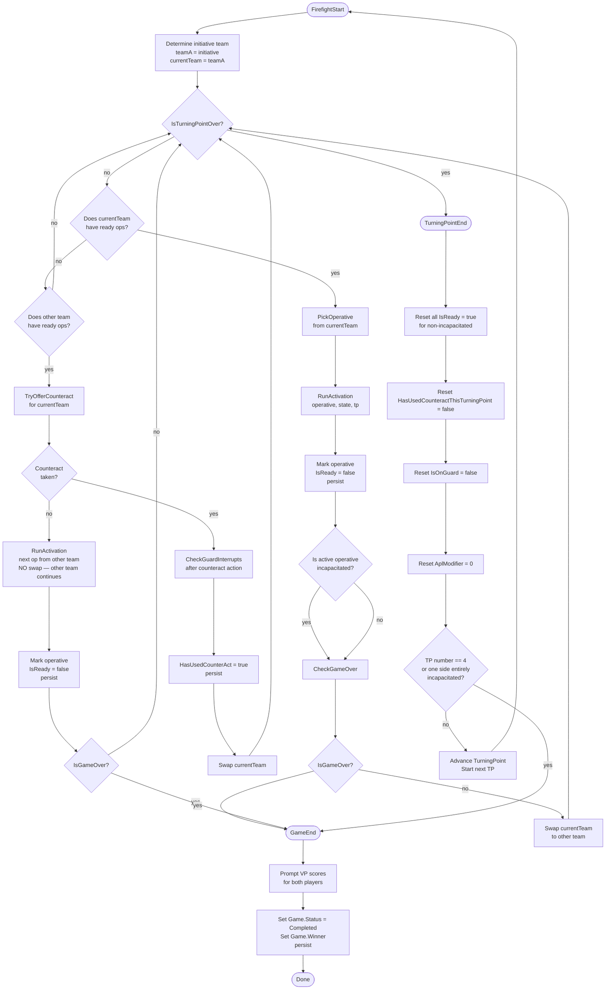

# Spike: Firefight Phase Play Loop

**Status**: Draft  
**Author**: Spike  
**Date**: 2025-07  
**Area**: Kill Team Game Tracking — Firefight Phase Play Loop

---

## 1. Introduction

This spike defines the `FirefightPhaseOrchestrator` — the outermost state machine that governs the
full Firefight Phase within a Turning Point. It covers:

- **Alternation logic**: initiative team activates first; teams alternate; when one side exhausts
  its ready operatives the other activates consecutively.
- **Activation loop**: per-operative order selection → AP expenditure loop → action dispatch.
- **Guard interrupt injection**: after every enemy action the app checks whether any friendly
  operative on Guard is eligible to interrupt; the prompt is injected inline without ending the
  active activation.
- **Counteract triggering**: after each activation during the consecutive-activation period, the
  exhausted team is offered a free 1AP Counteract action for one eligible Engage-order operative.
- **TP-end detection**: both teams have zero ready operatives, or one side is entirely
  incapacitated.
- **Game-end detection**: TP 4 completes, or one side is entirely incapacitated (at any point).

This spike does **not** re-document the Shoot, Fight, or Guard sub-flows. Those are fully specified
in `spike-shoot-ui.md`, `spike-fight-ui.md`, and `spike-guard-action.md` respectively. This spike
specifies how those sub-flows are called from the Firefight Phase loop and what happens before and
after each call.

**Worked example operatives** (used throughout this document):

| Operative | Player | Team | W | APL | Move | Save | Order | Guard |
|---|---|---|---|---|---|---|---|---|
| Intercessor Sergeant | Michael | Angels of Death (initiative) | 15 | 3 | 6″ | 3+ | Engage | — |
| Intercessor Gunner | Michael | Angels of Death | 14 | 2 | 6″ | 3+ | Conceal | — |
| Plague Marine Champion | Solomon | Plague Marines | 15 | 2 | 4″ | 3+ | Engage | **On Guard** |
| Plague Marine Bombardier | Solomon | Plague Marines | 14 | 2 | 4″ | 3+ | Conceal | — |

---

## 2. Firefight Phase State Machine

The diagram below covers the full TP loop. Action sub-flows (Shoot / Fight / Guard interrupt) are
shown as single nodes; their internals are documented in the respective spikes.



---

## 3. `FirefightPhaseOrchestrator` Class Design

```csharp
/// <summary>
/// Owns the Firefight Phase loop for a single game.
/// Handles alternation, guard interrupt injection, counteract, TP-end, and game-end.
/// Delegates action sub-flows to the respective orchestrators.
/// </summary>
public class FirefightPhaseOrchestrator
{
    private readonly IAnsiConsole _console;
    private readonly IGameRepository _gameRepo;
    private readonly IOperativeRepository _operativeRepo;
    private readonly IGameOperativeStateRepository _stateRepo;
    private readonly IActivationRepository _activationRepo;
    private readonly IActionRepository _actionRepo;
    private readonly ShootSessionOrchestrator _shootOrchestrator;
    private readonly FightSessionOrchestrator _fightOrchestrator;
    private readonly GuardInterruptOrchestrator _guardOrchestrator;
    private readonly GuardResolutionService _guardService;

    public FirefightPhaseOrchestrator(
        IAnsiConsole console,
        IGameRepository gameRepo,
        IOperativeRepository operativeRepo,
        IGameOperativeStateRepository stateRepo,
        IActivationRepository activationRepo,
        IActionRepository actionRepo,
        ShootSessionOrchestrator shootOrchestrator,
        FightSessionOrchestrator fightOrchestrator,
        GuardInterruptOrchestrator guardOrchestrator,
        GuardResolutionService guardService)
    { /* assign */ }

    /// <summary>
    /// Entry point. Runs all TPs (or resumes from the current TP if the game was reloaded).
    /// </summary>
    public void Run(Game game, TurningPoint currentTp);

    // ── Private ──────────────────────────────────────────────────────────────

    /// <summary>Runs the full alternation loop for one Turning Point.</summary>
    private void RunFirefightPhase(Game game, TurningPoint tp);

    /// <summary>
    /// Runs the full activation for one operative: order prompt → AP loop → expend.
    /// </summary>
    private void RunActivation(
        Operative operative,
        GameOperativeState state,
        TurningPoint tp,
        Activation activation);

    /// <summary>
    /// After each enemy action: check all friendly On Guard operatives and prompt each for an
    /// interrupt. Runs inline — does not create a new activation context.
    /// </summary>
    private void CheckGuardInterrupts(
        Operative actingOperative,
        GameOperativeState actingState,
        TurningPoint tp);

    /// <summary>
    /// Offers a Counteract action to the team that has just exhausted its ready operatives.
    /// Returns true if a counteract activation was taken (so the outer loop can swap teams).
    /// </summary>
    private bool TryOfferCounteract(Guid exhaustedTeamId, TurningPoint tp);

    /// <summary>True when both teams have zero ready ops, or one side is entirely incapacitated.</summary>
    private bool IsTurningPointOver(TurningPoint tp);

    /// <summary>True when TP 4 is done or one side is entirely incapacitated.</summary>
    private bool IsGameOver(Game game, TurningPoint tp);

    private void EndTurningPoint(Game game, TurningPoint tp);
    private void EndGame(Game game);

    // ── Helpers ──────────────────────────────────────────────────────────────

    private List<GameOperativeState> GetReadyOps(Guid teamId, TurningPoint tp);
    private List<GameOperativeState> GetExpendedEligibleForCounteract(Guid teamId, TurningPoint tp);
    private void DisplayBoardState(Game game, TurningPoint tp);
    private bool CheckAndHandleGameOver(Game game, TurningPoint tp);
}
```

**Dependency notes**:

- `GuardResolutionService` is stateless and injected into both this class and
  `GuardInterruptOrchestrator`. It is the single source of truth for guard eligibility queries.
- `ShootSessionOrchestrator`, `FightSessionOrchestrator`, and `GuardInterruptOrchestrator` each
  return a result record that includes the final wound totals and incapacitation status; the
  orchestrator uses these to update `GameOperativeState` before persisting.

---

## 4. Alternation Logic Pseudocode

```
RunFirefightPhase(game, tp):

    teamA ← game.InitiativeTeamId          // initiative team goes first
    teamB ← other team
    currentTeam ← teamA

    while NOT IsTurningPointOver(tp):

        readyThis  ← GetReadyOps(currentTeam, tp)
        readyOther ← GetReadyOps(otherTeam(currentTeam), tp)

        // ── Case 1: current team has ready operatives ──────────────────────
        if readyThis.Count > 0:
            operative ← PromptPickOperative(readyThis)     // or auto-pick if only one
            activation ← CreateActivation(operative, tp, IsCounteract=false)
            RunActivation(operative, GetState(operative), tp, activation)
            // IsReady = false set inside RunActivation after last action
            if CheckAndHandleGameOver(game, tp): return
            currentTeam ← otherTeam(currentTeam)           // alternate

        // ── Case 2: current team is exhausted, other still has ready ops ───
        elif readyOther.Count > 0:

            // Offer counteract to the exhausted team first
            counteractTaken ← TryOfferCounteract(currentTeam, tp)

            if counteractTaken:
                // Counteract counts as an "activation event" — opponent now activates
                if CheckAndHandleGameOver(game, tp): return
                currentTeam ← otherTeam(currentTeam)
                // Loop continues: other team may have ready ops
            else:
                // No counteract: other team activates its next ready operative
                operative ← PromptPickOperative(readyOther)
                activation ← CreateActivation(operative, tp, IsCounteract=false)
                RunActivation(operative, GetState(operative), tp, activation)
                if CheckAndHandleGameOver(game, tp): return
                // Do NOT swap currentTeam here; currentTeam is still the exhausted team
                // so next iteration will re-offer counteract (or not, if no more eligible)

        // ── Case 3: both teams exhausted ──────────────────────────────────
        else:
            break  // IsTurningPointOver will also be true; explicit break for clarity
```

### Alternation edge cases

| Situation | Behaviour |
|---|---|
| teamA exhausts first; teamB has 3 remaining | teamB activates all 3 consecutively. After **each** teamB activation, `TryOfferCounteract(teamA)` is called. If teamA takes a counteract, the counteract fires, then teamB activates its next ready op. |
| Counteract offered but no eligible operative | `TryOfferCounteract` returns `false` immediately. The other team activates. No second counteract is offered for the same activation gap. |
| Both teams exhaust simultaneously on the same loop iteration | `IsTurningPointOver` returns `true`; the `break` fires; no counteract is offered. |
| Only one team has any operatives at all | The single team activates all consecutively; `TryOfferCounteract` returns `false` every time (opponent has no expended-Engage-order operatives). |

---

## 5. Activation Loop Pseudocode

```
RunActivation(operative, state, tp, activation):

    DisplayActivationHeader(operative, state, tp)

    // ── 1. Order selection ────────────────────────────────────────────────
    order ← Prompt("Select order for [operative.Name]:", [Engage, Conceal])
    state.Order ← order
    activation.OrderSelected ← order
    Persist(state)
    Persist(activation)

    // ── 2. AP calculation ────────────────────────────────────────────────
    baseApl    ← operative.APL
    remainingAP ← baseApl + state.AplModifier   // AplModifier = -1 if Stunned
    // remainingAP may be 0 if Stunned and APL == 1 — activation continues but no actions

    hasMovedNonDash ← false   // used for Heavy weapon filtering

    // ── 3. Action loop ────────────────────────────────────────────────────
    while remainingAP > 0:

        DisplayBoardState(game, tp)
        DisplayApRemaining(operative, remainingAP)

        availableActions ← BuildActionMenu(operative, state, remainingAP, hasMovedNonDash)
        selectedAction   ← PromptActionType(availableActions)

        if selectedAction == EndActivation:
            break

        // ── Shoot ──
        if selectedAction == Shoot:
            result ← shootOrchestrator.Run(operative, state, tp, activation)
            RecordAction(activation, ActionType.Shoot, apCost=1, result)
            remainingAP -= 1
            ApplyWoundChanges(result)
            Persist(state)
            CheckGuardInterrupts(operative, state, tp)
            if state.IsIncapacitated: break

        // ── Fight ──
        elif selectedAction == Fight:
            result ← fightOrchestrator.Run(operative, state, tp, activation)
            RecordAction(activation, ActionType.Fight, apCost=1, result)
            remainingAP -= 1
            ApplyWoundChanges(result)
            Persist(state)
            CheckGuardInterrupts(operative, state, tp)
            if state.IsIncapacitated: break

        // ── Guard ──
        elif selectedAction == Guard:
            state.IsOnGuard ← true
            RecordAction(activation, ActionType.Guard, apCost=1)
            remainingAP -= 1
            Persist(state)
            // Guard action does NOT trigger a guard interrupt check —
            // it is your own action, not an enemy action.

        // ── Movement actions (Reposition / Dash / FallBack / Charge / Other) ──
        else:
            distance ← PromptDistance(selectedAction)
            RecordAction(activation, selectedAction, apCost=1, distance=distance)
            if selectedAction != Dash:
                hasMovedNonDash ← true
            remainingAP -= 1
            Persist(state)
            CheckGuardInterrupts(operative, state, tp)
            // Movement does not incapacitate the moving operative; no break needed.

    // ── 4. Expend operative ───────────────────────────────────────────────
    state.IsReady ← false
    Persist(state)
    DisplayEndOfActivationSummary(operative, activation)
```

### AP edge cases

- `remainingAP == 0` on loop entry: the `while` block is skipped entirely. The operative is still
  activated (order was set), but performs no actions. This is correct for a Stunned APL-1 operative.
- Player selects `EndActivation` with AP remaining: legal. Remaining AP is simply discarded.
- `IsIncapacitated` check after each action: if the active operative is incapacitated by a guard
  interrupt retaliation (the guard interrupt fires, the guarding operative kills the attacker), the
  activation ends immediately.

---

## 6. `CheckGuardInterrupts` Pseudocode

`CheckGuardInterrupts` is called after every enemy action from inside `RunActivation` and also
after a Counteract action from inside `TryOfferCounteract`.

```
CheckGuardInterrupts(actingEnemy, actingEnemyState, tp):

    friendlyTeam ← OpposingTeamOf(actingEnemy)
    candidates   ← guardService.GetEligibleGuards(friendlyTeam, tp)
    // GetEligibleGuards returns all GameOperativeState where:
    //   IsOnGuard == true AND !IsIncapacitated

    if candidates.IsEmpty: return

    for each guardState in candidates:

        // Check 1: has the enemy entered the guard's control range?
        if NOT guardService.IsGuardStillValid(guardState, actingEnemyState):
            guardState.IsOnGuard ← false
            Persist(guardState)
            Display("[Name]'s guard cleared — enemy entered control range.")
            continue

        // Check 2: is the enemy visible to this guard? (player confirms)
        guardOp ← GetOperative(guardState.OperativeId)
        visible ← Prompt(
            "[guardOp.Name] is on Guard. Is [actingEnemy.Name] visible to [guardOp.Name]?",
            [Yes, No])
        if visible == No:
            continue   // guard state preserved; will be checked again after next enemy action

        // Check 3: does the guarding player want to use the interrupt now?
        choice ← Prompt(
            "⚔  Guard interrupt available! Use [guardOp.Name]'s Guard?",
            [Shoot, Fight, Skip])
        if choice == Skip:
            continue   // guard state preserved

        // ── Run the interrupt sub-flow ──
        interruptActivation ← CreateActivation(
            operative    = guardOp,
            tp           = tp,
            IsGuardInterrupt = true,
            IsCounteract = false)
        Persist(interruptActivation)

        if choice == Shoot:
            result ← guardOrchestrator.RunInterrupt(
                guardState, actingEnemyState, InterruptType.Shoot, interruptActivation)
        elif choice == Fight:
            result ← guardOrchestrator.RunInterrupt(
                guardState, actingEnemyState, InterruptType.Fight, interruptActivation)

        ApplyWoundChanges(result)
        Persist(guardState)
        Persist(actingEnemyState)

        // ── Clear guard after interrupt resolves ──
        guardState.IsOnGuard ← false
        Persist(guardState)
        Display("[guardOp.Name]'s guard resolved.")

        // ── Check whether either operative was incapacitated ──
        if actingEnemyState.IsIncapacitated:
            Display("[actingEnemy.Name] has been incapacitated!")
            // Caller (RunActivation) will check IsIncapacitated after this returns
        if guardState.IsIncapacitated:
            Display("[guardOp.Name] has been incapacitated during the interrupt!")

        CheckAndHandleGameOver(game, tp)
        // If game ended, the calling RunActivation will exit via its own IsIncapacitated check.
```

### Multiple guards

When `candidates` contains more than one operative, each is prompted in sequence. A player who
skips an interrupt preserves that guard for the next enemy action; a player who accepts exhausts
the guard. The loop continues until all candidates have been prompted.

---

## 7. Counteract Logic Pseudocode

```
TryOfferCounteract(exhaustedTeamId, tp):

    eligibles ← GetExpendedEligibleForCounteract(exhaustedTeamId, tp)
    // Filters: IsReady == false
    //          Order == Engage
    //          HasUsedCounteractThisTurningPoint == false
    //          IsIncapacitated == false

    if eligibles.IsEmpty: return false

    Display("── Counteract Opportunity ──────────────────")
    Display("Team has no more ready operatives.")
    Display("Eligible to counteract:")
    foreach op in eligibles:
        Display("  • [op.Name]  [op.CurrentWounds]/[op.MaxWounds]W")

    choice ← Prompt("Select an operative to counteract (or Skip):",
                    eligibles + [Skip])

    if choice == Skip: return false

    selectedState ← GetState(choice)
    selectedOp    ← GetOperative(choice.OperativeId)

    activation ← CreateActivation(
        operative    = selectedOp,
        tp           = tp,
        IsCounteract = true,
        IsGuardInterrupt = false)
    Persist(activation)

    Display("── [selectedOp.Name] Counteracts ───────────")
    Display("One 1AP action only. Movement is capped at 2″.")

    // ── Offer the single 1AP action ──
    availableActions ← BuildActionMenu(selectedOp, selectedState, remainingAP=1,
                                       hasMovedNonDash=false,
                                       movementCap=2)
    // movementCap=2 overrides the operative's normal Move stat for this activation only.
    selectedAction ← PromptActionType(availableActions)

    if selectedAction != EndActivation:
        ExecuteAction(selectedAction, selectedOp, selectedState, activation, movementCap=2)
        RecordAction(activation, selectedAction, apCost=1)
        Persist(selectedState)
        // ── After the counteract action: check guard interrupts ──
        CheckGuardInterrupts(selectedOp, selectedState, tp)

    selectedState.HasUsedCounteractThisTurningPoint ← true
    Persist(selectedState)

    return true
```

### Counteract constraints

| Rule | Implementation |
|---|---|
| One counteract per operative per TP | `HasUsedCounteractThisTurningPoint` flag; cleared at TP reset. |
| Only Engage-order operatives | Filtered in `GetExpendedEligibleForCounteract`. |
| Only expended operatives | `IsReady == false` filter. |
| Movement capped at 2″ | `movementCap` parameter passed to movement prompt; `BuildActionMenu` records this in the activation context. |
| One action only | `remainingAP=1` passed to `BuildActionMenu`; loop not entered. |
| Can trigger a guard interrupt | `CheckGuardInterrupts` called after the action executes. |

---

## 8. CLI Transcript — Full TP1 Example

The following transcript shows a complete TP1 Firefight Phase for the worked example. Sections
marked `[INTERNAL]` are application state changes, not displayed to the user.

```
╔══════════════════════════════════════════════════════════════════╗
║  Turning Point 1 — Firefight Phase                               ║
║  Michael (Angels of Death) [3CP]  vs  Solomon (Plague Marines) [2CP] ║
╚══════════════════════════════════════════════════════════════════╝

 ANGELS OF DEATH                            PLAGUE MARINES
 ──────────────────────────────────────     ────────────────────────────────────────
  Intercessor Sergeant  15/15W  Engage        Champion         15/15W  Engage  [🔒 ON GUARD]
  Intercessor Gunner    14/14W  Conceal        Bombardier       14/14W  Conceal

Michael has initiative — Angels of Death activate first.

────────────────────────────────────────────────────────────────────
  ACTIVATION — Michael: Intercessor Sergeant   (APL 3)
────────────────────────────────────────────────────────────────────

Select order:
  > Engage
    Conceal

Order set: Engage   [INTERNAL: state.Order = "Engage", persist]

AP remaining: 3

Available actions:
  > Reposition (1AP)
    Dash       (1AP)
    FallBack   (1AP)
    Charge     (1AP)
    Shoot      (1AP)  [Bolt rifle — Heavy; no non-Dash move yet ✓]
    Guard      (1AP)
    Other      (1AP)
    — End Activation —

Selected: Dash (1AP)

  Distance moved: 4″   [INTERNAL: RecordAction, hasMovedNonDash=false, persist]

[INTERNAL: CheckGuardInterrupts(Sergeant, sergeantState, tp1)]

  ─────────────────────────────────────────────────────────────────
  ⚔  GUARD INTERRUPT — Solomon's Champion
  ─────────────────────────────────────────────────────────────────

  Is the Intercessor Sergeant visible to the Champion? (Y/N)
  > Y

  Guard interrupt! Use Champion's Guard?
  > Shoot
    Fight
    Skip

  Selected: Shoot

[INTERNAL: CreateActivation(Champion, IsGuardInterrupt=true); delegate to guardOrchestrator.RunInterrupt]

  ── Champion SHOOTS at Intercessor Sergeant ──────────────────────
  [See spike-shoot-ui.md for full Shoot sub-flow transcript]

  Bolt rifle: 4 attack dice, Hit 3+, Dmg 3/4, Heavy
  Champion rolls: 5, 3, 1, 2  →  Successes: [5 normal], [3 normal]
                                   Fails:     [1], [2]

  Sergeant saves: roll 2 dice (2 successes) → rolls 4, 6 → save [6 crit], [4 normal]
  Normal success blocked by normal save. Normal success blocked by normal save.
  Result: 0 wounds inflicted.

  Champion's guard resolved.   [INTERNAL: guardState.IsOnGuard = false, persist]
  ─────────────────────────────────────────────────────────────────

  Return to Sergeant's activation.

AP remaining: 2

Available actions:
  > Reposition (1AP)
    Dash       (1AP)
    FallBack   (1AP)
    Charge     (1AP)
    Shoot      (1AP)  [Bolt rifle — Heavy; Dashed only ✓]
    Guard      (1AP)
    Other      (1AP)
    — End Activation —

Selected: Shoot (1AP)

  [INTERNAL: shootOrchestrator.Run(Sergeant, ...) — see spike-shoot-ui.md]
  Targeting: Plague Marine Champion
  Bolt rifle: 4 attack dice, Hit 3+, Dmg 3/4, Heavy
  ... [abbreviated — see spike-shoot-ui.md]
  Result: Champion takes 3 wounds → 12/15W

  [INTERNAL: CheckGuardInterrupts — Champion no longer on Guard; no eligible guards; no interrupt.]

AP remaining: 1

Available actions:
  > Reposition (1AP)
    Dash       (1AP)
    ...
    — End Activation —

Selected: — End Activation —

[INTERNAL: state.IsReady = false, persist]

  ══ End of Activation — Intercessor Sergeant ══════════════════════
   Wounds: 15/15  Order: Engage  AP spent: 2 of 3

 ANGELS OF DEATH                            PLAGUE MARINES
 ──────────────────────────────────────     ────────────────────────────────────────
  Intercessor Sergeant  15/15W  Engage ✓     Champion         12/15W  Engage  (expended)
  Intercessor Gunner    14/14W  Conceal       Bombardier       14/14W  Conceal

────────────────────────────────────────────────────────────────────
  ACTIVATION — Solomon: Plague Marine Champion   (APL 2)
────────────────────────────────────────────────────────────────────

Select order:
  > Engage
    Conceal

Order set: Engage

AP remaining: 2

Available actions:
  > Reposition (1AP)
    Dash       (1AP)
    FallBack   (1AP)
    Charge     (1AP)
    Shoot      (1AP)
    Fight      (1AP)  [enemy in control range? — player confirms]
    Guard      (1AP)
    Other      (1AP)
    — End Activation —

Selected: Dash (1AP)    [Champion advances 4″ toward Sergeant]

  [INTERNAL: CheckGuardInterrupts — no friendly (Angels) operatives on Guard; skip]

AP remaining: 1

Selected: Shoot (1AP)

  [Abbreviated Shoot sub-flow — see spike-shoot-ui.md]
  Result: Sergeant takes 4 wounds → 11/15W

  [INTERNAL: CheckGuardInterrupts — no eligible guards]

[INTERNAL: state.IsReady = false, persist]

  ══ End of Activation — Plague Marine Champion ════════════════════
   Wounds: 12/15  Order: Engage  AP spent: 2 of 2

 ANGELS OF DEATH                            PLAGUE MARINES
 ──────────────────────────────────────     ────────────────────────────────────────
  Intercessor Sergeant  11/15W  Engage ✓     Champion         12/15W  Engage  ✓
  Intercessor Gunner    14/14W  Conceal       Bombardier       14/14W  Conceal

────────────────────────────────────────────────────────────────────
  ACTIVATION — Michael: Intercessor Gunner   (APL 2)
────────────────────────────────────────────────────────────────────

Order set: Engage

AP remaining: 2

Selected: Shoot (1AP)   [Targeting Bombardier]
  ... [abbreviated]
  Result: Bombardier takes 3 wounds → 11/14W

  [INTERNAL: CheckGuardInterrupts — no eligible guards]

Selected: Shoot (1AP)
  ... [abbreviated]
  Result: Bombardier takes 3 wounds → 8/14W

[INTERNAL: state.IsReady = false, persist]

  ══ End of Activation — Intercessor Gunner ════════════════════════
   Wounds: 14/14  Order: Engage  AP spent: 2 of 2

────────────────────────────────────────────────────────────────────
  ACTIVATION — Solomon: Plague Marine Bombardier   (APL 2)
────────────────────────────────────────────────────────────────────

Order set: Conceal

AP remaining: 2

Selected: Dash (1AP)
Selected: Dash (1AP)

[INTERNAL: state.IsReady = false, persist]

  ══ End of Activation — Plague Marine Bombardier ══════════════════
   Wounds: 8/14  Order: Conceal  AP spent: 2 of 2

 ANGELS OF DEATH                            PLAGUE MARINES
 ──────────────────────────────────────     ────────────────────────────────────────
  Intercessor Sergeant  11/15W  Engage ✓     Champion         12/15W  Engage  ✓
  Intercessor Gunner    14/14W  Engage ✓     Bombardier        8/14W  Conceal ✓

[INTERNAL: IsTurningPointOver → readyThis=0, readyOther=0 → true → break]

══════════════════════════════════════════════════════════════════════
  Turning Point 1 ENDS
══════════════════════════════════════════════════════════════════════

[INTERNAL: Reset all IsReady=true, HasUsedCounteractThisTurningPoint=false,
           IsOnGuard=false, AplModifier=0 for non-incapacitated operatives]

  ── Turning Point Summary ─────────────────────────────────────────
   Activations this TP: 4
   Wounds dealt — Michael: 7  |  Solomon: 4
  ──────────────────────────────────────────────────────────────────
```

---

## 9. Action Menu Filtering

`BuildActionMenu` returns the list of available actions given the operative's current state:

| Action | Available when |
|---|---|
| **Reposition** (1AP) | Always |
| **Dash** (1AP) | Always |
| **FallBack** (1AP) | Always |
| **Charge** (1AP) | Always |
| **Shoot** (1AP) | Operative has ≥1 ranged weapon **AND** (`!isHeavy` OR `!hasMovedNonDash`) |
| **Fight** (1AP) | Operative has ≥1 melee weapon **AND** `remainingAP >= 1` **AND** player confirms enemy is in control range |
| **Guard** (1AP) | `state.Order == Engage` **AND** player confirms no enemy within control range |
| **Other** (1AP) | Always (catches abilities, strategem effects, etc.) |
| **End Activation** | Always (even if AP remaining) |

### Heavy weapon rule

A weapon with the `Heavy` keyword restricts movement: the operative may only move via **Dash** if
they wish to also Shoot with that weapon. The activation context tracks `hasMovedNonDash` (a
`bool`). When evaluating whether Shoot is available for a Heavy weapon:

```
canShootHeavy = !hasMovedNonDash
```

`hasMovedNonDash` is set to `true` when any action of type `Reposition`, `FallBack`, `Charge`, or
`Other` is recorded. It remains `false` for `Dash` actions.

### Fight availability

Fight requires an enemy operative within control range (6″). Because the app does not track board
positions numerically, the player is asked to confirm: `"Is an enemy within control range of
[Name]? (Y/N)"`. If Yes, Fight appears in the menu. If No, it is omitted.

### Guard availability

Guard requires Engage order and no enemy within control range. The app checks `state.Order` for the
order constraint. For the control range constraint, the player is asked to confirm: `"Is [Name]
free of enemy control range (no enemy within 6″)? (Y/N)"`. If Yes, Guard appears in the menu.

---

## 10. Board State Display

The board state is displayed at the start of the Firefight Phase, between activations, and at
TP-end. It uses a two-column Spectre.Console table rendered as a panel.

### Standard display

```
╔══════════════════════════════════════════════════════════════════╗
║  Turning Point 1 — Firefight Phase                               ║
║  Michael (Angels of Death) [3CP]  vs  Solomon (Plague Marines) [2CP] ║
╚══════════════════════════════════════════════════════════════════╝

 ANGELS OF DEATH                            PLAGUE MARINES
 ──────────────────────────────────────     ────────────────────────────────────────
  Intercessor Sergeant  15/15W  Engage        Champion         15/15W  Engage  [🔒 ON GUARD]
  Intercessor Gunner    14/14W  Conceal        Bombardier       14/14W  Conceal
```

### With injuries and expended operatives

```
 ANGELS OF DEATH                            PLAGUE MARINES
 ──────────────────────────────────────     ────────────────────────────────────────
  Intercessor Sergeant  11/15W  Engage ✓     Champion         12/15W  Engage  ✓
  Intercessor Gunner    14/14W  Conceal       Bombardier        8/14W  Conceal (Injured)
```

### Badge legend

| Badge | Condition |
|---|---|
| `✓` (check mark, green) | `IsReady == false` (operative has been activated this TP) |
| `[🔒 ON GUARD]` (yellow) | `IsOnGuard == true` |
| `(Injured)` (orange) | `CurrentWounds < MaxWounds * 0.5` (below half wounds — cosmetic indicator) |
| `[INCAPACITATED]` (red) | `IsIncapacitated == true` |

### Spectre.Console implementation notes

- Use a `Table` with two columns (one per team), rendered inside a `Panel`.
- Wound display: `$"{state.CurrentWounds}/{operative.MaxWounds}W"`.
- Apply `Color.Green` to the `✓` badge via markup: `[green]✓[/]`.
- Apply `Color.Yellow` to `[🔒 ON GUARD]`: `[yellow][[🔒 ON GUARD]][/]`.
- Apply `Color.OrangeRed1` to `(Injured)`.
- Apply `Color.Red bold` to `[INCAPACITATED]`.
- CP display reads **live CP from `games.cp_team_a` / `games.cp_team_b`** (updated after every CP
  spend or gain). The `FirefightPhaseOrchestrator` must hold a reference to the current `Game`
  object (or call `IGameRepository.GetByIdAsync`) when rendering the board header — do **not** read
  CP from `TurningPoint.CpTeamA` / `TurningPoint.CpTeamB` here, as those are a snapshot taken at
  Strategy Phase end and will be stale after any CP re-roll during combat.

---

## 11. Edge Cases

### 1. Operative incapacitated mid-activation

After every action that can deal wounds (Shoot, Fight), the result is checked:

```
if actingState.CurrentWounds <= 0:
    actingState.IsIncapacitated = true
    Persist(actingState)
    Display("[Name] has been incapacitated!")
    break  // exit the AP loop immediately
```

The activation is marked complete (`IsReady = false`) even for the incapacitated operative. The
`CheckAndHandleGameOver` method is then called before the outer loop swaps teams.

### 2. Both teams simultaneously have 0 ready operatives

This occurs when the last activation of teamA is also the last activation of teamB in the same TP
iteration. `IsTurningPointOver` is checked at the top of the `while` loop:

```
IsTurningPointOver(tp):
    return GetReadyOps(teamA, tp).Count == 0
        && GetReadyOps(teamB, tp).Count == 0
    OR AllOperativesIncapacitated(teamA or teamB)
```

No counteract is offered. The `break` fires (or the `while` condition short-circuits). This prevents
the edge case of one team being offered a counteract when in fact neither team has any further
activations to "react" to.

### 3. Counteract + Guard in the same turn

Sequence:

1. teamA is exhausted; teamB just activated.
2. `TryOfferCounteract(teamA)` fires. Player selects operative A1 to counteract.
3. A1 performs a Dash (1AP). `CheckGuardInterrupts` is called.
4. teamB has operative B1 on Guard; B1 can see A1. Player accepts interrupt.
5. `guardOrchestrator.RunInterrupt(B1, A1, Shoot)` runs. B1 shoots A1.
6. Guard cleared on B1. A1's counteract activation ends.
7. `HasUsedCounteractThisTurningPoint = true` on A1.
8. `TryOfferCounteract` returns `true`. Loop swaps to teamB.
9. teamB activates its next ready operative normally.

### 4. Guard interrupt incapacitates the active operative

After `guardOrchestrator.RunInterrupt` returns, `actingEnemyState.IsIncapacitated` is checked:

```
if actingEnemyState.IsIncapacitated:
    // The RunActivation caller checks this after CheckGuardInterrupts returns:
    if state.IsIncapacitated: break  // exit AP loop
```

The `RunActivation` AP loop checks `if state.IsIncapacitated: break` after every
`CheckGuardInterrupts` call, so the incapacitation discovered inside the guard sub-flow propagates
correctly back to the caller.

### 5. Multiple guards eligible simultaneously

`CheckGuardInterrupts` iterates over all eligible guards in order. Each guard is prompted
independently. Example: teamB has both B1 (on Guard) and B2 (on Guard) when A1 performs a Shoot.

- B1 is prompted: player skips. B1's guard preserved.
- B2 is prompted: player accepts, selects Fight. Guard sub-flow runs. B2's guard cleared.
- After loop: return to A1's activation.

The order of the `candidates` list should be deterministic (e.g., sorted by `SequenceNumber` of
the guard action, ascending — i.e., the operative who took Guard earliest is prompted first).

### 6. AP exhausted before player selects "End Activation"

```
while remainingAP > 0:   // loop exits automatically when AP reaches 0
```

When `remainingAP` reaches 0, the `while` condition is false; the loop exits without prompting for
`End Activation`. The `IsReady = false` line runs. This is the normal case for most operatives who
expend their full APL.

### 7. AplModifier (Stun)

Stun applies `AplModifier = -1` to the operative's state. At the start of `RunActivation`:

```
remainingAP = operative.APL + state.AplModifier
```

| APL | AplModifier | remainingAP |
|---|---|---|
| 3 | 0 | 3 |
| 2 | -1 | 1 |
| 1 | -1 | 0 |

For `remainingAP == 0`, the `while` block is skipped. The operative is still considered activated
(their order is selected and `IsReady` is set to `false`). This is correct: a Stunned APL-1
operative activates but can take no actions.

`AplModifier` is reset to `0` at TP-end (`EndTurningPoint`) along with the other TP-boundary
resets.

### 8. Resume in-progress game

On application startup, `play <game-id>` loads all `GameOperativeState` records from the database.
To resume a mid-TP game:

1. Load the current `TurningPoint` record — the row with the **highest `number`** for the given
   `game_id` whose parent `Game` has `status = 'InProgress'`. There is no `status` column on
   `turning_points`; resume eligibility lives on the `games` table. Once the turning point row is
   found, the `is_strategy_phase_complete` flag tells us where in the flow to re-enter:
   `0` = still in the Strategy Phase, `1` = already in the Firefight Phase.
2. Load all `GameOperativeState` records for the game.
3. Operatives with `IsReady == false` are treated as already expended this TP.
4. Operatives with `IsReady == true` are still available for activation.
5. The `currentTeam` is reconstructed by counting activations in the current TP:
   if the total activation count is even, it is the initiative team's turn;
   if odd, it is the non-initiative team's turn.
6. `HasUsedCounteractThisTurningPoint` is loaded directly from the persisted state.
7. `IsOnGuard` is loaded from the persisted state (guard persists across an app restart within a TP).

```csharp
// Startup reconstruction
// Resume: find the current TurningPoint
// = the turning_points row with the MAX number for the given game_id
//   whose parent game has status = 'InProgress'
// (if is_strategy_phase_complete = 0, we are in the Strategy Phase;
//  if is_strategy_phase_complete = 1, we are in the Firefight Phase)
// SELECT tp.*
// FROM turning_points tp
// JOIN games g ON g.id = tp.game_id
// WHERE tp.game_id = @gameId
//   AND g.status = 'InProgress'
// ORDER BY tp.number DESC
// LIMIT 1
var currentTp   = await _tpRepo.GetCurrentAsync(game.Id);
var allStates   = await _stateRepo.GetAllByGameAsync(game.Id);
var activations = await _activationRepo.GetByTurningPointAsync(currentTp.Id);
int activationCount = activations.Count(a => !a.IsCounteract && !a.IsGuardInterrupt);
bool initiativeGoesNext = activationCount % 2 == 0;
Guid currentTeam = initiativeGoesNext ? game.InitiativeTeamId : OtherTeam(game);
```

---

## 12. Persistence Strategy

All state changes are persisted immediately after they occur. No batching.

| Event | Persisted entity | Fields updated |
|---|---|---|
| Order selected | `GameOperativeState`, `Activation` | `Order`, `OrderSelected` |
| Action recorded | `Action` | Created with type, APCost; updated with result after resolution |
| Wound change | `GameOperativeState` | `CurrentWounds`, `IsIncapacitated` |
| Guard taken | `GameOperativeState` | `IsOnGuard = true` |
| Guard cleared | `GameOperativeState` | `IsOnGuard = false` |
| Counteract used | `GameOperativeState` | `HasUsedCounteractThisTurningPoint = true` |
| Operative expended | `GameOperativeState` | `IsReady = false` |
| TP end reset | `GameOperativeState` (all) | `IsReady = true`, `IsOnGuard = false`, `HasUsedCounteractThisTurningPoint = false`, `AplModifier = 0` |
| Game end | `Game` | `Status = Completed`, `Winner`, `VpTeamA`, `VpTeamB` |

### Activation record lifecycle

```
CreateActivation(...)
  → INSERT Activation with IsCounteract, IsGuardInterrupt, SequenceNumber
  → (NarrativeNote added post-activation if player annotates)
```

### Action record lifecycle

```
CreateAction(activationId, type, apCost)
  → INSERT Action (result fields null)
  → ... sub-flow runs ...
  → UpdateAction(id, resultFields)
  → persist
```

The `Action` record is created *before* the sub-flow (so a crash mid-sub-flow leaves a partial
record that can be detected and cleaned up on resume).

### TurningPoint fields

`TurningPoint.CpTeamA` and `TurningPoint.CpTeamB` are a **snapshot** captured at the end of the
Strategy Phase (once per turning point). They are **never mutated** after that point and are used
only for post-game `view-game` logs — to show what CP each team had at the start of each TP's
Firefight Phase.

**Live CP** during play is stored on `games.cp_team_a` and `games.cp_team_b`, which are updated
after every CP spend or gain. The two-level design is therefore:

| Field | Table | Semantics |
|---|---|---|
| `cp_team_a` / `cp_team_b` | `games` | **Live / mutable** — updated on every CP spend or gain |
| `cp_team_a` / `cp_team_b` | `turning_points` | **Snapshot** — set once at Strategy Phase end, never mutated |

---

## 13. xUnit Tests

```csharp
/// <summary>
/// Verifies that the initiative team activates first at the start of TP1.
/// </summary>
[Fact]
public void FirefightPhase_AlternationOrder_InitiativeTeamGoesFirst()
{
    // Arrange
    // Create a game with teamA (initiative) and teamB.
    // Each team has one operative with IsReady=true.
    // Mock stateRepo to return two ready states (one per team).
    // Capture the sequence of RunActivation calls.

    // Act
    // orchestrator.RunFirefightPhase(game, tp)

    // Assert
    // First recorded activation operative belongs to teamA (initiative).
    // Second recorded activation operative belongs to teamB.
}

/// <summary>
/// When teamA has no more ready operatives and teamB has two, teamB activates both
/// consecutively without teamA intervening (no counteract eligible).
/// </summary>
[Fact]
public void FirefightPhase_ConsecutiveActivations_WhenOneTeamExhausted()
{
    // Arrange
    // teamA: 0 ready operatives, 1 expended on Conceal (not eligible for counteract).
    // teamB: 2 ready operatives.
    // TryOfferCounteract returns false (no Engage-order expended ops).

    // Act
    // orchestrator.RunFirefightPhase(game, tp)

    // Assert
    // Both of teamB's operatives were activated consecutively.
    // teamA had zero activations in this run.
    // TryOfferCounteract was called twice (once per teamB activation) but returned false.
}

/// <summary>
/// Counteract is offered when teamA is exhausted and has an eligible Engage-order operative.
/// </summary>
[Fact]
public void FirefightPhase_Counteract_OfferedWhenExpiredTeamEligible()
{
    // Arrange
    // teamA: 0 ready operatives, 1 expended on Engage, HasUsedCounteractThisTurningPoint=false.
    // teamB: 1 ready operative.
    // Mock console to select the eligible operative when counteract is offered.

    // Act
    // TryOfferCounteract(teamA.Id, tp)

    // Assert
    // Method returns true.
    // stateRepo.Update called with HasUsedCounteractThisTurningPoint=true.
    // Activation record created with IsCounteract=true.
}

/// <summary>
/// Counteract is not offered when no expended operative meets the eligibility criteria.
/// </summary>
[Fact]
public void FirefightPhase_Counteract_NotOfferedWhenNoEligibleOperatives()
{
    // Arrange
    // Scenario A: all expended operatives are on Conceal order.
    // Scenario B: only expended operative has HasUsedCounteractThisTurningPoint=true.
    // Scenario C: only expended operative is Incapacitated.

    // Act
    // bool result = TryOfferCounteract(teamA.Id, tp) for each scenario.

    // Assert
    // result == false in all three scenarios.
    // No Activation record created.
    // No console prompt shown.
}

/// <summary>
/// A guard interrupt fires after an enemy action when an eligible guard operative exists.
/// </summary>
[Fact]
public void FirefightPhase_GuardInterrupt_FiresAfterEnemyAction()
{
    // Arrange
    // friendlyOp: IsOnGuard=true, Order=Engage, not incapacitated.
    // enemyOp: performing a Dash action.
    // guardService.GetEligibleGuards returns [friendlyOp].
    // guardService.IsGuardStillValid returns true.
    // Mock console: visible=Yes, choice=Shoot.
    // guardOrchestrator.RunInterrupt returns a ShootResult.

    // Act
    // CheckGuardInterrupts(enemyOp, enemyState, tp)

    // Assert
    // guardOrchestrator.RunInterrupt called once with InterruptType.Shoot.
    // Activation created with IsGuardInterrupt=true.
    // guardState.IsOnGuard set to false and persisted.
}

/// <summary>
/// Skipping a guard interrupt preserves the IsOnGuard flag.
/// </summary>
[Fact]
public void FirefightPhase_GuardSkip_PreservesGuardState()
{
    // Arrange
    // friendlyOp: IsOnGuard=true.
    // guardService.GetEligibleGuards returns [friendlyOp].
    // guardService.IsGuardStillValid returns true.
    // Mock console: visible=Yes, choice=Skip.

    // Act
    // CheckGuardInterrupts(enemyOp, enemyState, tp)

    // Assert
    // guardOrchestrator.RunInterrupt NOT called.
    // guardState.IsOnGuard remains true.
    // No Activation record created.
}

/// <summary>
/// At the end of a Turning Point, all ready/guard/counteract flags are reset.
/// AplModifier is cleared to 0.
/// </summary>
[Fact]
public void FirefightPhase_TurningPointEnd_ResetsAllFlags()
{
    // Arrange
    // Operative A: IsReady=false, IsOnGuard=true, HasUsedCounteractThisTurningPoint=true, AplModifier=-1.
    // Operative B: IsReady=false, IsOnGuard=false, HasUsedCounteractThisTurningPoint=false, AplModifier=0.
    // Operative C: IsIncapacitated=true (should NOT have IsReady reset to true).

    // Act
    // EndTurningPoint(tp)

    // Assert
    // Operative A: IsReady=true, IsOnGuard=false, HasUsedCounteractThisTurningPoint=false, AplModifier=0.
    // Operative B: IsReady=true, unchanged flags.
    // Operative C: IsReady remains false (incapacitated operatives are not reset).
    // All state changes persisted to stateRepo.
}

/// <summary>
/// The game ends and is marked Completed when all operatives on one team are incapacitated.
/// VP scores are prompted and stored.
/// </summary>
[Fact]
public void FirefightPhase_GameEnd_WhenAllOperativesIncapacitated()
{
    // Arrange
    // teamA: all operatives IsIncapacitated=true (incapacitated mid-TP after a Fight action).
    // teamB: 1 operative active, non-incapacitated.
    // Mock console: VP prompt returns vpTeamA=0, vpTeamB=6.

    // Act
    // CheckAndHandleGameOver(game, tp)  [which calls EndGame when condition met]

    // Assert
    // EndGame called.
    // game.Status set to Completed, game.Winner set to teamB.Id.
    // game.VpTeamA=0, game.VpTeamB=6.
    // gameRepo.Update called with updated game record.
}

/// <summary>
/// Verifies that resume correctly identifies the next team to activate based on the even/odd
/// activation count rule (even count → initiative team is next; odd count → non-initiative team
/// is next), and that operatives already expended (IsReady = false) are excluded from the ready list.
/// </summary>
[Fact]
public async Task ResumeGame_WithTwoExistingActivations_IdentifiesCorrectCurrentTeamAndSkipsExpendedOps()
{
    // Arrange: a game in TP1, initiative = Team A
    // Two activations already recorded: A1 (Team A), then A2 (Team B)
    // Next activation should be Team A (alternation: A→B→A→...)
    // Both A1 and A2's operatives should be marked expended (IsReady = false)
    var db = await new TestDbBuilder()
        .WithGame(gameId, teamAId, teamBId)
        .WithTurningPoint(tpId, gameId, number: 1, strategyPhaseComplete: true)
        .WithOperative(opA1Id, teamAId, "Sergeant")
        .WithOperative(opB1Id, teamBId, "Plague Marine")
        .WithGameOperativeState(opA1Id, gameId, isReady: false)  // expended
        .WithGameOperativeState(opB1Id, gameId, isReady: false)  // expended
        .WithActivation(act1Id, tpId, sequenceNumber: 1, teamId: teamAId, operativeId: opA1Id)
        .WithActivation(act2Id, tpId, sequenceNumber: 2, teamId: teamBId, operativeId: opB1Id)
        .BuildAsync();

    var sut = new FirefightPhaseOrchestrator(/* inject repos */);

    // Act
    var state = await sut.ReconstructStateAsync(gameId);

    // Assert
    state.NextTeamToActivate.Should().Be(teamAId);          // sequence 2 = Team B last → Team A next
    state.ReadyOperatives.Should().BeEmpty();               // all expended — TP should auto-end
}
```

---

*End of Spike: Firefight Phase Play Loop*
