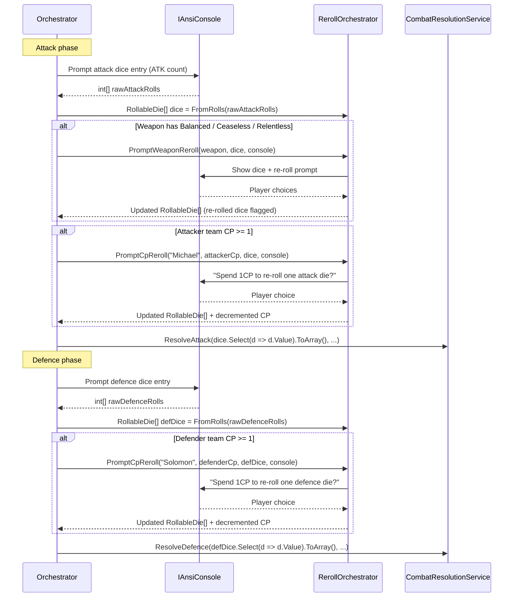

# Spike: Re-roll Mechanics CLI Flow

**Status**: Draft  
**Author**: Spike  
**Date**: 2025-07  
**Area**: Kill Team Game Tracking — Re-roll Mechanics

---

## 1. Introduction

Re-rolls are a mid-resolution interrupt that can change the outcome of any Shoot or Fight action.
They are **not** a post-resolution adjustment; they must be resolved before the dice pool is
finalised and passed to `CombatResolutionService` / `FightResolutionService`. This means the
orchestrator must hold dice in an in-memory structure between "raw entry" and "pool finalisation",
and must track which dice have already been re-rolled so they cannot be re-rolled a second time.

Three weapon-based re-roll rules exist (Balanced, Ceaseless, Relentless). All three are
**attacker-only** and fire **before** any CP Re-roll. Additionally, either player may spend 1CP to
re-roll a single die from either pool (attack or defence). The CP Re-roll is offered **after**
weapon re-rolls for the attacker, and independently for the defender after their dice entry.

The ordering and "no re-reroll" constraint make this the most UX-intensive sub-flow in the app.
Getting it wrong produces illegal game states (double re-rolls, CP re-rolls on already-re-rolled
dice) that are impossible to detect after the fact. This spike defines the exact UX transcripts,
the `RollableDie` in-memory model, the `RerollOrchestrator` service, enforcement logic, and xUnit
test stubs sufficient to implement the feature from this document alone.

**Worked example operatives** (used throughout this document):

| Operative | Player | Side | W | Save |
|---|---|---|---|---|
| Intercessor Gunner ("Michael") | Michael | Attacker | 14 | 3+ |
| Plague Marine Fighter ("Solomon") | Solomon | Defender | 14 | 3+ |

Weapons used in examples:

| Example | Weapon | ATK | Hit | DMG | Special Rules |
|---|---|---|---|---|---|
| A — Bolt rifle | Bolt rifle | 4 | 3+ | 3/4 | Piercing Crits 1 |
| B — Thunder hammer (hypothetical) | Thunder hammer | 3 | 4+ | 5/6 | **Balanced** |
| C — Hypno-gauntlet (hypothetical) | Hypno-gauntlet | 4 | 3+ | 2/3 | **Ceaseless** |
| D — Assault cannon (hypothetical) | Assault cannon | 6 | 3+ | 3/4 | **Relentless** |

> None of the starter-set weapons (Angels of Death or Plague Marines) have Balanced, Ceaseless, or
> Relentless. Examples B–D are explicitly hypothetical to demonstrate the UX for each rule.

---

## 2. Rules Recap

### 2.1 Weapon Re-roll Rules (Attacker Only)

> **Official rules text (verbatim, Kill Team V3.0 reference card):**

| Rule | Exact definition | Trigger |
|---|---|---|
| **Balanced** | Re-roll one attack dice. | After initial attack dice entry, before CP Re-roll. |
| **Ceaseless** | Re-roll all results of one number. | After initial attack dice entry. Player chooses which face value to re-roll. |
| **Relentless** | Re-roll any or all attack dice. | After initial attack dice entry. Player selects which specific dice to re-roll. |

### 2.2 CP Re-roll (Both Players)

| Rule | Exact definition | Trigger |
|---|---|---|
| **CP Re-roll** | Spend 1CP to re-roll one attack die OR one defence die. A die that has already been re-rolled by any means cannot be re-rolled again ("never re-roll a re-roll"). | After weapon re-rolls (for attacker); after dice entry (for defender). |

### 2.3 Key Constraints

- Weapon re-rolls (Balanced / Ceaseless / Relentless) apply to **attack dice only**.
- Weapon re-rolls fire **before** any CP Re-roll.
- CP Re-roll: the **attacker** is offered re-roll on attack dice after weapon re-rolls complete.
  The **defender** is offered re-roll on defence dice after their dice entry.
- Either player may use their team's CP on either pool (attack or defence). For simplicity, the
  app prompts the **shooter's team** to offer CP Re-roll on **attack dice** first, then prompts
  the **defender's team** to offer CP Re-roll on **defence dice**. Each team may spend at most
  1CP per action on CP Re-roll.
- **Never re-roll a re-roll**: any die that was re-rolled (by weapon rule or CP) is excluded from
  all subsequent re-roll prompts.

### 2.4 Re-roll Ordering Diagram

```
Attack dice entry
        │
        ▼
  ┌─────────────────────────────────────────────┐
  │  Weapon re-roll prompt (attacker only)       │
  │  Balanced  → player selects 1 die            │
  │  Ceaseless → player selects 1 face value     │
  │  Relentless → player selects any/all dice    │
  │  (skipped if weapon has none of these rules) │
  └─────────────────────────────────────────────┘
        │
        ▼  (re-rolled dice marked HasBeenRerolled = true)
  ┌─────────────────────────────────────────────┐
  │  Attacker CP Re-roll prompt                  │
  │  • Only if attacker team has ≥ 1CP           │
  │  • Selects one un-re-rolled attack die        │
  │  • 1CP deducted                              │
  │  (skipped if 0CP or attacker declines)       │
  └─────────────────────────────────────────────┘
        │
        ▼  (attack pool finalised → CombatResolutionService)
Attack dice classified  (CRIT / HIT / MISS)
        │
        ▼
Defence dice entry
        │
        ▼
  ┌─────────────────────────────────────────────┐
  │  Defender CP Re-roll prompt                  │
  │  • Only if defender team has ≥ 1CP           │
  │  • Selects one un-re-rolled defence die       │
  │  • 1CP deducted                              │
  │  (skipped if 0CP or defender declines)       │
  └─────────────────────────────────────────────┘
        │
        ▼  (defence pool finalised → CombatResolutionService)
Defence dice classified  (SAVE / MISS)
        │
        ▼
Save allocation & damage
```

---

## 3. `RollableDie` Record Design

The re-roll tracking record is **in-memory only**. It is constructed after dice are entered and
discarded once the action resolves. Only the final `int[]` values are persisted.

```csharp
/// <summary>
/// Represents a single die in an attack or defence pool during re-roll resolution.
/// Index: 1-based position in the pool (A1, A2 … / D1, D2 …).
/// Value: current face value (updated in-place when re-rolled).
/// HasBeenRerolled: true if this die was re-rolled by any means (weapon rule or CP).
///   Once true, this die is ineligible for any further re-roll.
/// </summary>
public record RollableDie(int Index, int Value, bool HasBeenRerolled)
{
    /// <summary>Returns a new RollableDie with Value replaced and HasBeenRerolled set to true.</summary>
    public RollableDie WithReroll(int newValue) => this with { Value = newValue, HasBeenRerolled = true };
}
```

**Conventions:**

- `Index` is 1-based: the first attack die is `Index = 1` (displayed as `A1`), the first defence
  die is `Index = 1` (displayed as `D1`).
- `RollableDie` is a positional record; use `with` expressions when updating — never mutate.
- The array is held as `RollableDie[]` (mutable array reference, but each element is replaced with
  a new record rather than mutated in place).

**Factory helper:**

```csharp
public static class RollableDieFactory
{
    /// <summary>Wraps raw int[] rolls into a RollableDie array (no dice are marked as re-rolled).</summary>
    public static RollableDie[] FromRolls(int[] rolls) =>
        rolls.Select((v, i) => new RollableDie(i + 1, v, HasBeenRerolled: false)).ToArray();
}
```

---

## 4. Re-roll Sequence Diagram



---

## 5. CLI Transcript — Balanced

**Weapon**: Thunder hammer (ATK 3, Hit 4+, DMG 5/6, **Balanced**)  
**Scenario**: Michael fires; rolls 6, 3, 1. Balanced lets him re-roll one die.

```
╔══════════════════════════════════════════════════════════════════╗
║                    🎯  SHOOT ACTION  🎯                           ║
║                    Intercessor Gunner                            ║
╚══════════════════════════════════════════════════════════════════╝

  Gunner rolls 3 dice  (Thunder hammer, Hit 4+)

Enter Gunner's dice results (space or comma separated):
> 6 3 1

  A1:  6  →  CRIT  ✓
  A2:  3  →  MISS  ✗
  A3:  1  →  MISS  ✗

Attack pool: 1 die  (1 CRIT, 0 HITs)

──────────────────────────────────────────────────────────
  Balanced: You may re-roll one attack die.
──────────────────────────────────────────────────────────

Select a die to re-roll (or skip):
    A1:  6  (CRIT)   ← already a crit — risky to re-roll
  > A2:  3  (MISS)
    A3:  1  (MISS)
    [Skip — keep all dice]

> A2:  3  (MISS)

Enter new value for A2:
> 5

  A2 re-rolled: 3 → 5  (HIT ✓)

  A1:  6  →  CRIT  ✓
  A2:  5  →  HIT   ✓  [re-rolled]
  A3:  1  →  MISS  ✗

Attack pool: 2 dice  (1 CRIT, 1 HIT)
```

**Notes:**
- Re-rolled dice are labelled `[re-rolled]` in all subsequent displays.
- Balanced re-roll is optional — `[Skip — keep all dice]` is always the last option.
- The player selected A2 (a miss). A1 was a CRIT — players will typically avoid re-rolling a CRIT,
  but the app does not restrict the choice. All dice (including crits) are offered.
- After re-roll, A2 is `HasBeenRerolled = true`; it will not appear in the CP Re-roll prompt.

---

## 6. CLI Transcript — Ceaseless

**Weapon**: Hypno-gauntlet (ATK 4, Hit 3+, DMG 2/3, **Ceaseless**)  
**Scenario**: Michael fires; rolls 4, 2, 2, 1. Ceaseless: he may re-roll all dice showing one
chosen face value.

```
  Gunner rolls 4 dice  (Hypno-gauntlet, Hit 3+)

Enter Gunner's dice results (space or comma separated):
> 4 2 2 1

  A1:  4  →  HIT   ✓
  A2:  2  →  MISS  ✗
  A3:  2  →  MISS  ✗
  A4:  1  →  MISS  ✗

Attack pool: 1 die  (0 CRITs, 1 HIT)

──────────────────────────────────────────────────────────
  Ceaseless: Re-roll all dice showing one chosen value.
──────────────────────────────────────────────────────────

Choose a face value to re-roll (all dice showing that value will be re-rolled),
or skip:
  > 2  (affects 2 dice: A2, A3)
    1  (affects 1 die:  A4)
    4  (affects 1 die:  A1)
    [Skip — keep all dice]

> 2

  Re-rolling 2 dice showing value 2: A2, A3.

Enter new value for A2:
> 5

Enter new value for A3:
> 3

  A2 re-rolled: 2 → 5  (HIT  ✓)  [re-rolled]
  A3 re-rolled: 2 → 3  (HIT  ✓)  [re-rolled]

  A1:  4  →  HIT   ✓
  A2:  5  →  HIT   ✓  [re-rolled]
  A3:  3  →  HIT   ✓  [re-rolled]
  A4:  1  →  MISS  ✗

Attack pool: 3 dice  (0 CRITs, 3 HITs)
```

**Notes:**
- The list of choosable values shows **only face values that appear in the current dice pool**.
  Offering `2` is meaningful; offering `6` (which no die shows) would be confusing.
- Each matching die is prompted for a new value individually.
- All re-rolled dice are marked `HasBeenRerolled = true` and excluded from the CP Re-roll prompt.
- Edge case: if **all** dice show the chosen value (e.g. rolling 2, 2, 2, 2 and choosing `2`),
  all four dice are re-rolled. See §13 for this edge case.

---

## 7. CLI Transcript — Relentless

**Weapon**: Assault cannon (ATK 6, Hit 3+, DMG 3/4, **Relentless**)  
**Scenario**: Michael fires; rolls 6, 5, 3, 2, 1, 1. Relentless: he may re-roll any or all dice.

```
  Gunner rolls 6 dice  (Assault cannon, Hit 3+)

Enter Gunner's dice results (space or comma separated):
> 6 5 3 2 1 1

  A1:  6  →  CRIT  ✓
  A2:  5  →  HIT   ✓
  A3:  3  →  HIT   ✓
  A4:  2  →  MISS  ✗
  A5:  1  →  MISS  ✗
  A6:  1  →  MISS  ✗

Attack pool: 3 dice  (1 CRIT, 2 HITs)

──────────────────────────────────────────────────────────
  Relentless: You may re-roll any or all attack dice.
──────────────────────────────────────────────────────────

Select dice to re-roll (space-bar to toggle, Enter to confirm):

  [ ] A1:  6  (CRIT)
  [ ] A2:  5  (HIT)
  [ ] A3:  3  (HIT)
  [x] A4:  2  (MISS)
  [x] A5:  1  (MISS)
  [x] A6:  1  (MISS)
      [Done — re-roll selected / skip if none selected]

> (player toggles A4, A5, A6 and presses Enter)

  Re-rolling 3 dice: A4, A5, A6.

Enter new value for A4:
> 4

Enter new value for A5:
> 6

Enter new value for A6:
> 2

  A4 re-rolled: 2 → 4  (HIT  ✓)  [re-rolled]
  A5 re-rolled: 1 → 6  (CRIT ✓)  [re-rolled]
  A6 re-rolled: 1 → 2  (MISS ✗)  [re-rolled]

  A1:  6  →  CRIT  ✓
  A2:  5  →  HIT   ✓
  A3:  3  →  HIT   ✓
  A4:  4  →  HIT   ✓  [re-rolled]
  A5:  6  →  CRIT  ✓  [re-rolled]
  A6:  2  →  MISS  ✗  [re-rolled]

Attack pool: 5 dice  (2 CRITs, 3 HITs)
```

**Notes:**
- The checkbox list is rendered via `Spectre.Console`'s `MultiSelectionPrompt<T>`.
- No minimum selection — the player may toggle zero dice and press Enter (equivalent to Skip).
- A dice already marked `[re-rolled]` (from an earlier weapon re-roll of the same type stacked) is
  not shown in the list — but Relentless is the only weapon re-roll rule; you cannot have both
  Balanced and Relentless on the same weapon.
- A6 was re-rolled to a miss: the player's choice, the app does not validate.

---

## 8. CLI Transcript — CP Re-roll (Attacker)

**Context**: After the Relentless roll above. Attack pool is finalised as above. Michael's team has
2CP remaining after the activation. The attacker CP Re-roll is offered **after** weapon re-rolls.

```
──────────────────────────────────────────────────────────
  Attacker CP Re-roll  (Michael's team: 2CP)
  Spend 1CP to re-roll one attack die?
──────────────────────────────────────────────────────────

  > Yes — select a die
    No  — keep all dice

> Yes — select a die

Which attack die to re-roll?
  (Dice marked [re-rolled] cannot be re-rolled again.)

    A1:  6  (CRIT)
    A2:  5  (HIT)
    A3:  3  (HIT)
    A4:  4  (HIT)   [re-rolled — ineligible]
    A5:  6  (CRIT)  [re-rolled — ineligible]
    A6:  2  (MISS)  [re-rolled — ineligible]
    [Cancel]

  Eligible dice: A1, A2, A3

> A3:  3  (HIT)

Enter new value for A3:
> 6

  A3 re-rolled: 3 → 6  (CRIT ✓)  [re-rolled]
  1CP spent. Michael's team: 2CP → 1CP.

  A1:  6  →  CRIT  ✓
  A2:  5  →  HIT   ✓
  A3:  6  →  CRIT  ✓  [re-rolled]
  A4:  4  →  HIT   ✓  [re-rolled]
  A5:  6  →  CRIT  ✓  [re-rolled]
  A6:  2  →  MISS  ✗  [re-rolled]

Final attack pool: 5 dice  (3 CRITs, 2 HITs)
```

**Notes:**
- Dice marked `[re-rolled — ineligible]` are shown greyed out (Spectre markup `[grey]…[/]`) but
  are **not** selectable — they are listed for context only.
- If all attack dice have been re-rolled (e.g. Relentless re-rolled all six), the CP Re-roll prompt
  is skipped entirely because no eligible dice remain.
- `[Cancel]` lets the player say "Yes" then change their mind without spending CP.
- After choosing `[Cancel]`, the prompt returns to the Yes/No question without spending CP.

---

## 9. CLI Transcript — CP Re-roll (Defender)

**Context**: Michael fires bolt rifle (ATK 4, Hit 3+, Piercing Crits 1) at Solomon.  
Attack dice: 6, 5, 4, 1 → CRIT, HIT, HIT, MISS. Piercing Crits 1 fires (attacker has a crit):
remove 1 defence die. Solomon rolls 3 dice (4 base − 1 Piercing Crits = 3).  
Solomon's save is 3+. He rolls: 5, 3, 1 → SAVE, SAVE, MISS. Solomon's team has 2CP.

```
  Gunner rolls 4 dice  (Bolt rifle, Hit 3+)
Enter Gunner's dice results:
> 6 5 4 1

  A1:  6  →  CRIT  ✓
  A2:  5  →  HIT   ✓
  A3:  4  →  HIT   ✓
  A4:  1  →  MISS  ✗

Attack pool: 3 dice  (1 CRIT, 2 HITs)

  [No weapon re-roll — bolt rifle has no Balanced / Ceaseless / Relentless]

──────────────────────────────────────────────────────────
  Attacker CP Re-roll  (Michael's team: 3CP)
  Spend 1CP to re-roll one attack die?
──────────────────────────────────────────────────────────

  > Yes — select a die
    No  — keep all dice

> No  — keep all dice

  (Michael declines — pool is already strong.)

  Piercing Crits 1: attacker has 1 crit → remove 1 defence die before rolling.
  Solomon rolls 3 dice  (4 base − 1 = 3)

──────────────────────────────────────────────────────────
  Solomon rolls defence dice (Save 3+) — 3 dice
──────────────────────────────────────────────────────────

Enter Solomon's defence dice results:
> 5 3 1

  D1:  5  →  SAVE  ✓
  D2:  3  →  SAVE  ✓
  D3:  1  →  MISS  ✗

Defence pool: 2 saves, 1 miss.

──────────────────────────────────────────────────────────
  Defender CP Re-roll  (Solomon's team: 2CP)
  Spend 1CP to re-roll one defence die?
──────────────────────────────────────────────────────────

  > Yes — select a die
    No  — keep all dice

> Yes — select a die

Which defence die to re-roll?

    D1:  5  (SAVE)
    D2:  3  (SAVE)
  > D3:  1  (MISS)
    [Cancel]

> D3:  1  (MISS)

Enter new value for D3:
> 4

  D3 re-rolled: 1 → 4  (SAVE ✓)  [re-rolled]
  1CP spent. Solomon's team: 2CP → 1CP.

  D1:  5  →  SAVE  ✓
  D2:  3  →  SAVE  ✓
  D3:  4  →  SAVE  ✓  [re-rolled]

Final defence pool: 3 saves.
```

**Notes:**
- The CP Re-roll prompt for the **defender** shows only defence dice — it does not offer attack dice
  (those were offered to the attacker in the prior step).
- If the defender team has 0CP, the prompt is skipped entirely (no prompt is shown).
- After the defender's CP Re-roll is resolved (or skipped), the pools are passed to
  `CombatResolutionService.ResolveShoot`.

---

## 10. `RerollOrchestrator` Service Design

`RerollOrchestrator` is a stateless service injected into `ShootSessionOrchestrator` and
`FightSessionOrchestrator`. It owns all re-roll UX. The orchestrators call it at the correct
sequence points; `RerollOrchestrator` has no knowledge of combat resolution.

```csharp
/// <summary>
/// Handles all re-roll prompts for a Shoot or Fight action.
/// Stateless — callers pass the current dice state and receive updated dice.
/// All CP tracking is done by the caller; this service only decrements CP when instructed.
/// </summary>
public class RerollOrchestrator
{
    private readonly IAnsiConsole _console;

    public RerollOrchestrator(IAnsiConsole console)
    {
        _console = console;
    }

    // ─────────────────────────────────────────────────────────────────────
    // Weapon re-rolls (attacker only, before CP Re-roll)
    // ─────────────────────────────────────────────────────────────────────

    /// <summary>
    /// Prompts weapon-based re-rolls (Balanced / Ceaseless / Relentless) if applicable.
    /// If the weapon has none of these rules, returns dice unchanged.
    /// </summary>
    /// <param name="weapon">The attacking weapon (parsed rules checked internally).</param>
    /// <param name="dice">Current attack dice — none will be HasBeenRerolled at this point.</param>
    /// <param name="hitThreshold">Used to classify dice values for display (e.g. HIT / CRIT / MISS).</param>
    /// <param name="lethalThreshold">Effective crit threshold (6 if no Lethal rule).</param>
    /// <returns>Updated RollableDie[] with re-rolled dice flagged.</returns>
    public RollableDie[] PromptWeaponReroll(
        Weapon         weapon,
        RollableDie[]  dice,
        int            hitThreshold,
        int            lethalThreshold = 6)
    {
        var rules = weapon.ParsedRules;

        if (rules.HasRule(SpecialRuleKind.Balanced))
            return PromptBalanced(dice, hitThreshold, lethalThreshold);

        if (rules.HasRule(SpecialRuleKind.Ceaseless))
            return PromptCeaseless(dice, hitThreshold, lethalThreshold);

        if (rules.HasRule(SpecialRuleKind.Relentless))
            return PromptRelentless(dice, hitThreshold, lethalThreshold);

        return dice; // no weapon re-roll rule
    }

    // ─────────────────────────────────────────────────────────────────────
    // CP Re-roll (either player, either pool)
    // ─────────────────────────────────────────────────────────────────────

    /// <summary>
    /// Prompts the named player to spend 1CP to re-roll one eligible die.
    /// Returns the updated dice array and the new CP total (decremented by 1 if accepted).
    /// If cp == 0 or no eligible dice remain, returns immediately without prompting.
    /// </summary>
    /// <param name="playerName">Display name of the player being offered the re-roll.</param>
    /// <param name="cp">Current CP of the player's team.</param>
    /// <param name="dice">Dice pool to re-roll from (attack or defence).</param>
    /// <param name="dieLabel">Label prefix for display: "A" for attack, "D" for defence.</param>
    /// <param name="hitThreshold">Used for die classification display.</param>
    /// <param name="lethalThreshold">Effective crit threshold.</param>
    /// <returns>(updatedDice, newCp)</returns>
    public (RollableDie[] UpdatedDice, int NewCp) PromptCpReroll(
        string        playerName,
        int           cp,
        RollableDie[] dice,
        string        dieLabel,
        int           hitThreshold,
        int           lethalThreshold = 6)
    {
        var eligible = dice.Where(d => !d.HasBeenRerolled).ToArray();

        if (cp <= 0 || eligible.Length == 0)
            return (dice, cp);

        _console.MarkupLine($"[bold]──────────────────────────────────────────────────────────[/]");
        _console.MarkupLine($"  [bold]{playerName}'s CP Re-roll[/]  ([yellow]{cp}CP[/])");
        _console.MarkupLine("  Spend 1CP to re-roll one die?");
        _console.MarkupLine($"[bold]──────────────────────────────────────────────────────────[/]");

        var spend = _console.Prompt(
            new SelectionPrompt<string>()
                .AddChoices("Yes — select a die", "No  — keep all dice"));

        if (spend != "Yes — select a die")
            return (dice, cp);

        var chosen = PromptDieSelection(dice, dieLabel, hitThreshold, lethalThreshold);
        if (chosen is null)                          // player chose [Cancel]
            return (dice, cp);

        var newValue = PromptNewValue(dieLabel + chosen.Index);
        var updated  = ApplyReroll(dice, chosen.Index, newValue);
        var newCp    = cp - 1;

        _console.MarkupLine(
            $"  [dim]{dieLabel}{chosen.Index} re-rolled: {chosen.Value} → {newValue}  " +
            $"({ClassifyLabel(newValue, hitThreshold, lethalThreshold)})  [re-rolled][/]");
        _console.MarkupLine(
            $"  1CP spent. {playerName}'s team: [yellow]{cp}CP[/] → [yellow]{newCp}CP[/].");

        return (updated, newCp);
    }

    // ─────────────────────────────────────────────────────────────────────
    // Core mutation
    // ─────────────────────────────────────────────────────────────────────

    /// <summary>
    /// Returns a new array with the die at the given 1-based index replaced by a re-rolled version.
    /// Throws ArgumentException if index is out of range or the die is already re-rolled.
    /// </summary>
    public RollableDie[] ApplyReroll(RollableDie[] dice, int index, int newValue)
    {
        var die = dice.FirstOrDefault(d => d.Index == index)
            ?? throw new ArgumentException($"Die index {index} not found.", nameof(index));

        if (die.HasBeenRerolled)
            throw new InvalidOperationException(
                $"Die {index} has already been re-rolled and cannot be re-rolled again.");

        return dice
            .Select(d => d.Index == index ? d.WithReroll(newValue) : d)
            .ToArray();
    }

    // ─────────────────────────────────────────────────────────────────────
    // Private helpers
    // ─────────────────────────────────────────────────────────────────────

    private RollableDie[] PromptBalanced(RollableDie[] dice, int hit, int lethal) { /* … */ }
    private RollableDie[] PromptCeaseless(RollableDie[] dice, int hit, int lethal) { /* … */ }
    private RollableDie[] PromptRelentless(RollableDie[] dice, int hit, int lethal) { /* … */ }

    private RollableDie?  PromptDieSelection(RollableDie[] dice, string label, int hit, int lethal) { /* … */ }
    private int           PromptNewValue(string dieLabel) { /* … */ }
    private string        ClassifyLabel(int value, int hit, int lethal) { /* … */ }
}
```

### Method Contracts

| Method | Preconditions | Returns | Side effects |
|---|---|---|---|
| `PromptWeaponReroll` | `dice` has no `HasBeenRerolled = true` entries (first call) | Updated `RollableDie[]` | Writes to `IAnsiConsole` |
| `PromptCpReroll` | `cp >= 0`; `dice` may have some `HasBeenRerolled = true` | `(updatedDice, newCp)` | Writes to `IAnsiConsole` |
| `ApplyReroll` | `index` exists; die at `index` has `HasBeenRerolled = false` | New `RollableDie[]` | None (pure) |

### Integration in `ShootSessionOrchestrator`

```csharp
// After attack dice entry:
var attackDice = RollableDieFactory.FromRolls(rawAttackRolls);

attackDice = _rerollOrchestrator.PromptWeaponReroll(
    weapon, attackDice, weapon.HitThreshold, lethalThreshold);

(attackDice, _attackerTeamCp) = _rerollOrchestrator.PromptCpReroll(
    attackerName, _attackerTeamCp, attackDice, "A", weapon.HitThreshold, lethalThreshold);

// Final attack values passed to resolution:
var finalAttackRolls = attackDice.Select(d => d.Value).ToArray();

// After defence dice entry:
var defenceDice = RollableDieFactory.FromRolls(rawDefenceRolls);

(defenceDice, _defenderTeamCp) = _rerollOrchestrator.PromptCpReroll(
    defenderName, _defenderTeamCp, defenceDice, "D", defender.SaveThreshold);

var finalDefenceRolls = defenceDice.Select(d => d.Value).ToArray();
```

---

## 11. "No Re-reroll" Enforcement

`HasBeenRerolled` is the single source of truth for re-roll eligibility. The flag is set to `true`
by `WithReroll(newValue)` and can never be reset to `false` within an action.

### Where enforcement fires

| Prompt | How eligibility is checked |
|---|---|
| Balanced | `dice` passed to `PromptBalanced` are shown in `SelectionPrompt`; all dice are eligible (Balanced fires before any re-roll has occurred). |
| Ceaseless | After the player chooses a face value, `PromptCeaseless` filters `dice.Where(d => d.Value == chosenValue && !d.HasBeenRerolled)`. In practice Ceaseless fires first, so all dice are eligible. |
| Relentless | `MultiSelectionPrompt` is populated from `dice.Where(d => !d.HasBeenRerolled)`. After weapon re-roll this filters already-re-rolled dice. |
| CP Re-roll | `eligible = dice.Where(d => !d.HasBeenRerolled)` computed before prompt. If `eligible.Length == 0`, prompt is skipped entirely. |

### Display of ineligible dice

Dice with `HasBeenRerolled = true` are always shown in the summary (so the player can see what
happened) but are visually distinguished:

```
    A1:  6  (CRIT)
    A2:  5  (HIT)
    A3:  3  (HIT)
    A4:  4  (HIT)   [re-rolled — ineligible]   ← Spectre: [grey]…[/]
    A5:  6  (CRIT)  [re-rolled — ineligible]   ← Spectre: [grey]…[/]
    A6:  2  (MISS)  [re-rolled — ineligible]   ← Spectre: [grey]…[/]
```

In `SelectionPrompt` / `MultiSelectionPrompt`, these dice are **not included** as selectable items.
They appear only in the classification summary above the selection list.

### `ApplyReroll` as the hard guard

`ApplyReroll` throws `InvalidOperationException` if the caller attempts to re-roll a die that is
already `HasBeenRerolled = true`. This acts as a defensive contract — even if the UI path somehow
bypasses the prompt-level filter, the mutation layer will refuse:

```csharp
if (die.HasBeenRerolled)
    throw new InvalidOperationException(
        $"Die {index} has already been re-rolled and cannot be re-rolled again.");
```

---

## 12. Fight Action Re-rolls

The Fight action follows the same re-roll pattern. The differences are:

- **Weapon re-rolls apply to the attacker's melee dice** (if the attacker's melee weapon has
  Balanced, Ceaseless, or Relentless — uncommon but rules-legal).
- **Defender does not get weapon re-rolls** (same as Shoot — weapon re-rolls are attacker-only).
- **Both players get CP Re-roll prompts** in sequence: attacker after their dice entry (and after
  weapon re-rolls), defender after their dice entry.
- In Fight, dice labels use `A1…An` for the attacker and `D1…Dn` for the defender, consistent
  with Shoot.

### Fight Re-roll Sequence

```
Attacker dice entry
        │
        ▼
  Weapon re-roll prompt (attacker only, if weapon has Balanced/Ceaseless/Relentless)
        │
        ▼
  Attacker CP Re-roll prompt (if CP >= 1)
        │
        ▼
  [Both pools are NOT passed to resolution yet — Fight resolution is alternating]
        │
        ▼
Defender dice entry
        │
        ▼
  [No weapon re-roll for defender]
        │
        ▼
  Defender CP Re-roll prompt (if CP >= 1)
        │
        ▼
  Both pools finalised → alternating Strike / Block resolution begins
```

### Integration in `FightSessionOrchestrator`

```csharp
var attackerDice = RollableDieFactory.FromRolls(rawAttackerRolls);

attackerDice = _rerollOrchestrator.PromptWeaponReroll(
    attackerWeapon, attackerDice, attackerWeapon.HitThreshold);

(attackerDice, _attackerTeamCp) = _rerollOrchestrator.PromptCpReroll(
    attackerName, _attackerTeamCp, attackerDice, "A", attackerWeapon.HitThreshold);

var defenderDice = RollableDieFactory.FromRolls(rawDefenderRolls);

(defenderDice, _defenderTeamCp) = _rerollOrchestrator.PromptCpReroll(
    defenderName, _defenderTeamCp, defenderDice, "D", defenderWeapon.HitThreshold);

// Pools finalised:
var finalAttackerRolls = attackerDice.Select(d => d.Value).ToArray();
var finalDefenderRolls = defenderDice.Select(d => d.Value).ToArray();
// → pass to FightResolutionService.ResolveFightRolls(...)
```

---

## 13. Edge Cases

### 13.1 Zero CP — CP Re-roll Prompt Not Shown

If the relevant team has 0CP when the CP Re-roll step is reached, `PromptCpReroll` returns
immediately without printing any prompt. The player sees no UI for that step.

```
  [No attacker CP Re-roll — Michael's team has 0CP]
```

This is enforced at the start of `PromptCpReroll`:

```csharp
if (cp <= 0 || eligible.Length == 0)
    return (dice, cp);
```

### 13.2 All Eligible Dice Already Re-rolled — CP Re-roll Skipped

If the weapon re-roll (e.g. Relentless re-rolling all dice) has consumed all available dice, the
CP Re-roll is also skipped — `eligible.Length == 0` triggers the early return above.

Example: Michael uses Relentless to re-roll all 6 dice. All dice are now `HasBeenRerolled = true`.
The CP Re-roll prompt is not shown, even if Michael's team has 3CP.

### 13.3 Relentless — Re-roll All, Keep Some Misses (Player's Free Choice)

With Relentless, the player is free to select any subset of dice — including re-rolling dice that
are already hits or crits, and keeping misses. The app does not validate or warn about this. The
player may toggle zero dice (press Enter with nothing selected) to effectively skip the re-roll.

### 13.4 Ceaseless — All Dice Show the Chosen Value

If the player rolled 4, 4, 4, 4 and chooses `4` as the value to re-roll, all four dice are
re-rolled. This is legal. The app shows:

```
  Re-rolling 4 dice showing value 4: A1, A2, A3, A4.

Enter new value for A1: > 5
Enter new value for A2: > 3
Enter new value for A3: > 1
Enter new value for A4: > 6
```

All four dice are then marked `HasBeenRerolled = true`. The CP Re-roll prompt will find zero
eligible dice and be skipped.

### 13.5 Balanced — Player Skips

Balanced is optional. If the player selects `[Skip — keep all dice]`, `PromptBalanced` returns
the original dice array unchanged with all `HasBeenRerolled = false`. The CP Re-roll is then
offered normally.

### 13.6 CP Re-roll: Player Says "Yes" Then Cancels

If the player selects `Yes — select a die` but then chooses `[Cancel]` in the die selection:

- No die is re-rolled.
- No CP is spent.
- The player is returned to the Yes/No prompt and offered the choice again.

This prevents accidental CP loss from an interface mis-click.

### 13.7 Defence CP Re-roll When All Defence Dice Are Saves

If Solomon rolls 3 saves and 0 misses, the CP Re-roll is still offered — a player might want to
attempt to convert a low-value save (e.g. a `3`) into a higher result for confidence, even though
all dice are already saves. The app does not filter by save/miss status — only by `HasBeenRerolled`.

---

## 14. xUnit Tests

All tests target `RerollOrchestrator` (via a `TestConsole` / mocked `IAnsiConsole`) or
`RollableDie` directly. Tests that involve `PromptWeaponReroll` / `PromptCpReroll` use a
`FakeConsole` that returns pre-scripted inputs.

```csharp
public class RollableDieTests
{
    [Fact]
    public void WithReroll_SetsNewValueAndFlagsRerolled()
    {
        // Arrange
        var die = new RollableDie(Index: 1, Value: 2, HasBeenRerolled: false);

        // Act
        var updated = die.WithReroll(5);

        // Assert
        Assert.Equal(5, updated.Value);
        Assert.True(updated.HasBeenRerolled);
        Assert.Equal(1, updated.Index);  // Index unchanged
    }

    [Fact]
    public void FromRolls_CreatesCorrectIndicesAndUnrerolledFlags()
    {
        // Arrange
        var rolls = new[] { 6, 4, 2 };

        // Act
        var dice = RollableDieFactory.FromRolls(rolls);

        // Assert
        Assert.Equal(3, dice.Length);
        Assert.All(dice, d => Assert.False(d.HasBeenRerolled));
        Assert.Equal(new[] { 1, 2, 3 }, dice.Select(d => d.Index));
        Assert.Equal(rolls, dice.Select(d => d.Value));
    }
}

public class RerollOrchestratorTests
{
    [Fact]
    public void ApplyReroll_UpdatesDieValueAndSetsFlag()
    {
        // Arrange
        var sut  = new RerollOrchestrator(new TestConsole());
        var dice = RollableDieFactory.FromRolls(new[] { 3, 1, 2 });

        // Act
        var updated = sut.ApplyReroll(dice, index: 2, newValue: 6);

        // Assert
        Assert.Equal(6, updated[1].Value);
        Assert.True(updated[1].HasBeenRerolled);
        Assert.False(updated[0].HasBeenRerolled);  // other dice unaffected
        Assert.False(updated[2].HasBeenRerolled);
    }

    [Fact]
    public void ApplyReroll_ThrowsWhenDieAlreadyRerolled()
    {
        // Arrange
        var sut  = new RerollOrchestrator(new TestConsole());
        var dice = RollableDieFactory.FromRolls(new[] { 2, 4 });
        var afterFirst = sut.ApplyReroll(dice, index: 1, newValue: 5);

        // Act & Assert
        Assert.Throws<InvalidOperationException>(() =>
            sut.ApplyReroll(afterFirst, index: 1, newValue: 3));
    }

    [Fact]
    public void PromptCpReroll_SkipsWhenCpIsZero()
    {
        // Arrange — fake console should never be read
        var console = new FakeConsole(/* no scripted inputs */);
        var sut     = new RerollOrchestrator(console);
        var dice    = RollableDieFactory.FromRolls(new[] { 2, 3 });

        // Act
        var (updatedDice, newCp) = sut.PromptCpReroll(
            "Michael", cp: 0, dice, "A", hitThreshold: 3);

        // Assert
        Assert.Equal(0, newCp);
        Assert.Equal(dice, updatedDice);                   // unchanged
        Assert.False(console.WasRead);                     // no prompt shown
    }

    [Fact]
    public void PromptCpReroll_SkipsWhenAllDiceAlreadyRerolled()
    {
        // Arrange
        var console = new FakeConsole();
        var sut     = new RerollOrchestrator(console);
        var dice    = new[]
        {
            new RollableDie(1, 4, HasBeenRerolled: true),
            new RollableDie(2, 2, HasBeenRerolled: true),
        };

        // Act
        var (updatedDice, newCp) = sut.PromptCpReroll(
            "Michael", cp: 3, dice, "A", hitThreshold: 3);

        // Assert
        Assert.Equal(3, newCp);                            // CP unchanged
        Assert.False(console.WasRead);
    }

    [Fact]
    public void PromptCpReroll_DeductsCpWhenPlayerAccepts()
    {
        // Arrange — scripted: "Yes", select die 2, enter value 5
        var console = new FakeConsole(responses: new[] { "Yes — select a die", "D2:  1  (MISS)", "5" });
        var sut     = new RerollOrchestrator(console);
        var dice    = RollableDieFactory.FromRolls(new[] { 4, 1 });

        // Act
        var (updatedDice, newCp) = sut.PromptCpReroll(
            "Solomon", cp: 2, dice, "D", hitThreshold: 3);

        // Assert
        Assert.Equal(1, newCp);                            // 2 → 1
        Assert.Equal(5, updatedDice[1].Value);
        Assert.True(updatedDice[1].HasBeenRerolled);
    }

    [Fact]
    public void PromptCpReroll_DoesNotDeductCpWhenPlayerDeclines()
    {
        // Arrange — scripted: "No"
        var console = new FakeConsole(responses: new[] { "No  — keep all dice" });
        var sut     = new RerollOrchestrator(console);
        var dice    = RollableDieFactory.FromRolls(new[] { 4, 1 });

        // Act
        var (_, newCp) = sut.PromptCpReroll(
            "Solomon", cp: 2, dice, "D", hitThreshold: 3);

        // Assert
        Assert.Equal(2, newCp);                            // unchanged
    }

    [Fact]
    public void PromptWeaponReroll_Balanced_RerollsOneDie()
    {
        // Arrange — scripted: choose die 2, enter value 6
        var console = new FakeConsole(responses: new[] { "A2:  1  (MISS)", "6" });
        var sut     = new RerollOrchestrator(console);
        var weapon  = WeaponBuilder.WithRules(SpecialRuleKind.Balanced);
        var dice    = RollableDieFactory.FromRolls(new[] { 5, 1, 3 });

        // Act
        var updated = sut.PromptWeaponReroll(weapon, dice, hitThreshold: 3);

        // Assert
        Assert.False(updated[0].HasBeenRerolled);          // A1 untouched
        Assert.True(updated[1].HasBeenRerolled);           // A2 re-rolled
        Assert.Equal(6, updated[1].Value);
        Assert.False(updated[2].HasBeenRerolled);          // A3 untouched
    }
}
```

> **Note**: `FakeConsole` is a test double for `IAnsiConsole` that returns scripted string
> responses in order and records whether it was consulted. `WeaponBuilder.WithRules(…)` is a test
> helper that constructs a minimal `Weapon` with the specified parsed rules.

---

## 15. Persistence

Re-roll tracking is **in-memory only**. The `RollableDie[]` arrays exist for the duration of the
re-roll phase and are discarded once the final rolls are extracted.

Only the final die values are persisted. The existing schema field `AttackerDice` (JSON `int[]`)
on the `Action` record stores `attackDice.Select(d => d.Value).ToArray()`. The `HasBeenRerolled`
flag is not stored.

```
Action {
    // ...existing fields...

    // Final attack rolls (post all re-rolls) — JSON int[] e.g. [6, 5, 6, 4, 6, 2]
    AttackerDice  TEXT  NOT NULL DEFAULT '[]'

    // Final defence rolls (post all re-rolls) — JSON int[] e.g. [5, 3, 4]
    DefenderDice  TEXT  NOT NULL DEFAULT '[]'
}
```

**Rationale for not persisting re-roll metadata:**

- The re-roll history is relevant only during the resolution of a single action. Once the action is
  complete, only the outcome matters for history review and statistics.
- Storing "which dice were re-rolled" would require additional schema columns
  (`AttackerRerolledIndices TEXT`) and complicates the display of action history without adding
  meaningful value to the tracker.
- If re-roll history becomes useful (e.g. "how many CP re-rolls were used this game"), a separate
  `RerollEvent` table can be added as a future iteration without changing the core `Action` schema.

**CP deductions** are written to the team's CP field (`TeamState.CommandPoints`) at the end of the
re-roll phase, before the action result is persisted. CP is an existing persisted field and
requires no schema change.
