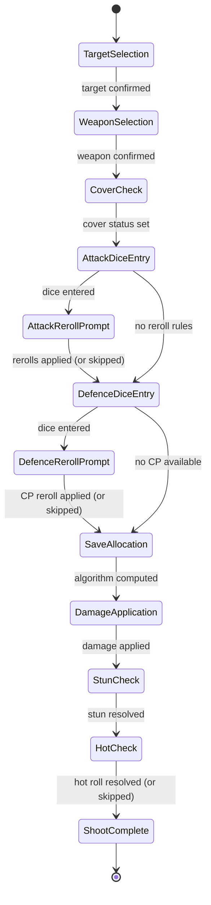

# Spike: Shoot Action UI Flow

**Status**: Draft  
**Author**: Spike  
**Date**: 2025-07  
**Area**: Kill Team Game Tracking — Shoot Action

---

## Introduction

The Shoot action is the primary ranged-combat flow in the Kill Team CLI app. Unlike Fight, it is
non-alternating: the attacker rolls all attack dice, the defender rolls all defence dice, and the
app allocates saves automatically (optimally). The main complexity comes from the interplay of cover
status, Piercing / Piercing Crits, weapon special rules, and the save-blocking algorithm.

This spike defines the full interactive CLI transcript, the state machine governing the phases,
service-layer design, persistence fields, edge-case handling, and xUnit tests, so that a developer
can implement the Shoot action directly from this document.

The app is a .NET 10 console application using Spectre.Console for all interactive prompts. All
combat rule logic lives in `CombatResolutionService` (stateless, no I/O). The
`ShootSessionOrchestrator` owns the CLI loop and calls the service.

**Worked example operatives** (used throughout this document):

| Operative | Player | Side | W | Save |
|---|---|---|---|---|
| Intercessor Gunner | Michael | Attacker | 14 | 3+ |
| Plague Marine Bombardier | Solomon | Defender | 14 | 3+ |

Weapons used in the two examples:

| Example | Weapon | ATK | Hit | NormalDmg | CritDmg | Special Rules |
|---|---|---|---|---|---|---|
| A — Krak grenade | Auxiliary grenade launcher (krak) | 4 | 3+ | 4 | 5 | Piercing 1 |
| B — Bolt rifle | Bolt rifle | 4 | 3+ | 3 | 4 | Piercing Crits 1 |

---

## 1. Rules Recap

> **Official rules text (verbatim, Kill Team V3.0 reference card):**
>
> **SHOOT (1AP):** SHOOT using ranged weapon profile.
> 2× Reg Save discard 1 Crit Hit (two normal saves cancel one crit hit).
> CONCEAL or ENGAGED by [restrictions].
>
> **Line of Sight:**
> - Enemy on Engage order: Can be shot if visible.
> - Enemy on Conceal order: Can be shot if visible and **not in cover**.
>
> **Cover:**
> - In Cover: Operative within 1″ of terrain that cover line crosses. Operatives >2″ apart.
>
> **Obscured:**
> - If cover lines broken by heavy terrain more than 1″ from shooter or target, critical hits
>   become regular hits and one success is discarded.
>
> **Save allocation ("2× Reg Save discard 1 Crit Hit"):**
> The app auto-allocates defender saves optimally:
> 1. 1 crit save → cancels 1 crit attack.
> 2. 2 normal saves → cancel 1 crit attack (if crits remain after step 1).
> 3. 1 normal save → cancels 1 normal attack.

---

## 2. Shoot State Machine



### State Descriptions

| State | Entry Condition | What Happens | Exit Condition |
|---|---|---|---|
| `TargetSelection` | Shoot action starts | List visible valid targets with order and cover status | Target confirmed |
| `WeaponSelection` | Target selected | List ranged weapons; show Heavy/Silent restrictions | Weapon confirmed |
| `CoverCheck` | Weapon selected | Prompt: In cover / Obscured / Neither | Cover status set |
| `AttackDiceEntry` | Cover status known | Roll or enter attack dice (ATK count); classify; apply post-roll rules (Punishing, Rending, Severe) | Dice pool populated |
| `AttackRerollPrompt` | Weapon has Balanced/Ceaseless/Relentless | Prompt for re-rolls; update pool; offer CP re-roll | Re-rolls complete |
| `DefenceDiceEntry` | Attack dice classified | Apply Piercing/PiercingCrits reduction; roll or enter reduced defender dice | Defence pool populated |
| `DefenceRerollPrompt` | Team has ≥ 1CP | Offer CP re-roll on any single die (attack or defence); 1CP spent if accepted | CP re-roll complete (or skipped) |
| `SaveAllocation` | All dice entered | App applies cover save if applicable (Saturate check); runs blocking algorithm; displays result | Unblocked attacks known |
| `DamageApplication` | Unblocked attacks computed | Compute damage; update `GameOperativeState.CurrentWounds`; display wound track | Damage persisted |
| `StunCheck` | Damage applied | If weapon has Stun AND attacker retains ≥ 1 crit in final pool: set `StunnedUntilEndOfNextActivation = true` on defender | Stun resolved |
| `HotCheck` | Stun resolved | If weapon has Hot: roll 1D6; if result < HitThreshold, attacker takes 2 × result self-damage | Hot resolved (or skipped) |
| `ShootComplete` | All effects resolved | Display shoot summary; prompt for narrative note | — |

### Transition Guards

- **TargetSelection**: only show operatives that satisfy LOS + order/cover targeting rules (see §8 edge cases).
- **AttackRerollPrompt**: entered only if weapon has Balanced, Ceaseless, or Relentless; and/or team has CP for CP re-roll.
- **DefenceRerollPrompt**: entered only if either team has ≥ 1CP.
- **StunCheck**: triggered only if weapon has `Stun` in `WeaponRules`.
- **HotCheck**: triggered only if weapon has `Hot` in `WeaponRules`.

---

## 3. Phase-by-Phase CLI Transcript

### Example A — Krak Grenade vs. Plague Marine Bombardier (In Cover)

**Demonstrates**: Piercing 1 removes 1 defender die; cover unconditionally adds 1 normal save;
optimal blocking algorithm; normal damage only (no crits in this example roll).

---

#### Phase 1 — Target Selection

```
╔══════════════════════════════════════════════════════════════════╗
║                    🎯  SHOOT ACTION  🎯                           ║
║                    Intercessor Gunner                            ║
╚══════════════════════════════════════════════════════════════════╝

Select a target:
  > Plague Marine Bombardier  [14W]  [Engage]  in cover
    Plague Marine Champion    [15W]  [Engage]  no cover
    Plague Marine Fighter     [14W]  [Conceal] in cover  ← on Conceal + in cover: INVALID TARGET
```

> **Targeting rule**: An operative on Conceal order can only be targeted if visible AND not in
> cover. The Fighter (Conceal + in cover) is not shown as a valid option. If an operative is on
> Conceal order but **not** in cover, it would appear in the list.

```
> Plague Marine Bombardier  [14W]  [Engage]  in cover
```

---

#### Phase 2 — Weapon Selection

```
──────────────────────────────────────────────────────────
  Gunner selects a ranged weapon:
──────────────────────────────────────────────────────────

  > Auxiliary grenade launcher (krak)  (ATK 4 | Hit 3+ | DMG 4/5 | Piercing 1)
    Bolt rifle                         (ATK 4 | Hit 3+ | DMG 3/4 | Piercing Crits 1)
    Fists                              ← Melee — not offered for Shoot

> Auxiliary grenade launcher (krak)
```

---

#### Phase 3 — Cover Check

```
──────────────────────────────────────────────────────────
  How is Plague Marine Bombardier positioned?
──────────────────────────────────────────────────────────

  > 1. In cover     (1 normal save retained free; crits hit normally)
    2. Obscured     (crits become normal hits; 1 attack success discarded)
    3. Neither      (no cover benefit)

> 1
```

---

#### Phase 4 — Attack Dice Entry

```
──────────────────────────────────────────────────────────
  Gunner rolls 4 dice  (Auxiliary grenade launcher (krak), Hit 3+)
──────────────────────────────────────────────────────────

How would you like to enter Gunner's dice?
    🎲 Roll for me
  > ✏  Enter manually

Enter Gunner's dice results (space or comma separated, e.g. 6 4 2):
> 5 4 3 2

  A1: 5  → HIT  ✓
  A2: 4  → HIT  ✓
  A3: 3  → HIT  ✓
  A4: 2  → MISS ✗  (discarded)

Attack pool: 3 dice  (0 CRITs, 3 HITs)
```

---

#### Phase 4b — Attack Reroll Prompt (Balanced — hypothetical)

> The krak grenade launcher does **not** have Balanced. The following shows what the Balanced
> prompt would look like if the weapon had it. This phase is skipped for the krak.

```
──────────────────────────────────────────────────────────
  Balanced: You may re-roll one attack die.
──────────────────────────────────────────────────────────

Your rolled dice:  1:5(HIT)  2:4(HIT)  3:3(HIT)  4:2(MISS)

Select a die to re-roll (or skip):
    1: rolled 5  (HIT)
    2: rolled 4  (HIT)
    3: rolled 3  (HIT)
  > 4: rolled 2  (MISS)
    [Skip — keep all dice]

> 4: rolled 2  (MISS)
  Die 4 re-rolled: 2 → 6  (CRIT ✓)
```

*(For full Balanced / Ceaseless / Relentless UX, see `spike-weapon-rules.md §4`.)*

---

#### Phase 5 — Piercing Reduction & Defender Dice Entry

```
  Piercing 1: 1 defender die removed before rolling.
  Bombardier rolls 2 dice (3 base − 1 Piercing = 2).

──────────────────────────────────────────────────────────
  Bombardier rolls defence dice (Save 3+) — 2 dice
──────────────────────────────────────────────────────────

How would you like to enter Bombardier's dice?
    🎲 Roll for me
  > ✏  Enter manually

Enter Bombardier's defence dice results:
> 5 2

  D1: 5  → SAVE ✓  (5 >= 3+)
  D2: 2  → MISS ✗

  + Cover save: 1 normal save added automatically (target is in cover).

  Total saves retained: 2  (1 rolled save + 1 cover save)
```

---

#### Phase 6 — CP Re-roll Prompt (Defence Dice)

```
──────────────────────────────────────────────────────────
  CP Re-roll available. Spend 1CP to re-roll one die?
  Michael's team: 2CP.  Solomon's team: 2CP.
──────────────────────────────────────────────────────────

  > Yes — select a die
    No  — keep all dice

> Yes — select a die

Which die to re-roll?
  Attack dice:
    A1: rolled 5  (HIT)
    A2: rolled 4  (HIT)
    A3: rolled 3  (HIT)
    A4: rolled 2  (MISS)
  Defence dice:
    D1: rolled 5  (SAVE)
    D2: rolled 2  (MISS)
    [Cancel]

> D2: rolled 2  (MISS)
  D2 re-rolled: 2 → 1  (still MISS — no change)
  1CP spent.  Solomon's team: 2CP → 1CP.
```

> Dice that were already re-rolled via weapon rule (Balanced/Ceaseless/Relentless) are **excluded**
> from this list. The CP re-roll is not available for the cover-save die (that die is synthetic —
> it was never rolled). App tracks re-rolled indices in a `HashSet<(DieOwner, int)> rerolledIndices`.

---

#### Phase 7 — Save Allocation (App-Computed)

```
──────────────────────────────────────────────────────────
  Save Allocation  (app-computed, optimal)
──────────────────────────────────────────────────────────

  ⚔ Attack pool:    0 CRITs, 3 HITs
  🛡 Defence saves: 2 normal saves  (1 rolled D1 + 1 cover)

  Step (a): 1 crit save cancels 1 crit attack.
    → No crit saves available. Skip.

  Step (b): 2 normal saves cancel 1 crit attack.
    → No crits to cancel. Skip.

  Step (c): 1 normal save cancels 1 normal attack.
    → D1 (normal) cancels A1 (HIT).  Saves remaining: 1.
    → Cover save (normal) cancels A2 (HIT).  Saves remaining: 0.

  Result:
    Blocked:   0 CRITs, 2 HITs
    Unblocked: 0 CRITs, 1 HIT
```

---

#### Phase 8 — Damage Application

```
  Damage calculation:
    Unblocked CRITs:   0 × 5 = 0 crit damage
    Unblocked normals: 1 × 4 = 4 normal damage
    Total: 4 damage

  ⚔ Gunner hits Bombardier for 4 NORMAL damage!
  Plague Marine Bombardier: 14W → 10W.
```

---

#### Phase 9 — Shoot Summary

```
╔══════════════════════════════════════════════════════════════════╗
║                     🎯  Shoot Summary  🎯                         ║
╠══════════════════════════════════════════════════════════════════╣
║  Gunner → Bombardier                                             ║
║  Weapon: Auxiliary grenade launcher (krak)                       ║
║                                                                  ║
║  Attacker rolled: 5  4  3  2                                     ║
║  Pool: HIT  HIT  HIT  (1 miss discarded)                         ║
║                                                                  ║
║  Piercing 1: 1 defence die removed                               ║
║  Defender rolled: 5  2   (+1 cover save)                         ║
║  Saves retained: 2  (1 rolled + 1 cover)                         ║
║                                                                  ║
║  Blocked: 0 CRITs, 2 HITs                                        ║
║  Unblocked: 0 CRITs, 1 HIT                                       ║
║  Damage dealt: 4 normal damage                                   ║
║                                                                  ║
║  Bombardier: 14W → 10W                                           ║
╚══════════════════════════════════════════════════════════════════╝

Add a narrative note? (leave blank to skip)
> The krak round clipped the Bombardier behind the barricade — barely scratched.
```

---

### Example B — Bolt Rifle vs. Plague Marine Bombardier (Obscured)

**Demonstrates**: Obscured converts all crit hits to normal hits then discards 1 success;
Piercing Crits 1 triggers only if attacker retains ≥ 1 crit **before** Obscured is applied.

> **Key design decision — Piercing Crits vs. Obscured ordering:**
> `PiercingCrits` is evaluated **after attack dice are classified** and **before the Obscured
> conversion**. The justification: PiercingCrits is a weapon rule that asks "did the attacker
> roll a crit?" — this refers to the natural dice result, not the post-Obscured result. Obscured
> is a positional modifier that converts crits to normals for damage purposes; it does not
> retroactively change whether a crit was "retained". This ordering is consistent with the
> Lethal / Rending / Severe rules, which also operate on the raw classified pool.
>
> Sequence: **Classify → PiercingCrits check → Obscured conversion → Defence rolls → Blocking**.

---

#### Phase 1–2 — Target & Weapon Selection

```
╔══════════════════════════════════════════════════════════════════╗
║                    🎯  SHOOT ACTION  🎯                           ║
║                    Intercessor Gunner                            ║
╚══════════════════════════════════════════════════════════════════╝

Select a target:
  > Plague Marine Bombardier  [14W]  [Engage]  no cover

> Bolt rifle  (ATK 4 | Hit 3+ | DMG 3/4 | Piercing Crits 1)
```

---

#### Phase 3 — Cover Check

```
  How is Plague Marine Bombardier positioned?
  > 2. Obscured  (crits become normal hits; 1 attack success discarded)
```

---

#### Phase 4 — Attack Dice Entry

```
──────────────────────────────────────────────────────────
  Gunner rolls 4 dice  (Bolt rifle, Hit 3+)
──────────────────────────────────────────────────────────

Enter Gunner's dice results:
> 6 5 4 1

  A1: 6  → CRIT ✓
  A2: 5  → HIT  ✓
  A3: 4  → HIT  ✓
  A4: 1  → MISS ✗  (discarded)

Attack pool (before Obscured): 3 dice  (1 CRIT, 2 HITs)
```

---

#### Phase 4b — Piercing Crits Check

```
  Piercing Crits 1: attacker retains 1 crit (A1) — triggered.
  1 defender die removed before defender rolls.
  Bombardier will roll 2 dice (3 base − 1 Piercing Crits = 2).
```

> **Rule enforcement**: `CalculatePiercingReduction(piercingX: 0, piercingCritsX: 1,
> attackerCritCount: 1)` returns 1 because `attackerCritCount >= 1`. This check occurs on
> the pre-Obscured crit count — the attacker genuinely rolled a crit, so the penalty applies
> to the defender.

---

#### Phase 4c — Obscured Conversion

```
  Obscured: A1 (CRIT) converted to normal HIT.
            1 attack success discarded (lowest-value die: A3 = 4 removed).

  Effective attack pool (post-Obscured): 2 HITs  (A1 converted, A2 retained, A3 discarded)
```

> **Obscured discard — which die is removed?** The app discards the success with the lowest
> raw rolled value (breaking ties by die ID). A3 (rolled 4) is discarded over A1 (rolled 6,
> now a normal) and A2 (rolled 5). If the attacker had zero successes after conversion, the
> discard is a no-op.

---

#### Phase 5 — Defender Dice Entry

```
──────────────────────────────────────────────────────────
  Bombardier rolls defence dice (Save 3+) — 2 dice
  (3 base − 1 Piercing Crits = 2; Obscured does NOT grant cover save)
──────────────────────────────────────────────────────────

Enter Bombardier's defence dice results:
> 4 1

  D1: 4  → SAVE ✓
  D2: 1  → MISS ✗

  Total saves retained: 1
```

---

#### Phase 7 — Save Allocation

```
  ⚔ Attack pool (post-Obscured): 0 CRITs, 2 HITs
  🛡 Defence saves: 1 normal save

  Step (a): No crit saves. Skip.
  Step (b): Need 2 normal saves to block 1 crit — none anyway. Skip.
  Step (c): D1 (normal) cancels A1 (HIT).  Saves remaining: 0.

  Blocked:   0 CRITs, 1 HIT
  Unblocked: 0 CRITs, 1 HIT
```

---

#### Phase 8 — Damage Application

```
  Unblocked normals: 1 × 3 = 3 normal damage
  Total: 3 damage

  ⚔ Gunner hits Bombardier for 3 NORMAL damage!
  Plague Marine Bombardier: 14W → 11W.
```

---

#### Phase 9 — Shoot Summary

```
╔══════════════════════════════════════════════════════════════════╗
║                     🎯  Shoot Summary  🎯                         ║
╠══════════════════════════════════════════════════════════════════╣
║  Gunner → Bombardier                                             ║
║  Weapon: Bolt rifle                                              ║
║                                                                  ║
║  Attacker rolled: 6  5  4  1                                     ║
║  Pool (raw):  CRIT  HIT  HIT  (1 miss discarded)                 ║
║  Piercing Crits 1: 1 crit retained → 1 defence die removed      ║
║  Obscured: CRIT → HIT; 1 success discarded (A3: rolled 4)        ║
║  Effective attack pool: 0 CRITs, 2 HITs                          ║
║                                                                  ║
║  Defender rolled: 4  1                                           ║
║  Saves retained: 1                                               ║
║  Blocked: 0 CRITs, 1 HIT                                         ║
║  Unblocked: 0 CRITs, 1 HIT                                       ║
║  Damage dealt: 3 normal damage                                   ║
║                                                                  ║
║  Bombardier: 14W → 11W                                           ║
╚══════════════════════════════════════════════════════════════════╝
```

---

## 4. Cover / Obscured Prompt Design

```
──────────────────────────────────────────────────────────
  How is the target positioned?
──────────────────────────────────────────────────────────

  > 1. In cover     (1 normal save retained free; crits hit normally)
    2. Obscured     (crits become normal hits; 1 attack success discarded)
    3. Neither      (no cover benefit)
```

### Behaviours by Selection

| Selection | Cover save added? | Crits converted? | Success discarded? |
|---|---|---|---|
| **In cover** | Yes (+1 normal save, before blocking) | No | No |
| **Obscured** | No | Yes (all crits → normal hits) | Yes (1 success discarded, lowest value) |
| **Neither** | No | No | No |

**Saturate override**: if the weapon has `Saturate`, the `In cover` option is displayed but the
cover save is suppressed silently in the service. The prompt is identical; a note is shown after
weapon selection:

```
  ⚠ Saturate: defender cannot retain cover saves (cover save will be ignored).
```

**Seek override**: if weapon has `Seek`, cover is treated as Neither regardless of selection (no
distance model in CLI). Shown as:

```
  ⚠ Seek: terrain provides no cover (cover selection will be ignored).
```

---

## 5. Service Layer Design

### ShootContext (from spike-weapon-rules.md)

```csharp
/// <summary>
/// All inputs required to resolve a Shoot action, including parsed weapon special rules.
/// </summary>
public record ShootContext(
    int[]                           AttackDice,      // raw D6 results (including misses)
    int[]                           DefenceDice,     // raw D6 results (before Piercing removal)
    bool                            InCover,         // true if target is in cover
    bool                            IsObscured,      // true if target is Obscured
    int                             HitThreshold,    // effective hit threshold (post-Injured adjustment)
    int                             SaveThreshold,   // defender's save stat (e.g. 3)
    int                             NormalDmg,
    int                             CritDmg,         // base; overridden by Devastating x if present
    IReadOnlyList<WeaponSpecialRule> WeaponRules      // parsed from weapon.SpecialRules
)
{
    public bool HasRule(SpecialRuleKind kind) =>
        WeaponRules.Any(r => r.Kind == kind);

    public WeaponSpecialRule? GetRule(SpecialRuleKind kind) =>
        WeaponRules.FirstOrDefault(r => r.Kind == kind);

    public int EffectiveCritDmg =>
        GetRule(SpecialRuleKind.Devastating)?.Parameter ?? CritDmg;
}
```

> `IsObscured` is added here (not in the original spike-weapon-rules.md draft, which only had
> `InCover`). A target cannot be simultaneously `InCover = true` and `IsObscured = true`; the
> orchestrator sets exactly one of these based on the three-option prompt.

### ShootResult

```csharp
/// <summary>
/// Full result of a resolved Shoot action, returned by CombatResolutionService.ResolveShoot.
/// </summary>
public record ShootResult(
    int  AttackerNormalHits,        // normal hits in effective pool (post-Obscured)
    int  AttackerCritHits,          // crit hits in effective pool (post-Obscured, 0 if Obscured)
    int  AttackerRawCritHits,       // crits before Obscured conversion (used for PiercingCrits, Stun)
    int  DefenderSaves,             // saves retained (including cover save if applicable)
    int  PiercingReduction,         // number of defender dice removed
    bool CoverSaveApplied,          // true if a cover save was added
    bool ObscuredApplied,           // true if Obscured conversion occurred
    int  BlockedNormals,
    int  BlockedCrits,
    int  NormalDamageDealt,
    int  CritDamageDealt,
    bool CausedIncapacitation       // caller provides current wounds to determine this
);
```

### CombatResolutionService.ResolveShoot — Internal Pipeline

```
1.  Lethal:   effectiveCritThreshold = Lethal?.Parameter ?? 6
2.  Accurate: prepend Accurate.Parameter synthetic HIT dice
3.  Classify each attack die: CalculateDie(roll, hitThreshold, effectiveCritThreshold)
    → collect (normals, crits, fails); record rawCritCount = crits
4.  Punishing: if HasRule(Punishing) && crits > 0 && fails > 0 → normals += 1
5.  Rending:   if HasRule(Rending)   && crits > 0 && normals > 0 → crits += 1; normals -= 1
6.  Severe:    if HasRule(Severe)    && crits == 0 && normals > 0 → crits += 1; normals -= 1
7.  PiercingCrits check: piercingReduction = CalculatePiercingReduction(
        piercingX:      GetRule(Piercing)?.Parameter ?? 0,
        piercingCritsX: GetRule(PiercingCrits)?.Parameter ?? 0,
        attackerCritCount: rawCritCount)          ← uses PRE-Obscured crit count
8.  Obscured conversion (if IsObscured):
    a. Convert all crit successes to normal: normals += crits; crits = 0
    b. Discard 1 success (remove lowest-value die from effective pool):
       if (normals + crits) > 0: remove 1 normal (normals -= 1)
9.  effectiveDefenceCount = Max(0, defenceDice.Length - piercingReduction)
10. Cover save:
    effectiveInCover = IsObscured ? false :
                       (HasRule(Saturate) || HasRule(Seek) ? false : InCover)
    if effectiveInCover → prepend 1 synthetic normal-save die to defence pool
11. Classify defence dice: each die >= saveThreshold → save; else fail
    (up to effectiveDefenceCount dice, plus the synthetic cover die if applicable)
12. Blocking algorithm (app-allocated, optimal):
    (a) 1 crit save → cancel 1 crit attack
    (b) 2 normal saves → cancel 1 crit attack (if crits remain)
    (c) 1 normal save → cancel 1 normal attack
13. effectiveCritDmg = EffectiveCritDmg
    damage = unblocked_crits × effectiveCritDmg + unblocked_normals × NormalDmg
14. Return ShootResult
```

### ShootSessionOrchestrator

Stateful; drives the UI loop. No combat logic.

```csharp
public class ShootSessionOrchestrator
{
    public ShootSessionOrchestrator(
        CombatResolutionService resolutionService,
        IAnsiConsole            console);

    // Entry point — called by the Shoot command handler.
    // Returns the completed ShootResult for persistence.
    public ShootResult Run(
        Operative            attacker,
        GameOperativeState   attackerState,
        Operative            defender,
        GameOperativeState   defenderState,
        IReadOnlyList<GameOperativeState> allActiveStates);

    // --- Private orchestration methods ---
    private Operative          PromptTargetSelection(
        GameOperativeState attackerState,
        IReadOnlyList<GameOperativeState> candidates);
    private Weapon             PromptWeaponSelection(Operative attacker, GameOperativeState attackerState);
    private CoverStatus        PromptCoverCheck(Operative attacker, Operative defender);
    private int[]              PromptDiceEntry(string label, int diceCount, string context);
    private int[]              PromptAttackRerolls(int[] attackDice, Weapon weapon, ref HashSet<(DieOwner, int)> rerolled);
    private int[]              PromptCpReroll(int[] attackDice, int[] defenceDice,
                                               ref HashSet<(DieOwner, int)> rerolled,
                                               ref int attackingTeamCp, ref int defendingTeamCp);
    private void               DisplayShootSummary(Operative attacker, Operative defender,
                                                    ShootResult result, Weapon weapon);
}

public enum CoverStatus { InCover, Obscured, Neither }
```

---

## 6. CP Re-roll Prompt — Defence Dice

After the defender enters their dice, if either team has ≥ 1CP:

```
──────────────────────────────────────────────────────────
  CP Re-roll available (2CP). Spend 1CP to re-roll one die?
──────────────────────────────────────────────────────────

  > Yes — select a die
    No  — keep all dice

> Yes — select a die

Which die to re-roll?
  Attack dice:
    A1: rolled 6  (CRIT)
    A2: rolled 5  (HIT)
    A3: rolled 4  (HIT)
    A4: rolled 1  (MISS)
  Defence dice:
    D1: rolled 5  (SAVE)
    D2: rolled 2  (MISS)         ← candidate for re-roll
    [Cancel]

> D2: rolled 2  (MISS)
  D2 re-rolled: 2 → 4  (SAVE ✓)
  1CP spent. Solomon's team: 2CP → 1CP.
```

**Rules enforced:**

- Dice already re-rolled (by weapon rule or a prior CP re-roll) are **excluded**.
- The cover-save die (synthetic) is never shown — it was not rolled.
- Only one CP re-roll per action per team (tracked in orchestrator).
- Either player's team may trigger the CP re-roll, in order: attacker team offered first, then defender team.
- A re-rolled die can never be re-rolled again (`HashSet<(DieOwner owner, int dieIndex)> rerolledIndices`).

---

## 7. Persistence

After `ShootSessionOrchestrator.Run()` returns, the calling command handler maps the result to the
`Action` SQLite record. Fields marked **NEW** are additions to the existing schema.

```
Action {
    Type              = Shoot
    WeaponId          = weapon.Id
    TargetOperativeId = Bombardier.Id

    // Raw rolls — JSON int arrays including misses
    AttackerDice      = [5, 4, 3, 2]                  // Example A rolls
    DefenderDice      = [5, 2]                         // Example A rolls (2 dice, post-Piercing not stored — raw stored)

    TargetInCover     = true                           // bool
    IsObscured        = false                          // bool  ← NEW field on Action

    // Resolved counts
    NormalHits        = ShootResult.AttackerNormalHits
    CriticalHits      = ShootResult.AttackerCritHits
    Blocks            = ShootResult.BlockedNormals + ShootResult.BlockedCrits

    // Damage
    NormalDamageDealt  = ShootResult.NormalDamageDealt
    CriticalDamageDealt= ShootResult.CritDamageDealt
    CausedIncapacitation = ShootResult.CausedIncapacitation

    SelfDamageDealt   = 0 (or Hot roll × 2 if Hot triggered)  ← NEW field on Action
    StunApplied       = false (or true if Stun triggered)      ← NEW field on Action

    NarrativeNote     = "The krak round clipped the Bombardier…"
}
```

**Schema migration note**: add three nullable columns to the `actions` table:

```sql
ALTER TABLE actions ADD COLUMN is_obscured       INTEGER NOT NULL DEFAULT 0;
ALTER TABLE actions ADD COLUMN self_damage_dealt INTEGER NOT NULL DEFAULT 0;
ALTER TABLE actions ADD COLUMN stun_applied      INTEGER NOT NULL DEFAULT 0;
```

---

## 8. Edge Cases

### 1. Target on Conceal Order and In Cover — Invalid Target

A target on Conceal order who is also in cover cannot be shot. The app excludes them from the
target selection list entirely. If all valid targets are excluded, the Shoot action is refused:

```
  ⚠ No valid targets.
    All visible enemies are either out of range, on Conceal order + in cover,
    or on Conceal order and obscured.
  Returning to action menu.
```

### 2. All Attack Dice Miss — No Damage

```
Attack pool: 0 dice  (all 4 dice missed)

  All attack dice missed. No damage dealt.
  Action ends.
```

The flow skips directly to `ShootComplete`. No defender dice are rolled. All damage fields are 0.

### 3. All Defender Dice Removed by Piercing — No Defence Roll

If `piercingReduction >= defenceDice.Length` and `effectiveInCover == false`:

```
  Piercing 2: all 2 defender dice removed. Bombardier cannot roll defence.
  All attacks resolve unblocked.
```

`DefenceDice` is stored as an empty array. The blocking algorithm receives 0 saves; all
attacks deal damage.

### 4. Stun — Applied When Crits Retained (Post-Obscured)

Stun triggers when the weapon has `Stun` and `ShootResult.AttackerCritHits > 0` (i.e., crits
**after** Obscured conversion). If the target is Obscured, no crits are retained in the effective
pool, so Stun cannot trigger via an Obscured target.

```csharp
// In ShootSessionOrchestrator.Run(), after ResolveShoot():
if (weapon.HasRule(SpecialRuleKind.Stun) && result.AttackerCritHits > 0)
{
    defenderState.StunnedUntilEndOfNextActivation = true;
    _console.MarkupLine("[yellow]⚡ Stun! Bombardier loses 1APL until end of their next activation.[/]");
}
```

`GameOperativeState` gains `StunnedUntilEndOfNextActivation` (bool). At the start of the
defender's next activation, APL is temporarily reduced by 1 and the flag cleared.

### 5. Hot — Post-Shoot Self-Damage Roll

After the shoot action completes (all damage applied), if the weapon has `Hot`:

```
──────────────────────────────────────────────────────────
  Hot: Roll 1D6 — if result < Hit threshold (3), suffer 2× result self-damage.
──────────────────────────────────────────────────────────

  🎲 Roll for me
> ✏  Enter manually

Hot roll result:
> 2

  2 < 3 (Hit threshold) — Hot triggered!
  Self-damage: 2 × 2 = 4.
  Gunner: 14W → 10W.

  [or]

> 4
  4 >= 3 (Hit threshold) — Hot not triggered. No self-damage.
```

The self-damage is applied to `attackerState.CurrentWounds`. If the attacker is incapacitated by
Hot, `CausedIncapacitation` is NOT set on the action (that field refers to the target); the
attacker is simply marked incapacitated after the action completes.

### 6. Saturate — Cover Save Not Retained

```
  ⚠ Saturate: defender cannot retain cover saves.
  Target is in cover but cover save is suppressed.
  Bombardier rolls 3 dice (no cover bonus).
```

In `ShootContext`, `effectiveInCover` is forced to `false` even when `InCover = true`.

### 7. Obscured — PiercingCrits Interaction (Pre-conversion Check)

As specified in §3 Example B: `PiercingCrits` uses the **raw** crit count (before Obscured
conversion). Even though Obscured will eliminate the crits from damage calculation, the attacker
did genuinely roll crits, so the defender still suffers the Piercing penalty.

---

## 9. Tests

```csharp
public class ShootResolutionTests
{
    private readonly CombatResolutionService _sut = new();

    [Fact]
    public void ResolveShoot_BasicHits_DamageCalculatedCorrectly()
    {
        // 2 hits, 0 saves, in cover: false → 2 × normalDmg
        var ctx = new ShootContext(
            AttackDice:  new[] { 5, 4, 1, 1 },    // 2 hits, 2 misses
            DefenceDice: Array.Empty<int>(),
            InCover:     false, IsObscured: false,
            HitThreshold:   3, SaveThreshold: 3,
            NormalDmg: 4, CritDmg: 5,
            WeaponRules: Array.Empty<WeaponSpecialRule>());

        var result = _sut.ResolveShoot(ctx);

        result.AttackerNormalHits.Should().Be(2);
        result.AttackerCritHits.Should().Be(0);
        result.DefenderSaves.Should().Be(0);
        result.NormalDamageDealt.Should().Be(8);
        result.CritDamageDealt.Should().Be(0);
    }

    [Fact]
    public void ResolveShoot_InCover_OneNormalSaveRetainedFree()
    {
        // 3 hits, 0 defence dice rolled, in cover → 1 free normal save blocks 1 hit
        var ctx = new ShootContext(
            AttackDice:  new[] { 5, 4, 3 },
            DefenceDice: Array.Empty<int>(),
            InCover:     true, IsObscured: false,
            HitThreshold:   3, SaveThreshold: 3,
            NormalDmg: 4, CritDmg: 5,
            WeaponRules: Array.Empty<WeaponSpecialRule>());

        var result = _sut.ResolveShoot(ctx);

        result.CoverSaveApplied.Should().BeTrue();
        result.DefenderSaves.Should().Be(1);
        result.BlockedNormals.Should().Be(1);
        result.NormalDamageDealt.Should().Be(2 * 4);  // 2 unblocked × 4
    }

    [Fact]
    public void ResolveShoot_Saturate_CoverSaveNotRetained()
    {
        // Saturate: InCover=true but cover save suppressed
        var ctx = new ShootContext(
            AttackDice:  new[] { 4 },
            DefenceDice: Array.Empty<int>(),
            InCover:     true, IsObscured: false,
            HitThreshold:   3, SaveThreshold: 3,
            NormalDmg: 4, CritDmg: 5,
            WeaponRules: SpecialRuleParser.Parse("Saturate"));

        var result = _sut.ResolveShoot(ctx);

        result.CoverSaveApplied.Should().BeFalse();
        result.DefenderSaves.Should().Be(0);
        result.NormalDamageDealt.Should().Be(4);
    }

    [Fact]
    public void ResolveShoot_Obscured_CritsConvertedAndOneSuccessDiscarded()
    {
        // 1 crit + 2 hits, Obscured:
        //   crit → normal (3 normals), then 1 discarded → 2 normals remain
        var ctx = new ShootContext(
            AttackDice:  new[] { 6, 5, 4, 1 },    // 1 crit, 2 hits, 1 miss
            DefenceDice: Array.Empty<int>(),
            InCover:     false, IsObscured: true,
            HitThreshold:   3, SaveThreshold: 3,
            NormalDmg: 3, CritDmg: 4,
            WeaponRules: Array.Empty<WeaponSpecialRule>());

        var result = _sut.ResolveShoot(ctx);

        result.AttackerCritHits.Should().Be(0);     // crits converted
        result.AttackerNormalHits.Should().Be(2);   // 3 successes − 1 discarded
        result.ObscuredApplied.Should().BeTrue();
        result.NormalDamageDealt.Should().Be(6);    // 2 × 3
    }

    [Fact]
    public void ResolveShoot_PiercingCrits_TriggersOnlyWhenCritRetained()
    {
        // With crit: piercingReduction = 1
        var ctxWithCrit = new ShootContext(
            AttackDice:  new[] { 6, 4, 1, 1 },    // 1 crit, 1 hit
            DefenceDice: new[] { 5, 4, 3 },        // 3 dice — should be reduced to 2
            InCover:     false, IsObscured: false,
            HitThreshold:   3, SaveThreshold: 3,
            NormalDmg: 3, CritDmg: 4,
            WeaponRules: SpecialRuleParser.Parse("Piercing Crits 1"));

        // Without crit: piercingReduction = 0
        var ctxNoCrit = ctxWithCrit with
        {
            AttackDice = new[] { 5, 4, 1, 1 }     // 0 crits, 2 hits
        };

        var withCrit   = _sut.ResolveShoot(ctxWithCrit);
        var withoutCrit = _sut.ResolveShoot(ctxNoCrit);

        withCrit.PiercingReduction.Should().Be(1);
        withCrit.DefenderSaves.Should().Be(2);       // 3 − 1 = 2 dice available, 2 succeed

        withoutCrit.PiercingReduction.Should().Be(0);
        withoutCrit.DefenderSaves.Should().Be(3);    // all 3 dice available
    }

    [Fact]
    public void ResolveShoot_TwoNormalSavesBlockOneCrit()
    {
        // 1 crit attack, 2 normal saves: 2 normals → block 1 crit (step b of algorithm)
        var ctx = new ShootContext(
            AttackDice:  new[] { 6, 1, 1, 1 },    // 1 crit
            DefenceDice: new[] { 5, 4 },           // 2 saves (both normal)
            InCover:     false, IsObscured: false,
            HitThreshold:   3, SaveThreshold: 3,
            NormalDmg: 4, CritDmg: 5,
            WeaponRules: Array.Empty<WeaponSpecialRule>());

        var result = _sut.ResolveShoot(ctx);

        result.BlockedCrits.Should().Be(1);
        result.CritDamageDealt.Should().Be(0);
        result.NormalDamageDealt.Should().Be(0);
    }

    [Fact]
    public void ResolveShoot_Stun_TriggersWhenCritsRetained()
    {
        // Stun check lives in orchestrator, but ShootResult.AttackerCritHits drives it.
        // Verify: with crits in pool post-Obscured → AttackerCritHits > 0 (triggers Stun)
        // Obscured scenario → AttackerCritHits == 0 (Stun does NOT trigger)

        var ctxWithCrit = new ShootContext(
            AttackDice:  new[] { 6, 1, 1, 1 },    // 1 crit
            DefenceDice: Array.Empty<int>(),
            InCover:     false, IsObscured: false,
            HitThreshold:   3, SaveThreshold: 3,
            NormalDmg: 4, CritDmg: 5,
            WeaponRules: SpecialRuleParser.Parse("Stun"));

        var ctxObscured = ctxWithCrit with { IsObscured = true };

        var withCrit    = _sut.ResolveShoot(ctxWithCrit);
        var withObscured = _sut.ResolveShoot(ctxObscured);

        withCrit.AttackerCritHits.Should().BeGreaterThan(0);   // Stun should trigger
        withObscured.AttackerCritHits.Should().Be(0);           // Obscured zeroed crits → Stun suppressed
    }

    [Fact]
    public void ResolveShoot_AllMiss_ZeroDamage()
    {
        var ctx = new ShootContext(
            AttackDice:  new[] { 2, 1, 1, 1 },    // all misses (Hit 3+)
            DefenceDice: Array.Empty<int>(),
            InCover:     false, IsObscured: false,
            HitThreshold:   3, SaveThreshold: 3,
            NormalDmg: 4, CritDmg: 5,
            WeaponRules: Array.Empty<WeaponSpecialRule>());

        var result = _sut.ResolveShoot(ctx);

        result.AttackerNormalHits.Should().Be(0);
        result.AttackerCritHits.Should().Be(0);
        result.NormalDamageDealt.Should().Be(0);
        result.CritDamageDealt.Should().Be(0);
    }
}
```

---

## Spectre.Console Components

| UI Element | Component | Notes |
|---|---|---|
| Shoot action header | `Panel` with `Rule` border title | `[bold yellow]🎯 SHOOT ACTION 🎯[/]` |
| Target selection | `SelectionPrompt<GameOperativeState>` | Filtered to valid targets only (order + cover rules) |
| Weapon selection | `SelectionPrompt<Weapon>` | Filtered to `WeaponType.Ranged`; Heavy-restricted weapons greyed or excluded |
| Cover prompt | `SelectionPrompt<CoverStatus>` | Three options: InCover / Obscured / Neither |
| Roll or Enter? | `SelectionPrompt<string>` | Two choices: auto-roll, manual entry |
| Manual dice entry | `TextPrompt<string>` | Validated: values 1–6, space/comma separated |
| Attack die classification | `Markup` | `A1: 6 → CRIT ✓ [yellow]`, `A4: 1 → MISS ✗ [dim]` |
| Piercing notice | `Markup` | `[cyan]Piercing N: N defender dice removed.[/]` |
| Obscured notice | `Markup` | `[cyan]Obscured: crits converted, 1 success discarded.[/]` |
| Cover save notice | `Markup` | `[green]+ Cover save: 1 normal save added automatically.[/]` |
| Save allocation | `Table` or `Markup` block | Shows each step of the blocking algorithm |
| Damage dealt | `Markup` | `[red]⚔ … for N NORMAL/CRIT damage![/]` |
| Stun notice | `Markup` | `[yellow]⚡ Stun! …[/]` |
| Hot roll prompt | `TextPrompt<int>` or auto-roll | Separate prompt after summary; shows threshold |
| Shoot summary | `Table` inside `Panel` | Single-column layout |
| Narrative note | `TextPrompt<string>` | Optional; `AllowEmpty()` enabled |

### Colour Conventions

| Colour | Used For |
|---|---|
| `[yellow]` | CRIT dice; injury and stun warnings |
| `[green]` | SAVE dice; cover save notice |
| `[cyan]` | Rule-application notices (Piercing, Obscured, Saturate) |
| `[red]` | Damage dealt; incapacitation |
| `[bold red]` | Incapacitation events |
| `[dim]` | Missed dice; discarded dice |
| `[blue]` | Defender dice labels (D1, D2…) |

---

## References

- `spike-fight-ui.md` — Fight action state machine, `FightDicePool`, `FightDie`, `DieResult`
- `spike-weapon-rules.md` — `WeaponSpecialRule`, `SpecialRuleParser`, `ShootContext`,
  `CombatResolutionService`, re-roll UX (Balanced / Ceaseless / Relentless / CP Re-roll)
- `spec.md §US-003` — Shoot action acceptance criteria, injured stat adjustments
